# AI Agent Platform as a Service

A production-grade, multi-tenant AI Agent Platform deployed on Azure Kubernetes Service. Product teams create, configure, and orchestrate AI agents through a self-service UI — with tenant-isolated runtime environments, model-agnostic LLM integration, and full control-plane / runtime-plane separation.

**Core Value:** Go from zero to a working AI agent with tools, data sources, RAG, and multi-agent workflows — without writing infrastructure code or managing model deployments.

## Quick Overview

This platform empowers organizations to bring AI capabilities to their teams with enterprise-grade security, governance, and rapid deployment. Instead of building AI infrastructure from scratch, developers and product managers can use a centralized control plane to build, test, and deployed sophisticated AI agents.

**Key capabilities include:**
- **Create Custom AI Agents:** Configure agents with specific personas, instructions, and capabilities using any preferred underlying LLM.
- **Equip Agents with Tools:** Connect agents directly to internal APIs, databases, or third-party services using integrated tools and the Model Context Protocol (MCP).
- **Manage Multi-Tenant Workloads:** Safely host multiple teams or customers on the same platform with strict data, namespace, and runtime isolation.
- **Orchestrate Complex Workflows:** Chain multiple specialized agents together to solve complex, multi-step business problems.
- **Monitor and Evaluate:** Track token costs, monitor execution latency, and evaluate agent quality from a single pane of glass.

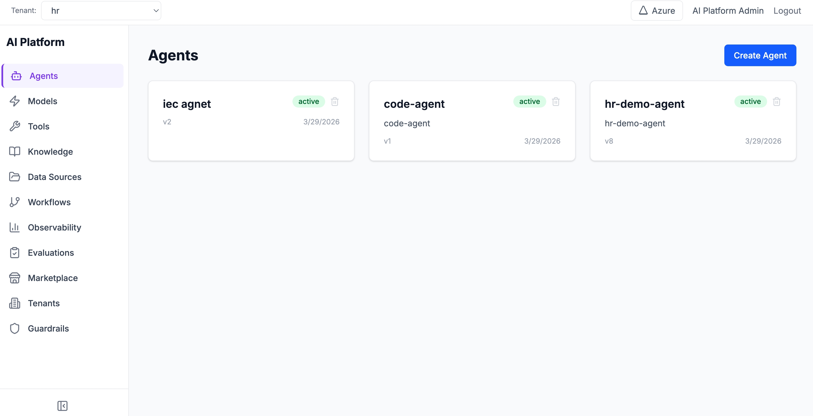

---

## Getting Started

### Prerequisites

| Tool | Version |
|------|---------|
| Docker Desktop | Latest (must be running) |
| Python | 3.11 – 3.13 |
| Node.js | 18+ |
| npm | 9+ |

### Quick Start (one command)

```bash
git clone https://github.com/roie9876/AI-Platform-System.git
cd AI-Platform-System
./start.sh
```

The `start.sh` script handles everything automatically:
1. Starts **PostgreSQL** (with pgvector) and **Redis** via Docker Compose
2. Creates a Python virtual environment and installs backend dependencies
3. Runs database migrations (Alembic)
4. Starts the **FastAPI** backend on `http://localhost:8000`
5. Starts demo **MCP servers** (Web Tools on `:8081`, Atlassian on `:8082`)
6. Installs frontend npm packages and starts the **Next.js** app on `http://localhost:3000`

### Access Points

| Service | URL |
|---------|-----|
| Frontend (UI) | http://localhost:3000 |
| Backend API | http://localhost:8000 |
| API Docs (Swagger) | http://localhost:8000/docs |
| MCP Web Tools | http://localhost:8081/mcp |
| MCP Jira/Confluence | http://localhost:8082/mcp |

### Docker-Only Setup (alternative)

If you prefer running everything inside containers:

```bash
docker compose up --build
```

This starts the backend, frontend, PostgreSQL, and Redis — no local Python or Node.js required.

Press `Ctrl+C` to stop all services.

---

## Table of Contents

- [1. High-Level Architecture](#1-high-level-architecture)
  - [1.1 System-Level View](#11-system-level-view)
  - [1.2 Control Plane vs Runtime Plane](#12-control-plane-vs-runtime-plane)
  - [1.3 Data Layer](#13-data-layer)
- [2. Control Plane — Deep Dive](#2-control-plane--deep-dive)
  - [2.1 API Gateway Pod](#21-api-gateway-pod)
  - [2.2 Authentication & Identity](#22-authentication--identity)
  - [2.3 Tenant Management & Isolation](#23-tenant-management--isolation)
  - [2.4 Agent Registry & Configuration](#24-agent-registry--configuration)
  - [2.5 Policy Engine & Governance](#25-policy-engine--governance)
  - [2.6 Evaluation Engine](#26-evaluation-engine)
  - [2.7 Tool & Agent Marketplace](#27-tool--agent-marketplace)
  - [2.8 Cost Observability Dashboard](#28-cost-observability-dashboard)
- [3. Runtime Plane — Deep Dive](#3-runtime-plane--deep-dive)
  - [3.1 Agent Executor Pod](#31-agent-executor-pod)
  - [3.2 Agent Execution Lifecycle (ReAct Loop)](#32-agent-execution-lifecycle-react-loop)
  - [3.3 Model Abstraction Layer & Multi-Model Routing](#33-model-abstraction-layer--multi-model-routing)
  - [3.4 Memory Management (Short-Term & Long-Term)](#34-memory-management-short-term--long-term)
  - [3.5 Thread & State Management](#35-thread--state-management)
  - [3.6 Tool Executor Pod](#36-tool-executor-pod)
  - [3.7 RAG System (Retrieval-Augmented Generation)](#37-rag-system-retrieval-augmented-generation)
  - [3.8 MCP Proxy Pod](#38-mcp-proxy-pod)
    - [3.8.1 MCP Servers](#381-mcp-servers)
  - [3.9 Workflow Engine Pod](#39-workflow-engine-pod)
  - [3.10 OpenClaw Agent Runtime](#310-openclaw-agent-runtime)
  - [3.11 MCP Platform Tools Server](#311-mcp-platform-tools-server)
  - [3.12 Auth Gateway](#312-auth-gateway)
  - [3.13 LLM Proxy (Token Proxy)](#313-llm-proxy-token-proxy)
  - [3.14 Channel Registration Guide](#314-channel-registration-guide)
- [4. Security Architecture](#4-security-architecture)
  - [4.1 Authentication Flow](#41-authentication-flow)
  - [4.2 Tenant Isolation Model](#42-tenant-isolation-model)
  - [4.3 Secrets Management](#43-secrets-management)
  - [4.4 Network Security Boundaries](#44-network-security-boundaries)
- [5. Scalability & Fault Tolerance](#5-scalability--fault-tolerance)
  - [5.1 Horizontal Pod Autoscaling](#51-horizontal-pod-autoscaling)
  - [5.2 KEDA Scale-to-Zero](#52-keda-scale-to-zero)
  - [5.3 Circuit Breaker & Resilience](#53-circuit-breaker--resilience)
  - [5.4 Cosmos DB Partition Strategy](#54-cosmos-db-partition-strategy)
- [6. Observability](#6-observability)
- [7. Microsoft Product Architecture Mapping](#7-microsoft-product-architecture-mapping)
  - [7.1 Logical-to-Physical Mapping](#71-logical-to-physical-mapping)
  - [7.2 Azure Resource Topology](#72-azure-resource-topology)
  - [7.3 End-to-End Request Lifecycle (Microsoft Stack)](#73-end-to-end-request-lifecycle-microsoft-stack)
- [8. Kubernetes Deployment Architecture](#8-kubernetes-deployment-architecture)
  - [8.1 Cluster Topology](#81-cluster-topology)
  - [8.2 Ingress & Traffic Routing](#82-ingress--traffic-routing)
  - [8.3 Pod Configuration](#83-pod-configuration)
- [9. Data Model — Cosmos DB Schema](#9-data-model--cosmos-db-schema)
- [10. Frontend Architecture](#10-frontend-architecture)
- [11. Azure Deployment Guide](#11-azure-deployment-guide)
  - [11.1 Prerequisites](#111-prerequisites)
  - [11.2 Entra ID App Registration (SPN)](#112-entra-id-app-registration-spn)
  - [11.3 Step-by-Step Deployment](#113-step-by-step-deployment)
  - [11.4 Azure Resources Created](#114-azure-resources-created)
  - [11.5 RBAC Assignments (Auto-Provisioned)](#115-rbac-assignments-auto-provisioned)
  - [11.6 Deployment Pipeline (Manual)](#116-deployment-pipeline-manual)
  - [11.7 Troubleshooting](#117-troubleshooting)
- [12. Local Development](#12-local-development)
- [13. API Reference](#13-api-reference)
- [14. Project Structure](#14-project-structure)

---

## 📚 Companion Education Repository

> **New to AI Agent Platforms?** The **[AI-Agent-Platform Education Hub](https://github.com/roie9876/AI-Agent-Platform)** is a companion repository with 17 in-depth chapters and 10 hands-on labs that teach all the concepts behind this codebase.

| This Repo (Implementation) | Education Chapter | Lab |
|---|---|---|
| [§1 High-Level Architecture](#1-high-level-architecture) | [Ch 14 — HLD Full Architecture](https://github.com/roie9876/AI-Agent-Platform/blob/main/education/en/14-hld-architecture.md) | — |
| [§2 Control Plane](#2-control-plane--deep-dive) | [Ch 08 — Control Plane](https://github.com/roie9876/AI-Agent-Platform/blob/main/education/en/08-control-plane.md) | — |
| [§3 Runtime Plane](#3-runtime-plane--deep-dive) | [Ch 09 — Runtime Plane](https://github.com/roie9876/AI-Agent-Platform/blob/main/education/en/09-runtime-plane.md) | — |
| [§3.2 ReAct Loop](#32-agent-execution-lifecycle-react-loop) | [Ch 01 — Fundamentals](https://github.com/roie9876/AI-Agent-Platform/blob/main/education/en/01-fundamentals.md) | [Lab 01](https://github.com/roie9876/AI-Agent-Platform/blob/main/labs/lab-01-react-agent/README.md) |
| [§3.3 Model Abstraction](#33-model-abstraction-layer--multi-model-routing) | [Ch 02 — Model Abstraction & Routing](https://github.com/roie9876/AI-Agent-Platform/blob/main/education/en/02-model-abstraction-routing.md) | [Lab 02](https://github.com/roie9876/AI-Agent-Platform/blob/main/labs/lab-02-model-routing/README.md) |
| [§3.4 Memory + §3.7 RAG](#34-memory-management-short-term--long-term) | [Ch 03 — Memory Management & RAG](https://github.com/roie9876/AI-Agent-Platform/blob/main/education/en/03-memory-management.md) | [Lab 03](https://github.com/roie9876/AI-Agent-Platform/blob/main/labs/lab-03-memory-rag/README.md) |
| [§3.5 Thread & State](#35-thread--state-management) | [Ch 04 — Thread & State Management](https://github.com/roie9876/AI-Agent-Platform/blob/main/education/en/04-thread-state-management.md) | — |
| [§3.9 Workflow Engine](#39-workflow-engine-pod) | [Ch 05 — Orchestration Patterns](https://github.com/roie9876/AI-Agent-Platform/blob/main/education/en/05-orchestration.md) | [Lab 04](https://github.com/roie9876/AI-Agent-Platform/blob/main/labs/lab-04-orchestration/README.md) |
| [§2.7 Marketplace + §3.6 Tools + §3.8 MCP](#27-tool--agent-marketplace) | [Ch 06 — Tools & Marketplace](https://github.com/roie9876/AI-Agent-Platform/blob/main/education/en/06-tools-marketplace.md) | [Lab 05](https://github.com/roie9876/AI-Agent-Platform/blob/main/labs/lab-05-tools-safety/README.md) |
| [§2.5 Policy Engine](#25-policy-engine--governance) | [Ch 07 — Policy & Governance](https://github.com/roie9876/AI-Agent-Platform/blob/main/education/en/07-policy-governance.md) | [Lab 05](https://github.com/roie9876/AI-Agent-Platform/blob/main/labs/lab-05-tools-safety/README.md) |
| [§2.6 Evaluation Engine](#26-evaluation-engine) | [Ch 10 — Evaluation Engine](https://github.com/roie9876/AI-Agent-Platform/blob/main/education/en/10-evaluation-engine.md) | [Lab 06](https://github.com/roie9876/AI-Agent-Platform/blob/main/labs/lab-06-evaluation/README.md) |
| [§2.8 Cost Dashboard + §6 Observability](#28-cost-observability-dashboard) | [Ch 11 — Observability & Cost](https://github.com/roie9876/AI-Agent-Platform/blob/main/education/en/11-observability-cost.md) | [Lab 08](https://github.com/roie9876/AI-Agent-Platform/blob/main/labs/lab-08-observability/README.md) |
| [§4 Security Architecture](#4-security-architecture) | [Ch 12 — Security & Isolation](https://github.com/roie9876/AI-Agent-Platform/blob/main/education/en/12-security-isolation.md) | — |
| [§5 Scalability](#5-scalability--fault-tolerance) | [Ch 13 — Scalability Patterns](https://github.com/roie9876/AI-Agent-Platform/blob/main/education/en/13-scalability.md) | — |
| [§7 Microsoft Stack](#7-microsoft-product-architecture-mapping) | [Ch 15 — Microsoft Stack Mapping](https://github.com/roie9876/AI-Agent-Platform/blob/main/education/en/15-microsoft-stack.md) | — |
| [§3.8 MCP Proxy](#38-mcp-proxy-pod) | [Ch 16 — Agent Frameworks & Ecosystem](https://github.com/roie9876/AI-Agent-Platform/blob/main/education/en/16-agent-frameworks.md) | [Lab 07](https://github.com/roie9876/AI-Agent-Platform/blob/main/labs/lab-07-frameworks/README.md) |

---

## 1. High-Level Architecture

> 📚 **Learn the concepts:** [HLD — Full Architecture (Education)](https://github.com/roie9876/AI-Agent-Platform/blob/main/education/en/14-hld-architecture.md)

### 1.1 System-Level View

The platform is organized into three layers: a **Control Plane** for management, a **Runtime Plane** for execution, and a shared **Data Layer** for persistence. Fourteen Kubernetes pods (13 backend microservices + 1 frontend) run inside an AKS cluster behind an Application Gateway for Containers (AGC) ingress controller.

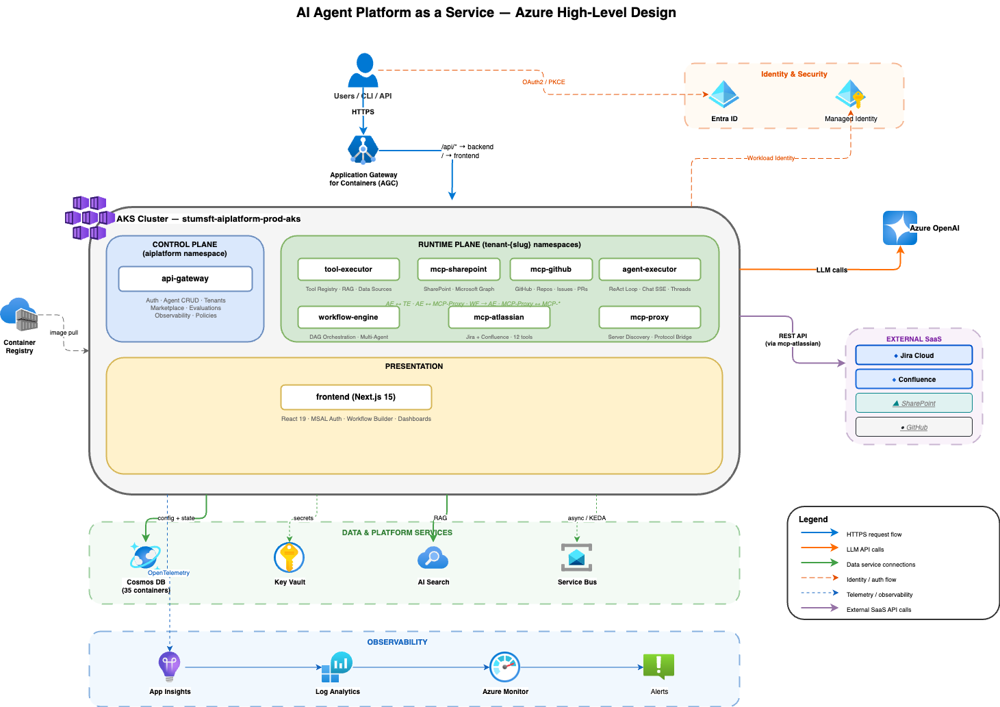

### 1.2 Control Plane vs Runtime Plane

The architecture enforces a strict separation between **management** and **execution**. The Control Plane can go down without affecting running agents. The Runtime Plane can scale independently to handle execution load.

| Property | Control Plane | Runtime Plane |
|----------|--------------|---------------|
| **Pods** | `api-gateway` | `agent-executor`, `tool-executor`, `mcp-proxy`, `mcp-platform-tools`, `mcp-atlassian`, `mcp-sharepoint`, `mcp-github`, `workflow-engine`, `auth-gateway`, `llm-proxy`, `openclaw` (per-tenant) |
| **Purpose** | Configuration, governance, admin ops | Agent execution, tool calls, LLM routing |
| **Traffic Pattern** | Low frequency (admin CRUD) | High frequency (user conversations) |
| **Latency Tolerance** | Seconds acceptable | Milliseconds critical (streaming) |
| **Scaling Strategy** | Minimal (1–2 replicas) | Aggressive (KEDA scale-to-zero → N) |
| **State** | Stateless (reads config from DB) | Stateful (threads, memory, execution state) |
| **If it goes down** | "Can't manage agents" | "Agents don't respond" |

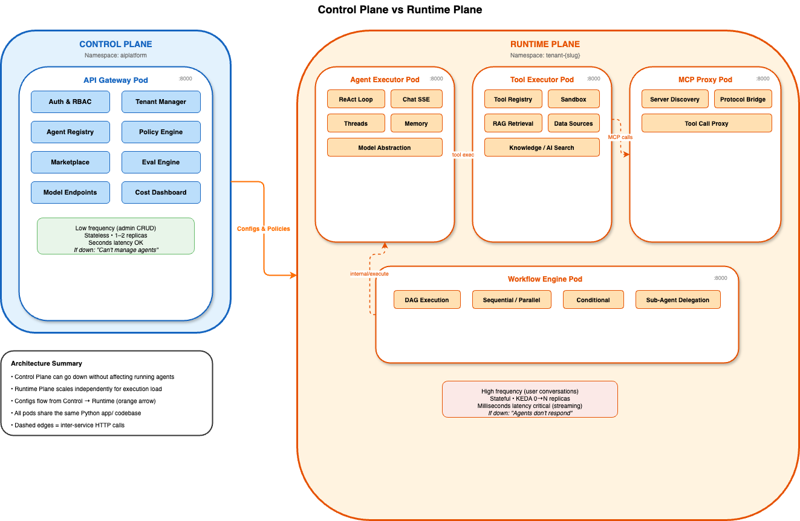

### 1.3 Data Layer

| Service | Technology | Purpose |
|---------|-----------|---------|
| **Primary Database** | Azure Cosmos DB (NoSQL, Serverless) | All platform data — 37 containers, partitioned by `/tenant_id` |
| **Secrets** | Azure Key Vault | API keys, connection strings, Entra config |
| **Search** | Azure AI Search | Hybrid vector + keyword search for RAG retrieval |
| **Observability** | Application Insights + Log Analytics | APM, distributed tracing, KQL queries |
| **Async Queue** | Azure Service Bus | Async agent execution with KEDA scale-to-zero |
| **Blob Storage** | Azure Storage Account | Agent archives, file uploads |

---

## 2. Control Plane — Deep Dive

> 📚 **Learn the concepts:** [Control Plane (Education)](https://github.com/roie9876/AI-Agent-Platform/blob/main/education/en/08-control-plane.md)

The Control Plane is the **management surface** of the platform. It is a single pod (`api-gateway`) running FastAPI that handles all administrative and configuration operations. No LLM calls or agent execution happen here.

### 2.1 API Gateway Pod

Despite the name, this is **not** a routing gateway. It is a **control-plane application service** that owns all management APIs. The actual request routing is done by the AGC ingress controller at the edge layer.

**What it owns:**

| Domain | Routes | Description |
|--------|--------|-------------|
| Authentication | `/api/v1/auth/*` | Entra ID SSO, device-code flow |
| Agent CRUD | `/api/v1/agents` | Create, list, update, delete agents; WhatsApp link management |
| Chat | `/api/v1/agents/{id}/chat` | Synchronous SSE streaming chat, file upload |
| Async Chat | `/api/v1/agents/{id}/chat/async` | Queue via Service Bus, poll with correlation ID |
| Model Endpoints | `/api/v1/model-endpoints` | Register LLM providers (Azure OpenAI, OpenAI, Anthropic, Claude, Grok, custom) |
| Knowledge | `/api/v1/knowledge` | Knowledge base CRUD, document ingestion |
| Catalog | `/api/v1/catalog` | Browse data source connector templates |
| Marketplace | `/api/v1/marketplace` | Share and discover agent/tool templates |
| Evaluations | `/api/v1/evaluations` | Test suite management, execution, comparison |
| Observability | `/api/v1/observability` | Cost dashboards, token usage, pricing management, cost alerts |
| Token Usage | `/api/v1/token-usage` | Fine-grained token usage logs and summaries |
| Tenant Admin | `/api/v1/tenants` | Tenant lifecycle (create, suspend, deactivate) |
| Azure Integration | `/api/v1/azure/*` | Subscription connection, resource discovery |
| AI Services | `/api/v1/ai-services` | Platform-managed AI tools (Bing, Grounding) |

**What it does NOT do:**
- Does not route requests to other services (the ingress does that)
- Does not call LLMs or execute agents
- Does not process chat messages or manage threads

### 2.2 Authentication & Identity

The platform uses **Microsoft Entra ID** for all authentication. No username/password flows exist.

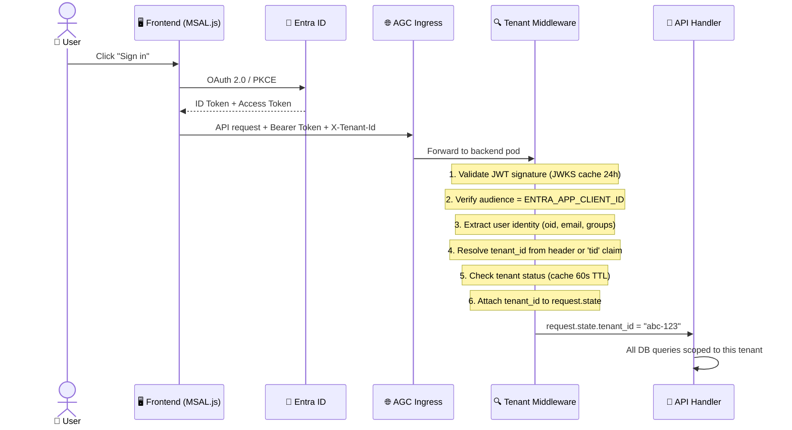
```mermaid
sequenceDiagram
    actor User as 👤 User
    participant FE as 🖥️ Frontend (MSAL.js)
    participant Entra as 🔐 Entra ID
    participant AGC as 🌐 AGC Ingress
    participant MW as 🔍 Tenant Middleware
    participant API as 🚪 API Handler

    User->>FE: Click "Sign in"
    FE->>Entra: OAuth 2.0 / PKCE
    Entra-->>FE: ID Token + Access Token
    FE->>AGC: API request + Bearer Token + X-Tenant-Id
    AGC->>MW: Forward to backend pod

    Note over MW: 1. Validate JWT signature (JWKS cache 24h)
    Note over MW: 2. Verify audience = ENTRA_APP_CLIENT_ID
    Note over MW: 3. Extract user identity (oid, email, groups)
    Note over MW: 4. Resolve tenant_id from header or 'tid' claim
    Note over MW: 5. Check tenant status (cache 60s TTL)
    Note over MW: 6. Attach tenant_id to request.state

    MW->>API: request.state.tenant_id = "abc-123"
    API->>API: All DB queries scoped to this tenant
```

**Key design decisions:**
- **Bearer tokens** (not httpOnly cookies) — tokens managed by MSAL.js in the browser, sent as `Authorization: Bearer <token>` headers
- **Tenant context** — determined by `X-Tenant-Id` header; users can access multiple tenants
- **Platform admin** — identified by Entra group membership or email allowlist
- **Pod-to-Azure auth** — workload identity (OIDC token exchange), no secrets in env vars

### 2.3 Tenant Management & Isolation

The platform implements **logical tenant isolation** using Cosmos DB partition keys. Every container uses `/tenant_id` as its partition key, meaning tenant data is physically separated at the storage layer.

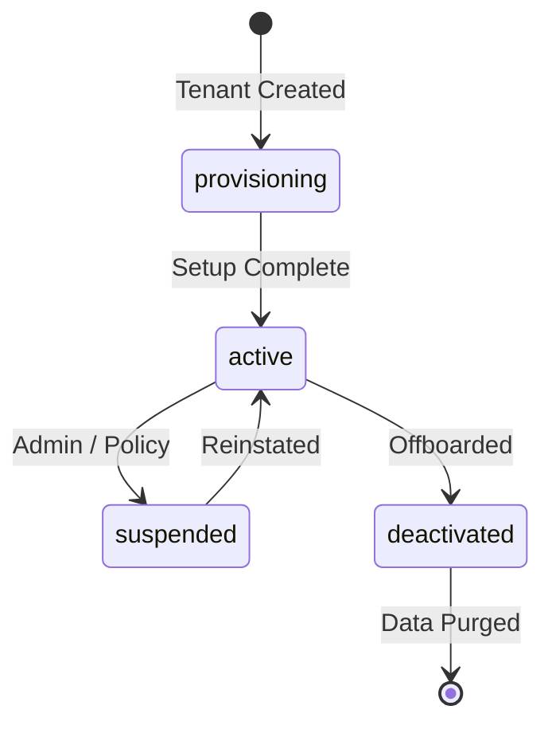
```mermaid
stateDiagram-v2
    [*] --> provisioning: Tenant Created
    provisioning --> active: Setup Complete
    active --> suspended: Admin / Policy
    suspended --> active: Reinstated
    active --> deactivated: Offboarded
    deactivated --> [*]: Data Purged
```

**Provisioning creates:**
1. Kubernetes namespace `tenant-{slug}` with ResourceQuota and NetworkPolicy
2. Entra ID security group for tenant members
3. Default seed data (sample agent, tools)
4. Admin user record linked to Entra identity (auto-created from Entra ID profile)

**Cascade delete:** Deleting a tenant removes all associated resources — agents (including OpenClaw CRs and pods), tools, threads, memories, data sources, knowledge bases, Key Vault secrets, and the Kubernetes namespace. Cascade also applies at the agent level — deleting an agent cleans up its threads, memories, tool attachments, MCP tool bindings, evaluation suites, and OpenClaw instance.

**Runtime isolation:**
- Every API request → middleware extracts `tenant_id` → all Cosmos DB queries use it as partition key
- A query without `tenant_id` returns empty results — cross-tenant leakage is structurally impossible
- Tenant status is cached in-memory (60s TTL) — suspended tenants get `403` immediately

### 2.4 Agent Registry & Configuration

Agents are the core entity of the platform. Each agent has:

| Field | Description |
|-------|-------------|
| `name` | Display name |
| `system_prompt` | Instructions defining agent behavior |
| `model_endpoint_id` | Which LLM to use |
| `temperature` | Creativity control (0.0–2.0) |
| `max_tokens` | Maximum response length |
| `timeout` | Execution timeout in seconds |
| `tools[]` | Attached tools (native + MCP) |
| `data_sources[]` | Attached data sources for RAG |
| `knowledge_indexes[]` | Azure AI Search indexes |

**Configuration versioning:** Every update creates a new version snapshot, enabling rollback to any previous configuration.

### 2.5 Policy Engine & Governance

> 📚 **Learn the concepts:** [Policy & Governance (Education)](https://github.com/roie9876/AI-Agent-Platform/blob/main/education/en/07-policy-governance.md)

The policy layer enforces rules at multiple levels:

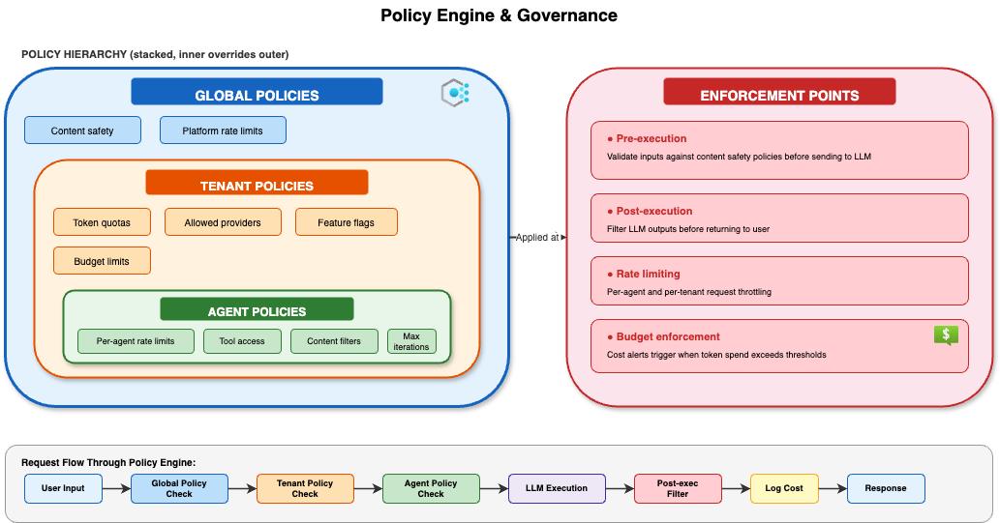

### 2.6 Evaluation Engine

> 📚 **Learn the concepts:** [Evaluation Engine (Education)](https://github.com/roie9876/AI-Agent-Platform/blob/main/education/en/10-evaluation-engine.md)

The evaluation engine measures agent quality through structured test suites:

```
Test Suite                    Evaluation Run
├── Test Case 1               ├── Result 1 (score: 0.92)
│   ├── input: "..."         │   ├── actual_output: "..."
│   ├── expected_output       │   ├── similarity: 0.92
│   └── keywords: [...]       │   ├── latency_ms: 1240
│                              │   └── tokens: {in: 340, out: 180}
├── Test Case 2               ├── Result 2 (score: 0.85)
└── Test Case N               └── Result N
```

**Workflow:** Create test suite → add test cases → run against agent → compare versions → iterate.

**Metrics computed:**
- Semantic similarity (embedding distance between actual and expected output)
- Keyword matching (presence of required terms)
- Latency (end-to-end response time)
- Token efficiency (tokens per useful output unit)
- Cost per test case

### 2.7 Tool & Agent Marketplace

> 📚 **Learn the concepts:** [Tools & Marketplace (Education)](https://github.com/roie9876/AI-Agent-Platform/blob/main/education/en/06-tools-marketplace.md)

The marketplace enables sharing across tenants:

- **Agent templates**: Pre-built agent configurations with system prompts and tool attachments
- **Tool templates**: Reusable tool definitions with JSON Schema
- **Categories**: Browsable by domain (Sales, Support, Engineering, etc.)
- **Featured**: Curated templates highlighted on dashboard
- **Import**: One-click import creates a copy in the user's tenant (deduplicated)

### 2.8 Cost Observability Dashboard

> 📚 **Learn the concepts:** [Observability & Cost (Education)](https://github.com/roie9876/AI-Agent-Platform/blob/main/education/en/11-observability-cost.md)

Every agent execution logs token usage and cost. The observability API surfaces this data:

| Endpoint | Data |
|----------|------|
| `GET /observability/dashboard` | KPI summary: total requests, tokens, cost ($), avg latency |
| `GET /observability/tokens` | Token usage time series (configurable granularity: 1h, 1d) |
| `GET /observability/costs` | Cost breakdown by agent, model, or time range |
| `GET /observability/logs` | Structured execution logs with state snapshots |
| `POST /observability/alerts` | Budget threshold alerts and spike detection |

**Cost calculation:**
```
cost_per_request = (input_tokens × model.input_price_per_1k / 1000)
                 + (output_tokens × model.output_price_per_1k / 1000)
```

Token counts are captured from the LLM response `usage` object and stored in the `execution_logs` container with each agent invocation.

---

## 3. Runtime Plane — Deep Dive

> 📚 **Learn the concepts:** [Runtime Plane (Education)](https://github.com/roie9876/AI-Agent-Platform/blob/main/education/en/09-runtime-plane.md)

The Runtime Plane handles the actual execution of AI agents. It consists of eleven shared pods plus per-tenant **OpenClaw** pods: the **Agent Executor** orchestrates the core ReAct loop, the **Tool Executor** runs tools and retrieves RAG content, the **MCP Proxy** bridges external tool protocols, four **MCP servers** (`mcp-atlassian`, `mcp-sharepoint`, `mcp-github`, `mcp-platform-tools`) connect to external SaaS APIs and platform internals, the **Workflow Engine** coordinates multi-agent flows, the **Auth Gateway** proxies OpenClaw native UIs with Entra ID authentication, the **LLM Proxy** transparently logs token usage, and **OpenClaw** provides an autonomous agent runtime with native multi-channel support (Telegram, WhatsApp, Slack, Discord).

### 3.1 Agent Executor Pod

The **primary execution engine** of the platform. This pod receives user messages, runs the ReAct loop (LLM → Tool → Observe → Repeat), manages conversation threads, and handles memory storage.

| Responsibility | Routes | Description |
|---------------|--------|-------------|
| Chat | `POST /api/v1/agents/{id}/chat` | Send message, receive SSE stream |
| Chat Upload | `POST /api/v1/agents/{id}/chat/upload` | Upload file for chat context |
| Async Chat | `POST /api/v1/agents/{id}/chat/async` | Queue via Service Bus (KEDA) |
| Async Poll | `GET /api/v1/agents/executions/{correlation_id}` | Poll for async result |
| Threads | `/api/v1/threads/*` | CRUD for conversation sessions |
| Memory | `/api/v1/agents/{id}/memories` | Long-term agent memory |
| Internal Execute | `POST /api/v1/internal/agents/{id}/execute` | Called by Workflow Engine |

### 3.2 Agent Execution Lifecycle (ReAct Loop)

> 📚 **Learn the concepts:** [Fundamentals — What is an AI Agent? (Education)](https://github.com/roie9876/AI-Agent-Platform/blob/main/education/en/01-fundamentals.md)

When a user sends a message, the agent executor runs the **ReAct loop** — Reason (LLM thinks), Act (call tool), Observe (read result), Repeat.

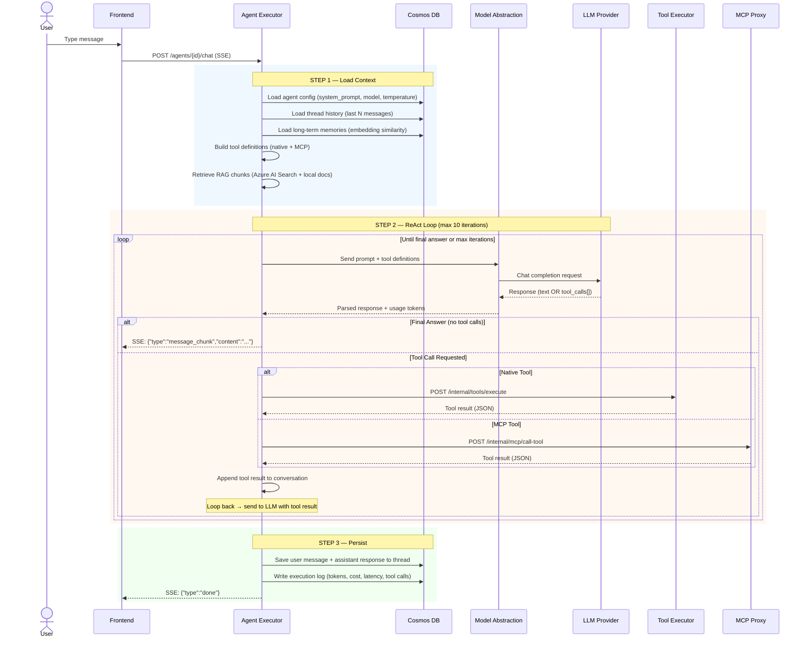
```mermaid
sequenceDiagram
    actor User
    participant FE as Frontend
    participant AE as Agent Executor
    participant DB as Cosmos DB
    participant MAL as Model Abstraction
    participant LLM as LLM Provider
    participant TE as Tool Executor
    participant MCP as MCP Proxy

    User->>FE: Type message
    FE->>AE: POST /agents/{id}/chat (SSE)

    rect rgb(240, 248, 255)
        Note over AE,DB: STEP 1 — Load Context
        AE->>DB: Load agent config (system_prompt, model, temperature)
        AE->>DB: Load thread history (last N messages)
        AE->>DB: Load long-term memories (embedding similarity)
        AE->>AE: Build tool definitions (native + MCP)
        AE->>AE: Retrieve RAG chunks (Azure AI Search + local docs)
    end

    rect rgb(255, 248, 240)
        Note over AE,LLM: STEP 2 — ReAct Loop (max 10 iterations)
        loop Until final answer or max iterations
            AE->>MAL: Send prompt + tool definitions
            MAL->>LLM: Chat completion request
            LLM-->>MAL: Response (text OR tool_calls[])
            MAL-->>AE: Parsed response + usage tokens

            alt Final Answer (no tool calls)
                AE-->>FE: SSE: {"type":"message_chunk","content":"..."}
            else Tool Call Requested
                alt Native Tool
                    AE->>TE: POST /internal/tools/execute
                    TE-->>AE: Tool result (JSON)
                else MCP Tool
                    AE->>MCP: POST /internal/mcp/call-tool
                    MCP-->>AE: Tool result (JSON)
                end
                AE->>AE: Append tool result to conversation
                Note over AE: Loop back → send to LLM with tool result
            end
        end
    end

    rect rgb(240, 255, 240)
        Note over AE,DB: STEP 3 — Persist
        AE->>DB: Save user message + assistant response to thread
        AE->>DB: Write execution log (tokens, cost, latency, tool calls)
        AE-->>FE: SSE: {"type":"done"}
    end
```

**ReAct loop parameters:**

| Parameter | Default | Description |
|-----------|---------|-------------|
| `MAX_TOOL_ITERATIONS` | 10 | Max LLM↔Tool round-trips before forced stop |
| Agent `timeout` | 120s | Per-agent execution timeout |
| Tool `timeout` | 30s | Per-tool invocation timeout |

### 3.3 Model Abstraction Layer & Multi-Model Routing

> 📚 **Learn the concepts:** [Model Abstraction & Routing (Education)](https://github.com/roie9876/AI-Agent-Platform/blob/main/education/en/02-model-abstraction-routing.md)

The model abstraction layer provides a **unified OpenAI-compatible interface** to 100+ LLM providers. Every model interaction, regardless of provider, goes through the same interface.

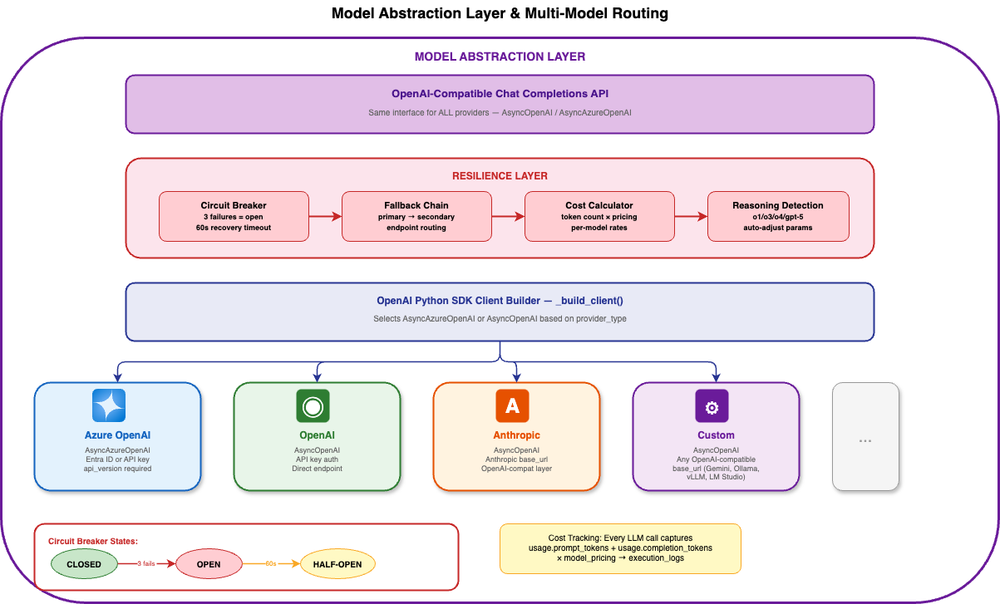

**Multi-model routing:** Each agent has a `model_endpoint_id` pointing to a registered endpoint. The platform supports:
- **Azure OpenAI** (Entra ID or API key auth, including reasoning models like o4-mini)
- **OpenAI** (API key auth)
- **Anthropic / Claude** (API key auth)
- **Grok** (xAI API)
- **Custom endpoints** (any OpenAI-compatible API)

The `ModelAbstractionService` automatically adapts parameters for reasoning vs. standard models (e.g., disabling `temperature` for reasoning models, using `max_completion_tokens` instead of `max_tokens`).

**Circuit breaker pattern:**

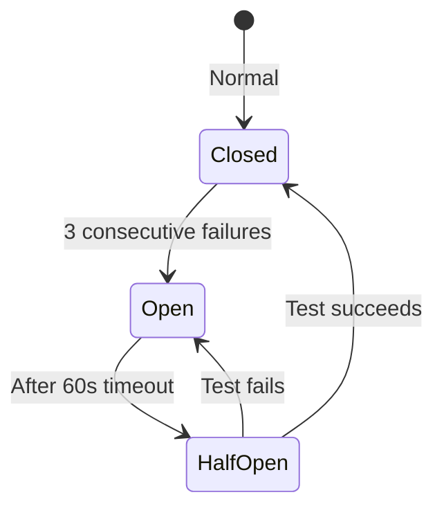
```mermaid
stateDiagram-v2
    [*] --> Closed: Normal
    Closed --> Open: 3 consecutive failures
    Open --> HalfOpen: After 60s timeout
    HalfOpen --> Closed: Test succeeds
    HalfOpen --> Open: Test fails
```

- **Closed**: All requests pass through to the endpoint
- **Open**: All requests fail-fast immediately (use fallback endpoint if configured)
- **Half-Open**: Allow one test request to probe recovery

**Cost tracking:** Every LLM call captures `usage.prompt_tokens` and `usage.completion_tokens` from the response. The cost calculator multiplies by the per-model pricing stored in `model_pricing` and writes to `execution_logs`.

### 3.4 Memory Management (Short-Term & Long-Term)

> 📚 **Learn the concepts:** [Memory Management & RAG (Education)](https://github.com/roie9876/AI-Agent-Platform/blob/main/education/en/03-memory-management.md)

The platform implements two memory scopes:

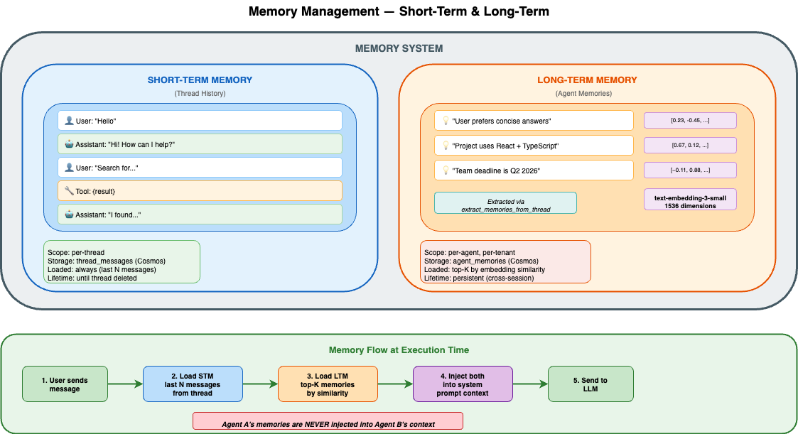

**Short-term memory:**
- Conversation history within a single thread
- All messages (user, assistant, system, tool) stored in `thread_messages` container
- Loaded automatically when building the prompt for the next LLM call
- Thread can be resumed — history persists until the thread is deleted

**Long-term memory:**
- Persistent knowledge that survives across threads
- Extracted from conversations via `extract_memories_from_thread` (automated insight extraction)
- Stored as text + vector embedding (OpenAI `text-embedding-3-small`, 1536 dimensions)
- Retrieved via embedding similarity search when constructing agent context
- Scoped per-agent, per-tenant — agent A's memories are never injected into agent B's context

**Conversation history search:**
- Agents can search their own past conversation history using the `conversation_search` MCP tool
- Full-text search across all thread messages (user, assistant, tool) for the agent
- Returns matching messages with thread context, timestamps, and sender roles
- Enables agents to recall specific past interactions beyond what vector memory captures

**Memory flow at execution time:**
1. User sends message
2. Load short-term: last N messages from current thread
3. Load long-term: top-K memories by embedding similarity to the user's message
4. Inject both into the system prompt as context
5. Send to LLM

### 3.5 Thread & State Management

> 📚 **Learn the concepts:** [Thread & State Management (Education)](https://github.com/roie9876/AI-Agent-Platform/blob/main/education/en/04-thread-state-management.md)

Threads are conversation containers. Each thread belongs to one agent and one tenant.

```
Thread (id, agent_id, tenant_id, title)
  ├── Message 1 (role: user, content: "Hello")
  ├── Message 2 (role: assistant, content: "Hi! How can I help?")
  ├── Message 3 (role: user, content: "Search for...")
  ├── Message 4 (role: tool, tool_call_id: "xyz", content: "{result}")
  └── Message 5 (role: assistant, content: "I found...")
```

**Thread API:**
- `POST /threads` — Create new conversation
- `GET /threads` — List all threads (tenant-scoped)
- `GET /threads/{id}` — Get thread with messages
- `GET /threads/{id}/messages` — Paginated message history
- `PUT /threads/{id}` — Update title
- `DELETE /threads/{id}` — Delete thread and all messages

**State tracking:** Each agent execution writes an **execution log** capturing:
- Input/output token counts
- Tool calls made (name, input, output)
- Model endpoint used
- Latency (total and per-step)
- Cost (calculated from token counts × pricing)
- State snapshots at each iteration step

These logs power the observability dashboard and enable debugging of agent behavior.

### 3.6 Tool Executor Pod

> 📚 **Learn the concepts:** [Tools & Marketplace (Education)](https://github.com/roie9876/AI-Agent-Platform/blob/main/education/en/06-tools-marketplace.md)

The tool executor manages the **tool registry**, **data source connections**, and **RAG retrieval**. It runs tools in sandboxed subprocesses with input validation and timeout protection.

| Responsibility | Routes | Description |
|---------------|--------|-------------|
| Tool Registry | `/api/v1/tools` | Register tools with JSON Schema for input/output |
| Data Sources | `/api/v1/data-sources` | Connect data sources (file upload, URL, databases) |
| Knowledge/RAG | `/api/v1/knowledge` | Azure AI Search index management |
| Internal Execute | `POST /internal/tools/execute` | Called by Agent Executor during ReAct loop |

**Tool execution flow:**
1. Agent Executor sends tool call request (tool name + parameters)
2. Tool Executor validates parameters against JSON Schema
3. Runs tool in subprocess with timeout (default 30s)
4. Captures stdout/stderr, truncates if output exceeds limit
5. Returns structured JSON result

**Supported data source types:**
- File upload (PDF, DOCX, TXT, MD — parsed and chunked automatically)
- URL ingestion (web scraping)
- SharePoint, OneDrive (via catalog connectors)
- Azure Blob Storage, AWS S3
- SQL Server, PostgreSQL, Cosmos DB

### 3.7 RAG System (Retrieval-Augmented Generation)

> 📚 **Learn the concepts:** [Memory Management & RAG (Education)](https://github.com/roie9876/AI-Agent-Platform/blob/main/education/en/03-memory-management.md)

The RAG pipeline runs at execution time, injecting relevant external knowledge into the agent's prompt before sending to the LLM.

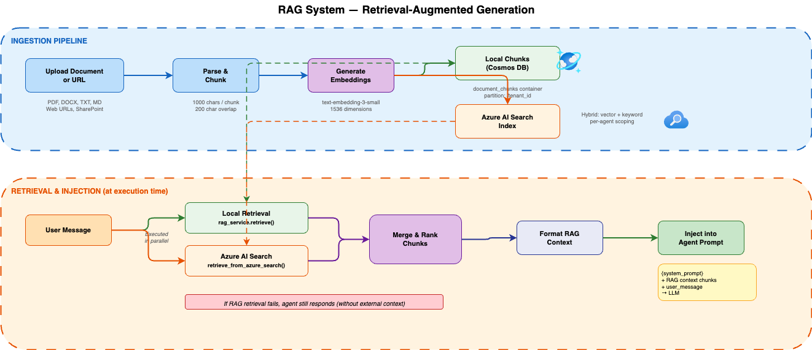

**Two retrieval paths (executed in parallel):**

1. **Local documents** — User-uploaded files are parsed, chunked (1000 chars, 200 overlap), and stored in `document_chunks`. Retrieved by text matching against the user's query.

2. **Azure AI Search indexes** — Externally managed search indexes connected via Azure connections. Retrieved via hybrid search (vector + keyword) for higher relevance. Indexes are attached per-agent via the knowledge management API (`ARRAY_CONTAINS` query ensures per-agent scoping).

**At execution time:**
```python
# Simplified execution flow
local_chunks = rag_service.retrieve(agent_id, query)          # Local docs
search_chunks = rag_service.retrieve_from_azure_search(agent_id, query)  # AI Search
context = format_rag_context(local_chunks + search_chunks)
prompt = f"{system_prompt}\n\n{context}\n\n{user_message}"
response = model_abstraction.chat_completion(prompt)
```

### 3.8 MCP Proxy Pod

> 📚 **Learn the concepts:** [Tools & Marketplace (Education)](https://github.com/roie9876/AI-Agent-Platform/blob/main/education/en/06-tools-marketplace.md) · [Agent Frameworks & Ecosystem (Education)](https://github.com/roie9876/AI-Agent-Platform/blob/main/education/en/16-agent-frameworks.md)

The MCP Proxy bridges the **Model Context Protocol** ecosystem to the platform. MCP is a standardized protocol for tool discovery and invocation across external services. The proxy routes tool calls to the appropriate MCP server based on the server registry.

| Responsibility | Routes | Description |
|---------------|--------|-------------|
| Server Registry | `/api/v1/mcp-servers` | Register/manage MCP server endpoints |
| Tool Discovery | `/api/v1/mcp/tools` | Introspect available tools from servers |
| Tool Execution | `POST /internal/mcp/call-tool` | Proxy tool calls during agent execution |
| Agent Attachment | `/api/v1/agents/{id}/mcp-tools` | Attach/detach discovered tools to agents |

### 3.8.1 MCP Servers

Each external SaaS integration runs as a dedicated MCP server pod. Separate servers are required because each SaaS has a different API and authentication model.

| MCP Server | External Service | API | Auth | Tools | Status |
|---|---|---|---|---|---|
| `mcp-atlassian` | Jira Cloud + Confluence | Atlassian REST API | API Token (Key Vault) | 12 (7 Jira + 5 Confluence) | **Active** |
| `mcp-sharepoint` | SharePoint / OneDrive | Microsoft Graph API | Managed Identity (Entra ID) | — | **Active** |
| `mcp-github` | Repos, Issues, PRs | GitHub REST / GraphQL | GitHub App or PAT | — | **Active** |
| `mcp-platform-tools` | Platform internals | FastMCP over HTTP | Workload Identity | 7 (4 memory + 3 config) | **Active** |

**MCP lifecycle:**

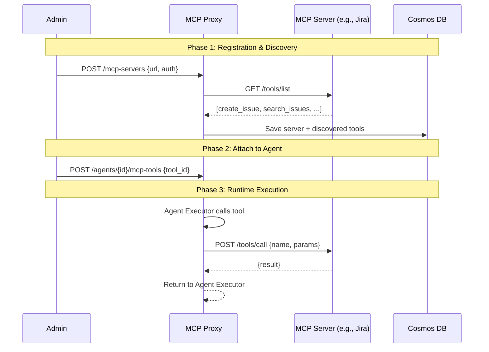
```mermaid
sequenceDiagram
    participant Admin
    participant Proxy as MCP Proxy
    participant Server as MCP Server (e.g., Jira)
    participant DB as Cosmos DB

    Note over Admin,DB: Phase 1: Registration & Discovery
    Admin->>Proxy: POST /mcp-servers {url, auth}
    Proxy->>Server: GET /tools/list
    Server-->>Proxy: [create_issue, search_issues, ...]
    Proxy->>DB: Save server + discovered tools

    Note over Admin,DB: Phase 2: Attach to Agent
    Admin->>Proxy: POST /agents/{id}/mcp-tools {tool_id}

    Note over Admin,DB: Phase 3: Runtime Execution
    Proxy->>Proxy: Agent Executor calls tool
    Proxy->>Server: POST /tools/call {name, params}
    Server-->>Proxy: {result}
    Proxy-->>Proxy: Return to Agent Executor
```

### 3.9 Workflow Engine Pod

> 📚 **Learn the concepts:** [Orchestration Patterns (Education)](https://github.com/roie9876/AI-Agent-Platform/blob/main/education/en/05-orchestration.md)

The workflow engine orchestrates **multi-agent workflows** as directed acyclic graphs (DAGs). Each node is an agent execution, and edges define data flow between agents.

| Responsibility | Routes | Description |
|---------------|--------|-------------|
| Workflow CRUD | `/api/v1/workflows` | Create/edit workflow definitions |
| Nodes & Edges | `/api/v1/workflows/{id}/nodes`, `/edges` | Build the DAG structure |
| Execution | `POST /api/v1/workflows/{id}/execute` | Run workflow end-to-end |
| History | `GET /api/v1/workflows/{id}/executions` | Execution history with per-node results |

**Supported orchestration patterns:**

```
Sequential                    Parallel (Fan-out/Fan-in)
A ──► B ──► C                 ┌──► B ──┐
                         A ──►├──► C ──►├──► E
                              └──► D ──┘

Conditional                   Sub-Agent Delegation
        ┌──► Sales Agent      Supervisor ──► Research ──┐
Classifier──► Support Agent                             │
        └──► Billing Agent    Supervisor ◄──────────────┘
                              Supervisor ──► Writer ──► Done
```

**Execution flow:** The workflow engine traverses the DAG, calling the Agent Executor internally via `POST /api/v1/internal/agents/{agent_id}/execute` for each node, passing tenant context and thread state. Node outputs feed into downstream nodes via `output_mapping` defined on edges.

### 3.10 OpenClaw Agent Runtime

The platform supports **OpenClaw** as a first-class agent type alongside the built-in ReAct executor. OpenClaw is an autonomous agent runtime that runs as a Kubernetes-native sidecar — each agent gets its own `OpenClawInstance` Custom Resource (CR), managed by the OpenClaw Operator.

**Why OpenClaw?** While the built-in Agent Executor handles standard ReAct-loop agents, OpenClaw provides a full-featured autonomous runtime with native multi-channel support (Telegram, WhatsApp, Slack, Discord), persistent session management, built-in tool orchestration, email access, web browsing, deep research, and advanced agentic capabilities that go beyond simple request-response patterns.

#### Capabilities & Integration Topology

The diagram below shows all the channels, tools, and platform services the OpenClaw agent integrates with:

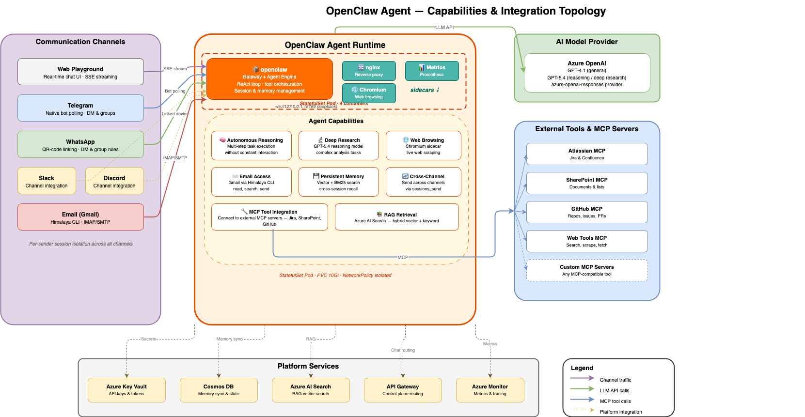

#### What Can an OpenClaw Agent Do?

| Capability | Description |
|-----------|-------------|
| **Multi-Channel Messaging** | Communicate with users across **Telegram**, **WhatsApp**, **Slack**, **Discord**, and the **Web Playground** — all from a single agent instance. Each channel supports per-sender session isolation. |
| **Autonomous Reasoning** | Execute complex, multi-step tasks without constant user interaction. The agent plans, reasons, and acts using a ReAct loop with tool orchestration. |
| **Deep Research** | Leverage reasoning models (GPT-5.4) for in-depth analysis, multi-source synthesis, and complex problem-solving tasks. |
| **Web Browsing** | Browse the live internet via a built-in Chromium sidecar. Scrape pages, extract data, and retrieve real-time information. |
| **Email Access (Gmail)** | Read, search, and send emails via the Himalaya CLI skill — IMAP/SMTP integration with Gmail using app passwords stored in Key Vault. |
| **MCP Tool Integration** | Connect to any MCP-compatible server: **Jira/Confluence** (Atlassian), **SharePoint**, **GitHub**, **Web Tools**, or custom servers. Tools are configured per agent. |
| **RAG Retrieval** | Query your organization's knowledge base via Azure AI Search — hybrid vector + keyword search over uploaded documents and data sources. |
| **Persistent Memory** | Hybrid vector + BM25 memory search across sessions. The agent remembers past conversations, user preferences, and context across interactions. |
| **Cross-Channel Delivery** | Send messages across channels using the `sessions_send` tool. A message received in the Playground can trigger a Telegram notification, and vice versa. |
| **Cross-Session Context** | Retrieve and share context across different channels — a WhatsApp conversation can inform a Telegram response for the same user. |
| **Conversation Search** | Search past conversation history across all threads — full-text search over messages with thread context and timestamps. |
| **Chat Tracing** | Every OpenClaw chat execution is traced end-to-end and logged to the platform's execution logs, enabling cost tracking, latency monitoring, and debugging from the Traces UI. |
| **Identity Mapping** | Map user identities across channels (Telegram user ID, WhatsApp phone number, Playground user) to a single profile (roadmap). |

#### Communication Channels — Deep Dive

| Channel | Protocol | Features |
|---------|----------|----------|
| **Web Playground** | SSE streaming via API Gateway → `/v1/chat/completions` | Real-time chat UI, source citations, conversation threads |
| **Telegram** | Native bot long-polling | DM & group support, allowlist-based access control, per-group rules, require-mention option |
| **WhatsApp** | QR-code device linking via WebSocket | DM & group support, per-group rules with custom instructions, phone allowlists, group-level blocking |
| **Slack** | Native channel integration | Direct messages and channel conversations |
| **Discord** | Native channel integration | Server and DM support |
| **Email (Gmail)** | IMAP/SMTP via Himalaya CLI | Read, search, send, reply — agent accesses Gmail without a browser |

#### Architecture

Each OpenClaw agent runs as a **StatefulSet pod** with 4 containers in the tenant's Kubernetes namespace:

| Container | Purpose |
|-----------|---------|
| `openclaw` | Core agent engine — gateway, ReAct loop, tool orchestration, channel polling, session & memory management |
| `nginx` | Reverse proxy for internal routing |
| `browser` | Chromium sidecar for web browsing and scraping |
| `metrics` | Prometheus exporter for monitoring |

All containers communicate via the loopback interface (`ws://127.0.0.1:18789`). The pod is isolated by NetworkPolicy (egress DNS+443 only, ingress from namespace only) and uses a 10Gi PVC for persistent session state and workspace files.

#### How It Works

1. **Deployment:** When a user creates an agent with `agent_type: "openclaw"` via the UI, the platform creates an `OpenClawInstance` CR in the tenant's namespace. The OpenClaw Operator watches for CRs and provisions a StatefulSet with 4 containers.

2. **Configuration:** The CR includes the full agent config:
   - **Model provider** — Azure OpenAI endpoint + API key (from Key Vault), using the `openai-completions` API
   - **Channels** — Telegram bot token + allowlist, WhatsApp QR linking, Slack/Discord tokens
   - **MCP servers** — External tool servers the agent can call (Jira, SharePoint, GitHub, custom)
   - **Skills** — Email (Himalaya), web browsing (Chromium), custom skills
   - **Gateway** — HTTP chat completions endpoint for platform integration

3. **Platform Integration (Playground):** The API Gateway routes chat messages to OpenClaw via WebSocket `chat.send`. Messages are streamed back as events, rendered in real-time in the Playground UI with source citations and RAG context.

4. **Multi-Channel (Telegram/WhatsApp):** OpenClaw natively polls Telegram via long-polling and connects to WhatsApp via linked device. Users message the bot directly — OpenClaw processes the message, calls tools, and replies. A `per-sender` session scope ensures each user gets an isolated conversation.

5. **Cross-Channel Delivery:** The agent can send messages across channels using the `sessions_send` tool. A message received in the Playground can trigger a Telegram notification, and vice versa.

#### Key Configuration (OpenClawInstance CR)

```yaml
apiVersion: openclaw.rocks/v1alpha1
kind: OpenClawInstance
spec:
  config:
    raw:
      agents:
        defaults:
          model:
            primary: azure-openai-responses/gpt-5.4
      channels:
        telegram:
          enabled: true
          dmPolicy: allowlist
          allowFrom: ["<telegram-user-id>"]
      gateway:
        auth:
          mode: none          # loopback-only, protected by NetworkPolicy
        bind: loopback
        http:
          endpoints:
            chatCompletions:
              enabled: true
      models:
        providers:
          azure-openai-responses:
            api: openai-completions   # required for Azure reasoning models
            baseUrl: https://<endpoint>.openai.azure.com/openai/v1
            apiKey: ${AZURE_API_KEY}
  envFrom:
    - secretRef:
        name: <instance>-secrets    # AZURE_API_KEY, TELEGRAM_BOT_TOKEN
  storage:
    persistence:
      enabled: true
      size: 10Gi
```

#### Platform ↔ OpenClaw Integration

| Aspect | Implementation |
|--------|---------------|
| **Agent CRUD** | Platform creates/updates/deletes `OpenClawInstance` CRs via Kubernetes API |
| **Chat** | API Gateway → `POST /v1/chat/completions` on OpenClaw's ClusterIP service |
| **Auth** | Gateway `auth.mode: none` + loopback binding + NetworkPolicy isolation |
| **Secrets** | Platform stores API keys in Key Vault, provisions them as K8s Secrets referenced via `envFrom` |
| **Sessions** | OpenClaw manages its own session state on PVC; platform sends `X-Openclaw-Session-Key` header |
| **Memory** | Platform retrieves relevant memories from Cosmos DB and injects them as context before sending to OpenClaw |
| **Tracing** | LLM Proxy captures token usage from every OpenClaw request; execution logs are written to Cosmos DB `execution_logs` and surfaced in the platform Traces UI |
| **Monitoring** | Prometheus metrics exported on port 9090, scraped by Azure Monitor |

### 3.11 MCP Platform Tools Server

The `mcp-platform-tools` pod is a dedicated **FastMCP server** (port 8085) that exposes platform-internal capabilities as MCP tools. Unlike the external MCP servers (Atlassian, GitHub, SharePoint), this server connects to platform data stores rather than external SaaS APIs.

**Tools exposed:**

| Tool | Category | Description |
|------|----------|-------------|
| `memory_store` | Memory | Store semantic memory with vector embedding (Cosmos DB `agent_memories`) |
| `memory_search` | Memory | Vector similarity search using `VectorDistance()` in Cosmos DB |
| `memory_store_structured` | Memory | Store key-value facts without embeddings (`structured_memories` container, upsert by hash) |
| `memory_get_structured` | Memory | Retrieve structured facts by key or category |
| `conversation_search` | Memory | Full-text search across past conversation history (all threads) for the agent |
| `get_group_instructions` | Config | Fetch WhatsApp group-specific system prompt and settings |
| `get_agent_config` | Config | Agent metadata (safe fields only) |
| `list_configured_groups` | Config | All WhatsApp groups for an agent |

**Architecture:** Built with FastMCP + Starlette (async Python). Uses Azure OpenAI `text-embedding-3-large` for embedding generation. Runs 2 replicas with HPA. Authenticates to Azure via Workload Identity (no API keys in pods).

### 3.12 Auth Gateway

The `auth-gateway` pod provides **OIDC authentication and reverse proxying** for OpenClaw agent native UIs. When users access an agent's web interface at `/agents/{slug}`, the auth gateway:

1. Initiates an Entra ID OIDC login flow
2. Validates the user's identity and tenant membership
3. Proxies authenticated requests (including WebSocket upgrades) to the correct OpenClaw pod in the tenant namespace
4. Injects **per-agent localStorage namespacing** so multiple agent consoles can run in separate browser tabs without session cross-contamination
5. Patches the **JS bundle server-side** to replace OpenClaw branding with the agent's display name in the sidebar

**Key features:**

- **localStorage Isolation:** All agents share the same browser origin (path-based routing). The gateway injects a script that prefixes all `localStorage` keys with `__oc_{agent_id}_`, preventing one agent's settings from interfering with another's.
- **Agent Branding:** The gateway replaces `>OpenClaw</span>` in the JS bundle and the `<title>` tag with the agent's name, so each console clearly identifies which agent it belongs to. JS responses include `Cache-Control: no-cache` to prevent cross-agent browser caching.
- **WebSocket Proxy:** Full bidirectional WebSocket proxying from the browser to the correct OpenClaw pod, including Origin header forwarding for CORS compatibility.
- **Rate Limiting, Pod Disruption Budget for HA, session cookie management.**

### 3.13 LLM Proxy (Token Proxy)

The `llm-proxy` pod is a **transparent HTTP proxy** that sits between OpenClaw agents and Azure OpenAI. It intercepts LLM requests, forwards them to the real Azure OpenAI endpoint, and captures token usage from responses for cost tracking.

**Routes proxied:** `/v1/chat/completions`, `/v1/embeddings`, and other OpenAI-compatible endpoints.

**Why:** OpenClaw manages its own LLM calls independently. The LLM Proxy allows the platform to track token usage and costs for OpenClaw agents without modifying the OpenClaw runtime.

### 3.14 Channel Registration Guide

This section explains how to connect an OpenClaw agent to external messaging channels. Each channel requires specific credentials obtained outside the platform, which are then provided during agent creation or update via the UI (Channel Wizard) or the API.

#### Overview — Credential Flow

```
User obtains credentials (external)
  ↓
Frontend Channel Wizard (or API POST /agents)
  ↓  raw secrets are sent once
API Gateway
  ├── Strips raw secrets from payload
  ├── Stores them in Azure Key Vault
  └── Saves secret-name reference in Cosmos DB
  ↓
OpenClaw CR deployed to tenant namespace
  ↓
CSI Secret Provider mounts Key Vault secrets as env vars
  ↓
OpenClaw pod starts with channel credentials available
```

> **Security:** Raw secrets (tokens, passwords) are **never** stored in the database. Only Key Vault secret-name references are persisted. The actual values are mounted at pod runtime via CSI Secret Provider.

#### 3.14.1 WhatsApp Registration

WhatsApp uses **QR-code device linking** — no API keys or tokens required.

**Prerequisites:**
- A phone with WhatsApp installed
- The phone number must remain active (WhatsApp session is tied to the device)

**Step-by-Step:**

1. **Create or update an agent** with WhatsApp enabled:
   - In the UI: Open the Channel Wizard → enable WhatsApp
   - Via API: Set `openclaw_config.whatsapp.whatsapp_enabled: true`

2. **Configure access control:**
   - `whatsapp_dm_policy` — `"allowlist"` (only listed phones) or `"pairing"` (pair request flow)
   - `whatsapp_group_policy` — `"allowlist"` (only listed groups)
   - `whatsapp_allowed_phones` — Array of phone numbers for DM access (e.g., `["+972508880989"]`)
   - `whatsapp_group_rules` — Per-group configuration:

   > **Security default:** The `groupAllowFrom` (who can trigger the agent in groups) is locked down by default to the same phone numbers in `whatsapp_allowed_phones`. Only if a group is explicitly set to `policy: "open"` does `groupAllowFrom` widen to `["*"]`. This means the agent will only process messages from approved contacts unless explicitly configured otherwise.

     ```json
     {
       "group_name": "Family Group",
       "group_jid": "120363012345678@g.us",
       "require_mention": false,
       "allowed_phones": ["+972508880989"],
       "instructions": "Respond in Hebrew"
     }
     ```

3. **Deploy the agent** — the platform creates the OpenClaw CR and pod.

4. **Link WhatsApp via QR code:**
   - In the UI: Click "Link WhatsApp" → the QR code appears
   - Via API: `GET /api/v1/agents/{id}/whatsapp/link` → returns base64 PNG QR code
   - Open WhatsApp on your phone → **Linked Devices** → **Link a Device** → scan the QR code
   - The session is established. Credentials are stored on the pod's PVC (`/home/openclaw/.openclaw/credentials/whatsapp/`).

5. **Verify connection:**
   - UI shows connection status automatically
   - Via API: `GET /api/v1/agents/{id}/whatsapp/link-status` → `{"status": "connected"}`

6. **Discover groups:**
   - After linking, the agent auto-discovers groups it's a member of
   - `GET /api/v1/agents/{id}/groups` returns the list with group JIDs
   - Use these JIDs in `whatsapp_group_rules` for per-group configuration

**API Endpoints:**

| Method | Endpoint | Purpose |
|--------|----------|--------|
| `GET` | `/api/v1/agents/{id}/whatsapp/link` | Get QR code for pairing |
| `GET` | `/api/v1/agents/{id}/whatsapp/link-status` | Check if WhatsApp is connected |
| `POST` | `/api/v1/agents/{id}/whatsapp/logout` | Clear session (requires re-link) |
| `GET` | `/api/v1/agents/{id}/groups` | List discovered groups |

> **Note:** WhatsApp credentials are **not** stored in Key Vault — the Baileys session lives on the pod's PVC. To re-link, call the logout endpoint and scan a new QR code.

#### 3.14.2 Telegram Registration

Telegram uses a **Bot Token** obtained from BotFather.

**Prerequisites:**
- A Telegram account
- Access to **@BotFather** on Telegram

**Step-by-Step:**

1. **Create a Telegram bot:**
   - Open Telegram → search for **@BotFather** → send `/newbot`
   - Follow the prompts to set a name and username
   - BotFather returns a **Bot Token** like: `123456:ABC-DEF1234ghIkl-zyx57W2v1u123ew11`
   - Copy this token — you will need it in the next step

2. **Get your Telegram User ID** (for DM allowlist):
   - Search for **@userinfobot** on Telegram → send any message → it replies with your user ID (e.g., `123456789`)
   - For group rules, get group IDs by adding **@RawDataBot** to the group temporarily

3. **Create or update the agent** with Telegram config:
   - In the UI: Open Channel Wizard → enable Telegram → paste the Bot Token and user IDs
   - Via API:
     ```json
     {
       "openclaw_config": {
         "channels": {
           "telegram_enabled": true,
           "telegram_bot_token": "123456:ABC-DEF1234ghIkl-zyx57W2v1u123ew11",
           "telegram_allowed_users": ["123456789", "987654321"],
           "dm_policy": "allowlist",
           "telegram_group_rules": [
             {
               "group_name": "Dev Team",
               "group_id": "-1001234567890",
               "policy": "open",
               "require_mention": true,
               "instructions": "Respond in English"
             }
           ]
         }
       }
     }
     ```

4. **What happens behind the scenes:**
   - The API strips `telegram_bot_token` from the payload
   - Stores it in Key Vault as `{tenant}-telegram-bot-token-{agent-slug}`
   - Saves only the secret-name reference (`telegram_bot_token_secret`) in Cosmos DB
   - The OpenClaw pod receives the token as `TELEGRAM_BOT_TOKEN` env var via CSI mount

5. **The bot starts polling** — send a message to your bot on Telegram to verify it responds.

**Reusing an existing token:** If you've already stored a bot token (e.g., from a previous agent), set `telegram_use_existing_secret: true` and provide `telegram_bot_token_secret` with the Key Vault secret name instead of the raw token.

#### 3.14.3 Gmail Registration

Gmail uses an **App Password** for IMAP/SMTP access via the Himalaya CLI.

**Prerequisites:**
- A Gmail account
- **2-Step Verification** must be enabled on the Google Account

**Step-by-Step:**

1. **Enable 2-Step Verification** (if not already):
   - Go to [Google Account Security](https://myaccount.google.com/security)
   - Under "How you sign in to Google" → enable **2-Step Verification**

2. **Generate an App Password:**
   - Go to [App Passwords](https://myaccount.google.com/apppasswords)
   - Select **Mail** as the app and your device
   - Google generates a **16-character password** (e.g., `abcd efgh ijkl mnop`)
   - Copy this password — spaces are automatically removed by the platform

3. **Create or update the agent** with Gmail config:
   - In the UI: Open Channel Wizard → enable Gmail → enter the email address and app password
   - Via API:
     ```json
     {
       "openclaw_config": {
         "gmail": {
           "gmail_enabled": true,
           "gmail_email": "your-agent@gmail.com",
           "gmail_app_password": "abcdefghijklmnop",
           "gmail_display_name": "My AI Agent"
         }
       }
     }
     ```

4. **What happens behind the scenes:**
   - The API strips `gmail_app_password` from the payload
   - Removes any spaces or non-breaking spaces Google inserts
   - Stores the password in Key Vault as `{tenant}-gmail-app-password-{agent-slug}`
   - Saves only the secret-name reference (`gmail_app_password_secret`) in Cosmos DB
   - The OpenClaw pod receives the password as `GMAIL_APP_PASSWORD` env var via CSI mount
   - Himalaya CLI inside the pod uses IMAP/SMTP to read, search, and send emails

5. **Verify:** The agent can now read and send emails. Test by sending an email to the configured address and asking the agent to check its inbox.

#### 3.14.4 Key Vault Secret Naming

All channel secrets follow a consistent naming convention in Azure Key Vault:

| Channel | Secret Name Format | Example |
|---------|-------------------|--------|
| Telegram | `{tenant}-telegram-bot-token-{agent}` | `eng-telegram-bot-token-family-agent` |
| Gmail | `{tenant}-gmail-app-password-{agent}` | `eng-gmail-app-password-family-agent` |
| WhatsApp | N/A (QR-based, stored on PVC) | — |

#### 3.14.5 Channel Credential Lifecycle

| Stage | WhatsApp | Telegram | Gmail |
|-------|----------|----------|-------|
| **Obtain** | N/A | @BotFather `/newbot` | Google App Passwords page |
| **Provide** | Scan QR in UI | Paste token in Channel Wizard | Paste password in Channel Wizard |
| **Store** | PVC on pod | Azure Key Vault | Azure Key Vault |
| **DB Reference** | Enabled flag only | Secret name | Secret name |
| **Runtime** | Read from PVC | `TELEGRAM_BOT_TOKEN` env var | `GMAIL_APP_PASSWORD` env var |
| **Rotate** | Re-scan QR code | Update KV secret, redeploy | Update KV secret, redeploy |

---

## 4. Security Architecture

> 📚 **Learn the concepts:** [Security & Isolation (Education)](https://github.com/roie9876/AI-Agent-Platform/blob/main/education/en/12-security-isolation.md)

### 4.1 Authentication Flow

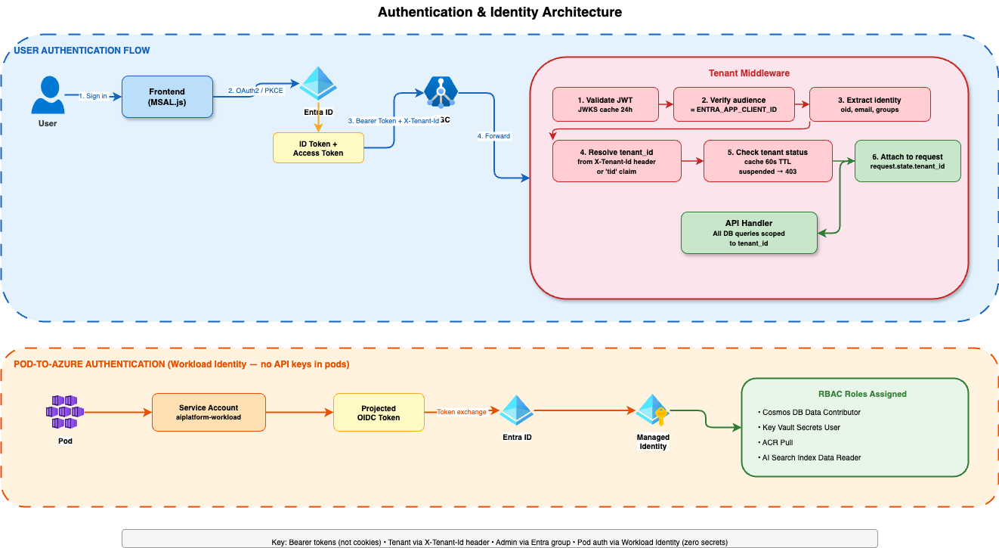

### 4.2 Tenant Isolation Model

| Layer | Mechanism |
|-------|-----------|
| **Identity** | JWT `tid` claim + `X-Tenant-Id` header; multi-tenant Entra ID app |
| **Middleware** | `TenantMiddleware` on every request — extracts, validates, attaches `tenant_id` |
| **Database** | Cosmos DB partition key = `/tenant_id`; all queries include partition key |
| **Kubernetes** | Per-tenant namespaces with `ResourceQuota`, `LimitRange`, `NetworkPolicy` |
| **Network** | NetworkPolicy restricts ingress to ALB controller + same namespace only |

**Cross-tenant leakage is structurally impossible:** Cosmos DB queries without the partition key return empty results. The middleware rejects requests with invalid or missing tenant context.

### 4.3 Secrets Management

| Secret Type | Storage | Access Method |
|------------|---------|---------------|
| LLM API keys | Key Vault (Cosmos endpoint backup, encrypted with Fernet in DB) | Read at execution time, decrypt in memory |
| Azure connection strings | Key Vault | `DefaultAzureCredential` via Workload Identity |
| Entra config (client ID, tenant ID) | Key Vault → ConfigMap | Environment variable injection |
| Service Bus namespace | Key Vault | Workload Identity |

### 4.4 Network Security Boundaries

Each tenant namespace has a `tenant-isolation` NetworkPolicy that restricts egress:

| Rule | Destination | Ports | Purpose |
|------|------------|-------|---------|
| DNS | All namespaces | 53 (UDP/TCP) | Cluster DNS resolution |
| HTTPS egress | Public internet (excl. private ranges) | 443 | LLM APIs, external services |
| Inter-pod | Same namespace (podSelector) | 8000 | Internal microservice calls |
| Chrome CDP VM | `10.0.9.4/32` | 9222, 3389 | Remote browser for agent web browsing |

Ingress is restricted to the ALB controller + pods within the same namespace.

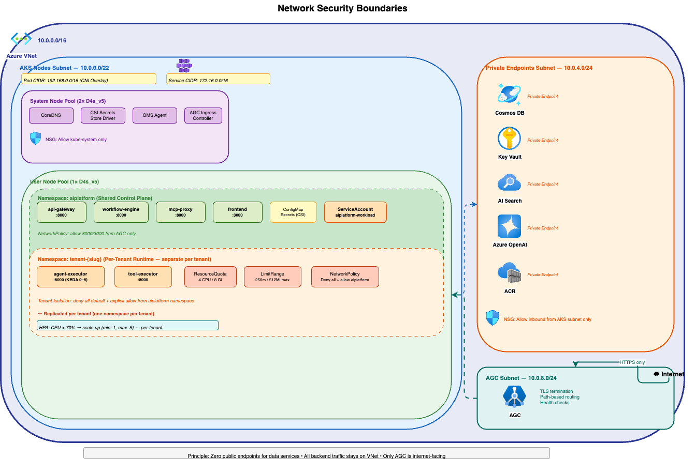

---

## 5. Scalability & Fault Tolerance

> 📚 **Learn the concepts:** [Scalability Patterns (Education)](https://github.com/roie9876/AI-Agent-Platform/blob/main/education/en/13-scalability.md)

### 5.1 Horizontal Pod Autoscaling

All pods can be scaled horizontally. The current configuration runs 1 replica per service with the option for HPA based on CPU/memory metrics.

### 5.2 KEDA Scale-to-Zero

The **Agent Executor** supports a scale-to-zero pattern via Azure Service Bus + KEDA:

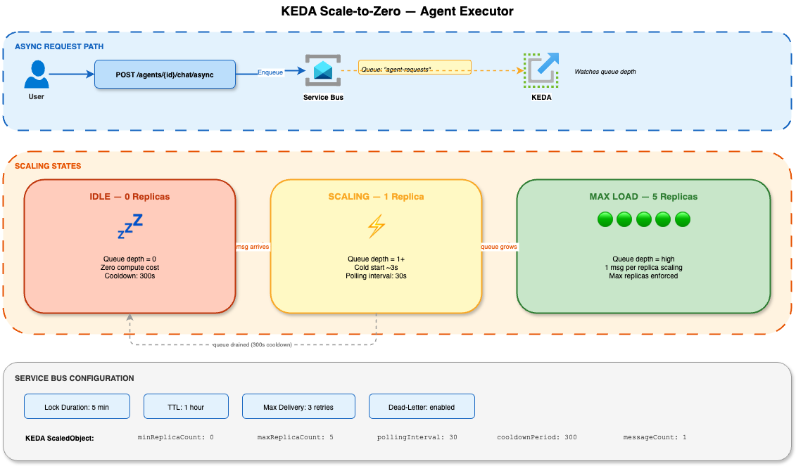

**Service Bus configuration:** 5-minute lock duration, 1-hour TTL, 3 max delivery retries, dead-letter enabled.

### 5.3 Circuit Breaker & Resilience

- **Model endpoints**: Circuit breaker (3 consecutive failures → open for 60s → half-open probe)
- **Fallback chains**: If primary model endpoint fails, route to configured secondary
- **Tool timeouts**: Each tool invocation has a configurable timeout (default 30s)
- **Max iterations**: ReAct loop capped at 10 iterations to prevent infinite loops
- **Graceful degradation**: If RAG retrieval fails, agent still responds (without external context)

### 5.4 Cosmos DB Partition Strategy

All 37 containers use `/tenant_id` as partition key:

- **Single-partition queries**: All tenant-scoped operations are O(1) partition reads (lowest RU cost)
- **Independent scaling**: Each partition scales independently based on storage and throughput
- **Serverless model**: Pay-per-request — no provisioned throughput; auto-scales with load
- **Session consistency**: Strong enough for user-facing operations; avoids global strong consistency cost

---

## 6. Observability

> 📚 **Learn the concepts:** [Observability & Cost (Education)](https://github.com/roie9876/AI-Agent-Platform/blob/main/education/en/11-observability-cost.md)

The platform uses **OpenTelemetry** for distributed tracing across all five microservices, with data exported to Azure Application Insights.

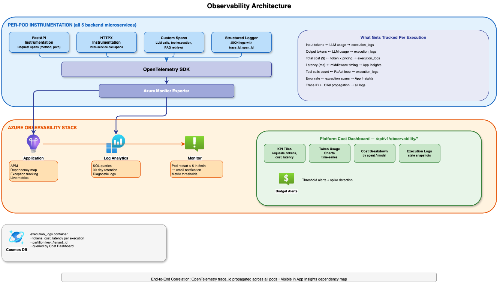

**What gets tracked per execution:**

| Metric | Source | Storage |
|--------|--------|---------|
| Input tokens | LLM `usage` response | `execution_logs` |
| Output tokens | LLM `usage` response | `execution_logs` |
| Total cost ($) | Token count × model pricing | `execution_logs` |
| Latency (ms) | Middleware timing + span duration | App Insights |
| Tool calls count | ReAct loop counter | `execution_logs` |
| Error rate | Exception spans | App Insights |
| Trace ID | OpenTelemetry propagation | All logs |

---

## 7. Microsoft Product Architecture Mapping

> 📚 **Learn the concepts:** [Microsoft Stack Mapping (Education)](https://github.com/roie9876/AI-Agent-Platform/blob/main/education/en/15-microsoft-stack.md)

### 7.1 Logical-to-Physical Mapping

Every logical component maps to a specific Microsoft Azure service:

| Logical Component | Microsoft Product | How It's Used |
|-------------------|-------------------|---------------|
| **Compute** | Azure Kubernetes Service (AKS) | Hosts all 14 pods (13 backend + 1 frontend) |
| **Ingress / Edge** | Application Gateway for Containers (AGC) | TLS termination, path-based routing, health checks |
| **Container Registry** | Azure Container Registry (ACR) | Docker image storage and vulnerability scanning |
| **Primary Database** | Azure Cosmos DB (NoSQL, Serverless) | 37 containers, all platform data, partition key = `/tenant_id` |
| **Search / RAG** | Azure AI Search | Hybrid vector + keyword search for knowledge retrieval |
| **Secrets** | Azure Key Vault | API keys, connection strings, Entra config |
| **Identity (Users)** | Microsoft Entra ID | User SSO, JWT authentication, group-based RBAC |
| **Identity (Pods)** | Azure Workload Identity | Pod-to-Azure auth without secrets |
| **Async Queue** | Azure Service Bus | Agent request queue for KEDA scale-to-zero |
| **Autoscaler** | KEDA | Scale agent-executor 0→5 based on Service Bus queue depth |
| **APM / Traces** | Application Insights | Distributed tracing, dependency map, exception tracking |
| **Log Analytics** | Azure Monitor Log Analytics | KQL queries, 30-day retention, diagnostic logs |
| **Alerts** | Azure Monitor Alerts | Pod restart alerts, metric thresholds |
| **Networking** | Azure VNet + CNI Overlay | Network isolation, pod-level networking |
| **Default LLM** | Azure OpenAI Service | Default LLM provider (Entra ID auth or API key) |
| **Content Safety** | Azure AI Content Safety | Pre/post-execution content filtering (planned) |
| **IaC** | Azure Bicep | 16 modules for all infrastructure provisioning |

### 7.2 Azure Resource Topology

All infrastructure is defined in Bicep and deployed in three waves:

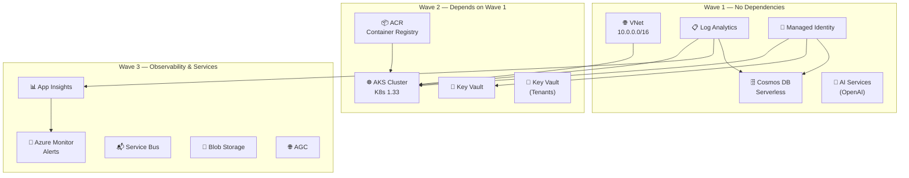
```mermaid
graph TB
    subgraph "Wave 1 — No Dependencies"
        VNet["🌐 VNet<br/>10.0.0.0/16"]
        Log["📋 Log Analytics"]
        Identity["🪪 Managed Identity"]
        Cosmos["🗄️ Cosmos DB<br/>Serverless"]
        AI["🤖 AI Services<br/>(OpenAI)"]
    end

    subgraph "Wave 2 — Depends on Wave 1"
        ACR["📦 ACR<br/>Container Registry"]
        AKS["☸️ AKS Cluster<br/>K8s 1.33"]
        KV["🔐 Key Vault"]
        KVT["🔐 Key Vault<br/>(Tenants)"]
    end

    subgraph "Wave 3 — Observability & Services"
        AppIns["📊 App Insights"]
        Alerts["🚨 Azure Monitor<br/>Alerts"]
        SB["📬 Service Bus"]
        Storage["💾 Blob Storage"]
        AGC["🌐 AGC"]
    end

    VNet --> AKS
    Identity --> AKS & KV & Cosmos
    Log --> AKS & AppIns & Cosmos
    ACR --> AKS
    AppIns --> Alerts
```

| Resource | Bicep Module | Key Config |
|----------|-------------|------------|
| VNet | `vnet.bicep` | CNI Overlay, pod CIDR `192.168.0.0/16`, service CIDR `172.16.0.0/16` |
| AKS | `aks.bicep` | K8s 1.33, system pool (2×D4s_v5), user pool (1–5×D4s_v5 autoscaling), Workload Identity |
| Cosmos DB | `cosmos.bicep` | Serverless, session consistency, vector-enabled containers |
| ACR | `acr.bicep` | Standard SKU, AKS `AcrPull` RBAC |
| Key Vault | `keyvault.bicep` | RBAC-enabled, soft delete (7 days) |
| Key Vault (Tenants) | `keyvault-tenants.bicep` | Per-tenant secret isolation |
| Log Analytics | `loganalytics.bicep` | 30-day retention |
| App Insights | `appinsights.bicep` | Linked to Log Analytics |
| Managed Identity | `identity.bicep` | Workload Identity + AKS identity |
| AGC | `agc.bicep` | Azure ALB ingress controller |
| Alerts | `alerts.bicep` | Pod restart count > 5 in 5min → email |
| AI Services | `ai-services.bicep` | Azure OpenAI account with default embedding model |
| Service Bus | `servicebus.bicep` | Async messaging for KEDA triggers |
| Blob Storage | `storage.bicep` | Agent archives, file uploads |
| DNS Zone | `dns.bicep` | Optional custom agents domain |
| Domain | `domain.bicep` | Optional App Service Domain registration |

### 7.3 End-to-End Request Lifecycle (Microsoft Stack)

This traces a complete chat request through the entire Microsoft stack:

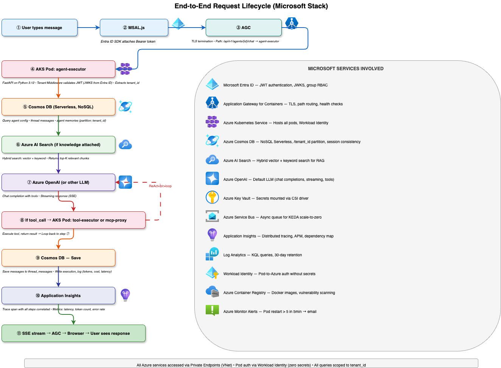

---

## 8. Kubernetes Deployment Architecture

### 8.1 Cluster Topology

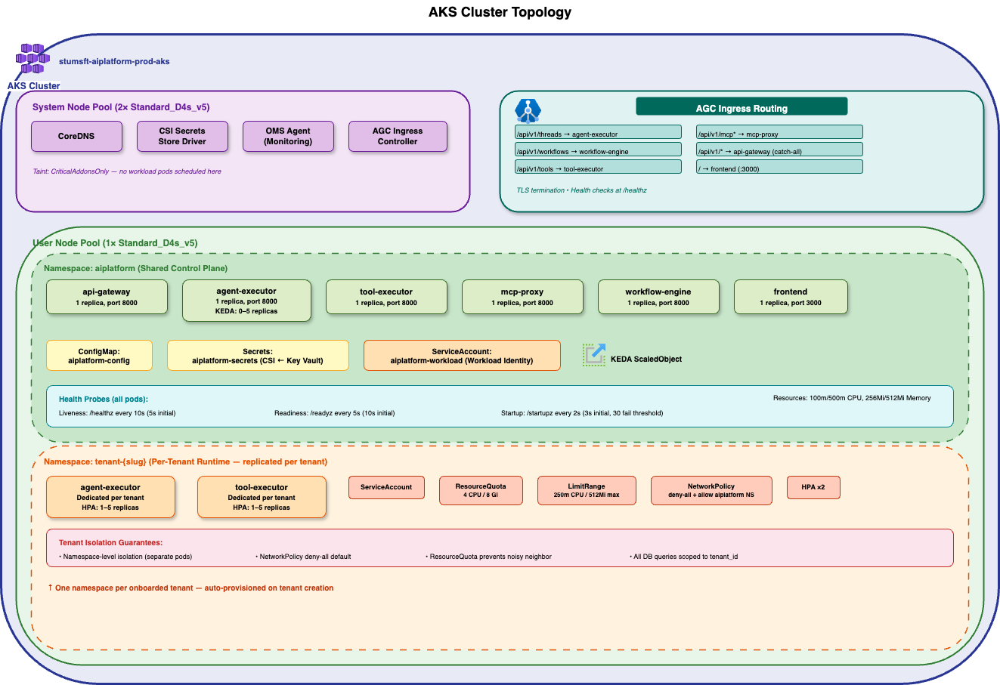

### 8.2 Ingress & Traffic Routing

The AGC ingress routes requests to the correct pod based on URL path prefix. Rules are evaluated top-to-bottom:

| Priority | Path Pattern | Target Service | Port | Responsibility |
|----------|-------------|----------------|------|----------------|
| 1 | `/api/v1/threads` | agent-executor | 8000 | Chat threads, messages |
| 2 | `/api/v1/workflows` | workflow-engine | 8000 | Workflow CRUD & execution |
| 3 | `/api/v1/tools` | tool-executor | 8000 | Tool registry |
| 4 | `/api/v1/data-sources` | tool-executor | 8000 | Data source management |
| 5 | `/api/v1/knowledge` | tool-executor | 8000 | RAG / AI Search indexes |
| 6 | `/api/v1/mcp-servers` | mcp-proxy | 8000 | MCP server registry |
| 7 | `/api/v1/mcp` | mcp-proxy | 8000 | MCP tool operations |
| 8 | `/api/v1/*` | api-gateway | 8000 | All other APIs (catch-all) |
| 9 | `/agents/*` | auth-gateway | 8000 | OpenClaw native UI proxy (Entra ID OIDC) |
| 10 | `/` | frontend | 3000 | Web UI, static assets |

**Important:** The chat endpoint `POST /api/v1/agents/{id}/chat` routes to `agent-executor` via the `/api/v1/threads` path. Agent CRUD (`GET/POST /api/v1/agents`) routes to `api-gateway` via the catch-all.

### 8.3 Pod Configuration

**Shared by all pods:**

| Config | Value |
|--------|-------|
| CPU request / limit | 100m / 500m |
| Memory request / limit | 256Mi / 512Mi |
| Liveness probe | `/healthz` every 10s (5s initial delay) |
| Readiness probe | `/readyz` every 5s (10s initial delay) |
| Startup probe | `/startupz` every 2s (3s initial, 30 failure threshold) |

**ConfigMap (aiplatform-config):**

| Key | Value | Purpose |
|-----|-------|---------|
| `COSMOS_DATABASE` | `aiplatform` | Database name |
| `KEY_VAULT_NAME` | `${KEY_VAULT_NAME}` | Main Key Vault |
| `TENANT_KEY_VAULT_NAME` | `${TENANT_KEY_VAULT_NAME}` | Per-tenant Key Vault |
| `TOOL_EXECUTOR_URL` | `http://tool-executor:8000` | Inter-service call |
| `MCP_PROXY_URL` | `http://mcp-proxy:8000` | Inter-service call |
| `AGENT_EXECUTOR_URL` | `http://agent-executor:8000` | Inter-service call |
| `API_GATEWAY_URL` | `http://api-gateway:8000` | Inter-service call |
| `WORKFLOW_ENGINE_URL` | `http://workflow-engine:8000` | Inter-service call |
| `OTEL_SERVICE_NAME` | `ai-platform` | OpenTelemetry service name |
| `AGENTS_DOMAIN` | `${AGENTS_DOMAIN}` | Custom domain for agent UIs |
| `PLATFORM_BASE_URL` | `${PLATFORM_BASE_URL}` | Platform public URL |
| `ACR_LOGIN_SERVER` | `${ACR_SERVER}` | Container registry |
| `STORAGE_ACCOUNT_NAME` | `${STORAGE_ACCOUNT_NAME}` | Blob storage account |
| `CORS_ORIGINS` | `${CORS_ORIGINS}` | CORS allowed origins |

**Shared codebase pattern:** All backend microservices share the same Python `app/` package. Each microservice's `main.py` creates a FastAPI app and mounts only the relevant routers for that service. A single Dockerfile per service copies the entire `backend/` directory and sets the entry point. The MCP servers (`mcp-atlassian`, `mcp-sharepoint`, `mcp-github`, `mcp-platform-tools`) each run as standalone apps with dedicated Dockerfiles.

---

## 9. Data Model — Cosmos DB Schema

Azure Cosmos DB (serverless, NoSQL) hosts all platform data in 37 containers. Every container uses `/tenant_id` as partition key.

```
Database: aiplatform
│
├── CORE ENTITIES
│   ├── agents                    — Agent definitions (system_prompt, model, config)
│   ├── tools                     — Tool definitions (name, schema, command)
│   ├── threads                   — Conversation containers
│   ├── thread_messages           — Individual messages (user/assistant/tool)
│   ├── workflows                 — Workflow definitions (type, status)
│   ├── workflow_nodes            — Agent nodes in workflow DAG
│   └── workflow_edges            — Edges between nodes (conditions, mappings)
│
├── AGENT CONFIGURATION
│   ├── agent_config_versions     — Version history snapshots
│   ├── agent_tools               — Agent ↔ Tool join table
│   ├── agent_mcp_tools           — Agent ↔ MCP Tool join table
│   ├── agent_data_sources        — Agent ↔ Data Source join table
│   ├── agent_memories            — Long-term memories (text + vector embedding)
│   ├── structured_memories       — Key-value facts without embeddings (upsert by hash)
│   └── agent_templates           — Marketplace agent templates
│
├── TOOL ECOSYSTEM
│   ├── tool_templates            — Marketplace tool templates
│   ├── data_sources              — Data source configurations
│   ├── documents                 — Uploaded file metadata
│   ├── document_chunks           — Parsed text chunks
│   ├── mcp_servers               — MCP server registrations
│   └── mcp_discovered_tools      — Tools discovered from MCP servers
│
├── INFRASTRUCTURE
│   ├── tenants                   — Tenant records (status, settings, quotas)
│   ├── users                     — User accounts
│   ├── model_endpoints           — LLM endpoint configurations
│   ├── model_pricing             — Per-model pricing (input/output per 1k tokens)
│   ├── azure_connections         — Azure resource connections
│   └── azure_subscriptions       — Azure subscription tokens
│
├── EXECUTION & OBSERVABILITY
│   ├── execution_logs            — Per-execution metrics (tokens, cost, latency)
│   ├── execution_results         — Async execution results (keyed by correlation_id)
│   ├── token_logs                — Fine-grained token usage logging for cost tracking
│   ├── test_suites               — Evaluation test suite definitions
│   ├── test_cases                — Individual test cases
│   ├── evaluation_runs           — Batch evaluation executions
│   ├── evaluation_results        — Per-case evaluation results
│   └── cost_alerts               — Budget alerts and thresholds
│
├── WORKFLOW EXECUTION
│   ├── workflow_executions       — Workflow run records
│   └── workflow_node_executions  — Per-node execution results
│
└── OTHER
    ├── catalog_entries           — Data source connector templates
    └── refresh_tokens            — Token revocation tracking
```

---

## 10. Frontend Architecture

The frontend is a **Next.js 15.3** application (React 19, App Router) with **Shadcn/ui** components and **Tailwind CSS 4.0**.

**Authentication:** MSAL.js (Microsoft Entra ID) — browser handles OAuth2/PKCE flow, sends Bearer token on every API call.

**Key pages:**

| Page | Path | Features |
|------|------|----------|
| Dashboard | `/dashboard` | Overview with KPI tiles |
| Agents | `/dashboard/agents` | List, create, delete agents |
| Agent Config | `/dashboard/agents/{id}` | Multi-tab: Playground, Tools, Data Sources, AI Services, Versions |
| Chat | `/dashboard/agents/{id}/chat` | SSE streaming chat, file upload, thread management |
| Workflows | `/dashboard/workflows` | React Flow canvas, node/edge editing |
| Workflow Run | `/dashboard/workflows/{id}/run` | Execution monitor with per-node results |
| Tools | `/dashboard/tools` | Custom tool creation, JSON Schema editor |
| MCP Tools | `/dashboard/mcp-tools` | MCP tool list + server management |
| Data Sources | `/dashboard/data-sources` | File upload, URL ingestion, connector catalog |
| Knowledge | `/dashboard/knowledge` | Knowledge base management, document ingestion |
| Models | `/dashboard/models` | LLM endpoint management (Azure OpenAI, OpenAI, Anthropic) |
| Evaluations | `/dashboard/evaluations` | Test suites, execution runs, score comparison |
| Guardrails | `/dashboard/guardrails` | Agent guardrails configuration |
| Observability | `/dashboard/observability` | KPI tiles, token charts, cost breakdown |
| Logs | `/dashboard/observability/logs` | Structured execution log viewer |
| Cost Analysis | `/dashboard/observability/costs` | Cost breakdown by agent, model, time range |
| Token Usage | `/dashboard/observability/tokens` | Token usage time series |
| Marketplace | `/dashboard/marketplace` | Browse and import agent/tool templates |
| Tenants | `/dashboard/tenants` | Admin: create, configure, suspend tenants |
| Azure | `/dashboard/azure` | Subscription connection, resource discovery |

**Proxy configuration:** API calls from the browser use relative paths (`/api/v1/...`). In production, the AGC ingress routes them directly to backend pods. In development, `next.config.ts` rewrites them to `http://api-gateway:8000`.

---

## 11. Azure Deployment Guide

This section covers deploying the AI Agent Platform to Azure from scratch using `azd up`.

### 11.1 Prerequisites

| Requirement | Details |
|-------------|---------|
| **Azure Subscription** | Active subscription with Owner or Contributor + User Access Administrator roles |
| **Entra ID Role** | **Global Administrator** or **Application Administrator** — required to create the App Registration and grant admin consent for API permissions |
| **Azure CLI** | `az` — [Install](https://learn.microsoft.com/cli/azure/install-azure-cli) |
| **Azure Developer CLI** | `azd` — [Install](https://learn.microsoft.com/azure/developer/azure-developer-cli/install-azd) |
| **kubectl** | [Install](https://kubernetes.io/docs/tasks/tools/) |
| **Helm** | [Install](https://helm.sh/docs/intro/install/) |
| **jq** | `brew install jq` (macOS) or `apt install jq` (Linux) |
| **Git** | For cloning the repo and computing image tags |

### 11.2 Entra ID App Registration (SPN)

The platform uses Microsoft Entra ID for user authentication. An **App Registration** is required and is automatically created by the `preprovision.sh` hook if `entraAppClientId` is empty in your parameter file.

> **Why Global Admin?** The app requires Application-type Microsoft Graph permissions (`User.Read.All`, `Group.ReadWrite.All`) which need admin consent. Only a Global Administrator or Privileged Role Administrator can grant tenant-wide admin consent.

#### What the automation creates

The `preprovision.sh` script will:

1. **Create the App Registration** named `AI-Agent-Platform-{env}`
2. **Expose an API** with scope `access_as_user` (used by the frontend SPA for login)
3. **Define App Roles** for RBAC:
   - `Platform.Admin` — Full platform administration
   - `Tenant.Admin` — Tenant-level administration
   - `Tenant.User` — Standard agent user
4. **Add API Permissions** and grant admin consent:
   - `Microsoft Graph → User.Read.All` (Application) — Read user profiles for tenant management
   - `Microsoft Graph → Group.ReadWrite.All` (Application) — Manage security groups for tenant isolation
5. **Create a Client Secret** (1-year expiry) and store it in the azd environment
6. **Update the Bicep parameter file** with the new client ID

#### If you already have an App Registration

Set the client ID in your parameter file (`infra/parameters/{env}.bicepparam`):

```bicep
param entraAppClientId = 'your-existing-app-client-id'
```

Then the script will skip auto-creation. You must ensure your existing app has:
- **Exposed API:** `api://{clientId}/access_as_user` scope
- **App Roles:** `Platform.Admin`, `Tenant.Admin`, `Tenant.User`
- **API Permissions (Application type, admin consent granted):**
  - `Microsoft Graph → User.Read.All`
  - `Microsoft Graph → Group.ReadWrite.All`
- **A client secret** stored in Key Vault as `entra-client-secret`

### 11.3 Step-by-Step Deployment

#### Step 1: Clone and authenticate

```bash
git clone https://github.com/roie9876/AI-Platform-System.git
cd AI-Platform-System

# Login to Azure (use an account with Global Admin role)
az login
azd auth login
```

#### Step 2: Create and configure environment

```bash
# Create a new azd environment (e.g., "dev", "staging", "prod")
azd env new dev

# Set required variables
azd env set AZURE_LOCATION swedencentral    # or your preferred region
azd env set AZURE_SUBSCRIPTION_ID <your-subscription-id>
```

#### Step 3: Edit the parameter file

Copy and customize the environment parameter file:

```bash
cp infra/parameters/dev.bicepparam infra/parameters/<your-env>.bicepparam
```

Edit the file and update:

| Parameter | Description | Action |
|-----------|-------------|--------|
| `entraAppClientId` | Leave empty (`''`) for auto-creation, or set your existing App Registration client ID | Required |
| `platformAdminEmails` | Comma-separated admin emails (e.g., `admin@yourdomain.com`). Users matching these emails are always granted `platform_admin` role. | Required |
| `entraAdminGroupId` | Object ID of an Entra ID **security group** whose members automatically receive `platform_admin` role (see below) | Recommended |
| `alertEmail` | Email for Azure Monitor alerts | Required |
| `aksSystemNodeVmSize` | VM size for AKS nodes (e.g., `Standard_D2s_v5` for dev) | Optional |

> **What is `entraAdminGroupId`?**
>
> This is the Object ID of a Microsoft Entra ID security group (e.g., "AI Platform Admins"). Any user who is a member of this group is automatically granted the `platform_admin` role when they sign in — giving them full access to manage tenants, agents, and platform-wide settings.
>
> **How to set it up:**
> 1. Go to **Azure Portal → Microsoft Entra ID → Groups → New group**
> 2. Create a **Security** group (e.g., `AI Platform Admins`)
> 3. Add your admin users as members
> 4. Copy the group's **Object ID** and paste it as the `entraAdminGroupId` value
>
> **Why use it?** You can add or remove platform admins directly in Entra ID without redeploying. The `platformAdminEmails` parameter serves as a fallback — it also grants admin access, but requires a redeployment to change.

#### Step 4: Deploy

```bash
azd up -e dev
```

This runs the full pipeline:
1. **`preprovision.sh`** — Validates tools, creates App Registration if needed, copies parameter file
2. **Bicep provisioning** — Creates all Azure resources (~15-20 min on first run):
   - VNet, AKS, ACR, Cosmos DB, Key Vault, Service Bus, App Insights, AGC
   - Azure AI Services (OpenAI) account with default embedding model
   - Managed identities with RBAC role assignments (including deployer admin access)
   - Federated identity credentials for workload identity
3. **`postprovision.sh`** — Configures AKS cluster, builds 11 Docker images, deploys K8s manifests
4. **`postdeploy.sh`** — Final configuration and health checks

#### Step 5: Post-deploy secrets (if using an existing App Registration)

If you let the deployment **auto-create** the App Registration (by leaving `entraAppClientId` empty), this step is already handled — **skip to Step 6**.

If you used an **existing** App Registration, set its client secret in Key Vault:

```bash
KEY_VAULT_NAME="stumsft-aiplat-dev-kv"  # Adjust for your environment

az keyvault secret set --vault-name $KEY_VAULT_NAME \
  --name entra-client-secret \
  --value "<your-client-secret>"

# Restart pods to pick up the new secret
kubectl rollout restart deployment -n aiplatform
```

#### Step 6: Configure frontend environment

The frontend reads the Entra client ID from the API Gateway's `/api/config` endpoint, which gets it from Key Vault. This is fully automated — no manual frontend config needed for Azure deployments.

For local frontend development against the deployed backend, create `frontend/.env.local`:
```
NEXT_PUBLIC_AZURE_CLIENT_ID=<your-app-registration-client-id>
```

### 11.4 Azure AI Services (Auto-Provisioned)

The deployment automatically provisions an Azure AI Services (OpenAI) account with:

- **Account:** `stumsft-aiplat-{env}-ai` — shared across all tenants
- **Default model:** `text-embedding-3-large` — used by the platform's RAG and memory system
- **Key Vault secrets:** `azure-openai-endpoint` and `azure-openai-key` are auto-populated from the provisioned account

**No manual configuration is needed for Azure OpenAI.** The endpoint and key are injected into Key Vault during provisioning.

To deploy additional chat models (e.g., GPT-4.1, o4-mini), platform admins can create them from the Azure Portal or CLI:

```bash
az cognitiveservices account deployment create \
  --resource-group rg-dev \
  --name stumsft-aiplat-dev-ai \
  --deployment-name gpt-4.1 \
  --model-name gpt-4.1 \
  --model-version "2025-04-14" \
  --model-format OpenAI \
  --sku-name Standard \
  --sku-capacity 80
```

> **Future:** Model deployment management will be available directly from the platform UI.

### 11.5 Configure Tool Integrations (Optional)

These are optional — only needed if you want to use specific tool integrations with your agents:

```bash
KEY_VAULT_NAME="stumsft-aiplat-dev-kv"  # Adjust for your environment

# Jira/Confluence integration
az keyvault secret set --vault-name $KEY_VAULT_NAME \
  --name jira \
  --value "<your-jira-api-token>"

# Restart pods to pick up new secrets
kubectl rollout restart deployment -n aiplatform
```

### 11.6 Azure Resources Created

| Resource | Naming Convention | Purpose |
|----------|-------------------|---------|
| Resource Group | `rg-{env}` (user-created) | Container for all resources |
| AKS Cluster | `stumsft-aiplatform-{env}-aks` | Kubernetes cluster |
| ACR | `stumsftaiplatform{env}acr` | Docker image registry |
| Cosmos DB | `stumsft-aiplatform-{env}-cosmos` | Primary database (NoSQL, Serverless) |
| Key Vault | `stumsft-aiplat-{env}-kv` | Secrets management |
| Log Analytics | `stumsft-aiplatform-{env}-logs` | Centralized logging |
| App Insights | `stumsft-aiplatform-{env}-appins` | APM and distributed tracing |
| Key Vault (Tenants) | `stumsft-aiplat-{env}-tkv` | Per-tenant secrets isolation |
| Service Bus | `stumsft-aiplatform-{env}-sb` | Async messaging (KEDA triggers) |
| Storage Account | `stumsftaiplat{env}st` | Blob storage for agent archives |
| VNet | `stumsft-aiplatform-{env}-vnet` | Network isolation |
| AGC | `stumsft-aiplatform-{env}-agc` | Application Gateway for Containers |
| Managed Identity (AKS) | `stumsft-aiplatform-{env}-aks-id` | AKS control plane identity |
| Managed Identity (Workload) | `stumsft-aiplatform-{env}-workload-id` | Pod workload identity |
| AI Services (OpenAI) | `stumsft-aiplat-{env}-ai` | LLM and embedding model hosting |

### 11.7 RBAC Assignments (Auto-Provisioned)

These role assignments are created automatically by Bicep:

| Identity | Role | Scope | Purpose |
|----------|------|-------|---------|
| Workload Identity | Key Vault Secrets User | Key Vault | Read secrets from pods via CSI driver |
| Workload Identity | Cosmos DB Contributor | Cosmos DB account | Read/write database operations |
| Workload Identity | Service Bus Data Owner | Service Bus namespace | Send/receive async messages |
| Workload Identity | Cognitive Services OpenAI User | AI Services account | Invoke LLM and embedding models |
| Workload Identity | Cognitive Services OpenAI Contributor | AI Services account | Create/manage model deployments via API |
| Workload Identity | Storage Blob Data Contributor | Storage Account | Read/write blob storage for agent archives |
| AKS Identity | AcrPull | ACR | Pull container images |
| Deployer (admin) | Key Vault Secrets Officer | Key Vault (main + tenants) | Read/write secrets in portal & CLI |
| Deployer (admin) | Cosmos DB Data Contributor | Cosmos DB account | Access data in Data Explorer |
| Deployer (admin) | Service Bus Data Owner | Service Bus namespace | Manage queues in portal |
| Deployer (admin) | Cognitive Services OpenAI Contributor | AI Services account | Manage model deployments |

### 11.8 Deployment Pipeline (Manual)

For subsequent deployments or single-service updates:

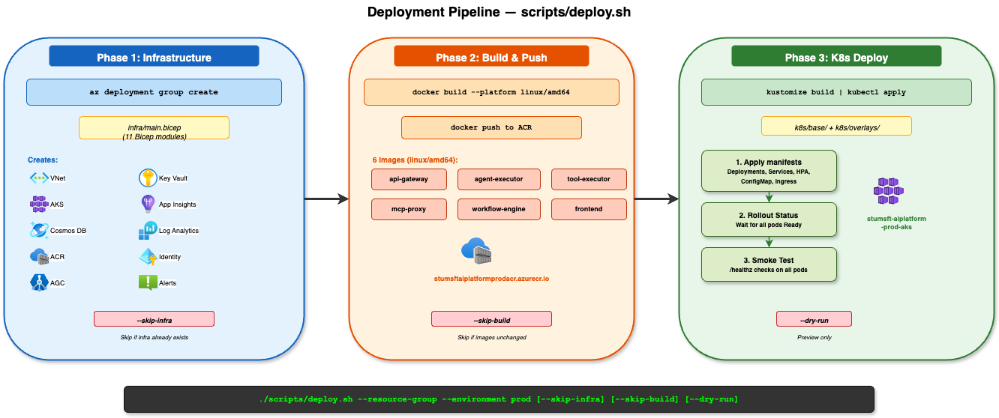

```bash
./scripts/deploy.sh \
  --resource-group <rg-name> \
  --environment prod \
  [--skip-infra]     # Skip Bicep deployment
  [--skip-build]     # Skip Docker build
  [--dry-run]        # Preview only
```

**Manual single-service deployment:**
```bash
# Build for AKS (linux/amd64 required)
docker build --platform linux/amd64 \
  -t stumsftaiplatformprodacr.azurecr.io/aiplatform-<service>:latest \
  -f backend/microservices/<service>/Dockerfile backend/

# Push to ACR
az acr login --name stumsftaiplatformprodacr
docker push stumsftaiplatformprodacr.azurecr.io/aiplatform-<service>:latest

# Restart deployment
kubectl rollout restart deployment/<service> -n aiplatform
```

### 11.9 Troubleshooting

| Problem | Cause | Fix |
|---------|-------|-----|
| `AADSTS700016: Application not found` | Wrong `entraAppClientId` in param file | Verify client ID matches your App Registration |
| Pods stuck in `CreateContainerConfigError` | Missing Key Vault secrets | Run Step 5 (post-deploy secrets) and restart pods |
| `401 Unauthorized` on API calls | Client secret expired or missing | Rotate secret: `az ad app credential reset`, update Key Vault |
| `AZURE_OPENAI_ENDPOINT` empty | AI Services account not yet provisioned | Re-run `azd up` — endpoint is auto-populated from the provisioned AI account |
| ACR pull errors | AKS identity missing AcrPull role | Re-run `azd up` to fix RBAC, or add manually |
| Frontend login redirect fails | Missing SPA redirect URI | Add your domain to App Registration → Authentication → SPA |

---

## 12. Local Development

### Option 1: Native (Recommended)

```bash
./start.sh
```

| Service | Port | Description |
|---------|------|-------------|
| Backend | 8000 | FastAPI (uvicorn --reload) |
| Frontend | 3000 | Next.js (npm run dev) |
| MCP Web Tools | 8081 | Demo MCP server |
| MCP Atlassian | 8082 | Demo Jira/Confluence MCP |

### Option 2: Docker Compose

```bash
./start-docker.sh                                     # Monolith mode
docker compose -f docker-compose.microservices.yml up  # Microservices mode
```

---

## 13. API Reference

### Authentication
| Method | Path | Service |
|--------|------|---------|
| `GET` | `/api/v1/auth/me` | api-gateway |
| `POST` | `/api/v1/azure/auth/device-code` | api-gateway |
| `POST` | `/api/v1/azure/auth/device-code/token` | api-gateway |

### Agents
| Method | Path | Service |
|--------|------|---------|
| `POST` | `/api/v1/agents` | api-gateway |
| `GET` | `/api/v1/agents` | api-gateway |
| `GET` | `/api/v1/agents/{id}` | api-gateway |
| `PUT` | `/api/v1/agents/{id}` | api-gateway |
| `DELETE` | `/api/v1/agents/{id}` | api-gateway |
| `GET` | `/api/v1/agents/{id}/versions` | api-gateway |
| `POST` | `/api/v1/agents/{id}/rollback/{version}` | api-gateway |
| `GET` | `/api/v1/agents/{id}/whatsapp/link` | api-gateway |
| `GET` | `/api/v1/agents/{id}/whatsapp/link-status` | api-gateway |
| `POST` | `/api/v1/agents/{id}/whatsapp/logout` | api-gateway |
| `GET` | `/api/v1/agents/{id}/groups` | api-gateway |
| `POST` | `/api/v1/agents/{id}/groups/refresh-cache` | api-gateway |

### Chat & Threads
| Method | Path | Service |
|--------|------|---------|
| `POST` | `/api/v1/agents/{id}/chat` | agent-executor |
| `POST` | `/api/v1/agents/{id}/chat/upload` | agent-executor |
| `POST` | `/api/v1/agents/{id}/chat/async` | agent-executor |
| `GET` | `/api/v1/agents/executions/{correlation_id}` | agent-executor |
| `GET` | `/api/v1/threads` | agent-executor |
| `POST` | `/api/v1/threads` | agent-executor |
| `GET` | `/api/v1/threads/{id}` | agent-executor |
| `GET` | `/api/v1/threads/{id}/messages` | agent-executor |
| `PATCH` | `/api/v1/threads/{id}` | agent-executor |
| `DELETE` | `/api/v1/threads/{id}` | agent-executor |
| `DELETE` | `/api/v1/threads` | agent-executor |

### Memories
| Method | Path | Service |
|--------|------|---------|
| `GET` | `/api/v1/agents/{id}/memories` | agent-executor |
| `DELETE` | `/api/v1/agents/{id}/memories/{memory_id}` | agent-executor |
| `DELETE` | `/api/v1/agents/{id}/memories` | agent-executor |

### Tools
| Method | Path | Service |
|--------|------|---------|
| `POST` | `/api/v1/tools` | tool-executor |
| `GET` | `/api/v1/tools` | tool-executor |
| `GET` | `/api/v1/tools/{id}` | tool-executor |
| `PUT` | `/api/v1/tools/{id}` | tool-executor |
| `DELETE` | `/api/v1/tools/{id}` | tool-executor |
| `POST` | `/api/v1/agents/{id}/tools` | tool-executor |
| `DELETE` | `/api/v1/agents/{id}/tools/{tool_id}` | tool-executor |

### Data Sources & RAG
| Method | Path | Service |
|--------|------|---------|
| `POST` | `/api/v1/data-sources` | tool-executor |
| `GET` | `/api/v1/data-sources` | tool-executor |
| `GET` | `/api/v1/data-sources/{id}` | tool-executor |
| `PUT` | `/api/v1/data-sources/{id}` | tool-executor |
| `DELETE` | `/api/v1/data-sources/{id}` | tool-executor |
| `POST` | `/api/v1/data-sources/{id}/documents` | tool-executor |
| `POST` | `/api/v1/data-sources/{id}/ingest-url` | tool-executor |
| `GET` | `/api/v1/data-sources/{id}/documents` | tool-executor |
| `POST` | `/api/v1/agents/{id}/data-sources` | tool-executor |
| `DELETE` | `/api/v1/agents/{id}/data-sources/{ds_id}` | tool-executor |

### Knowledge
| Method | Path | Service |
|--------|------|---------|
| `GET` | `/api/v1/knowledge` | tool-executor |
| `POST` | `/api/v1/knowledge` | tool-executor |
| `GET` | `/api/v1/knowledge/{kb_id}` | tool-executor |
| `POST` | `/api/v1/knowledge/{kb_id}/documents` | tool-executor |
| `DELETE` | `/api/v1/knowledge/{kb_id}/documents/{doc_id}` | tool-executor |

### MCP
| Method | Path | Service |
|--------|------|---------|
| `POST` | `/api/v1/mcp-servers` | mcp-proxy |
| `GET` | `/api/v1/mcp-servers` | mcp-proxy |
| `GET` | `/api/v1/mcp-servers/{id}` | mcp-proxy |
| `PATCH` | `/api/v1/mcp-servers/{id}` | mcp-proxy |
| `DELETE` | `/api/v1/mcp-servers/{id}` | mcp-proxy |
| `POST` | `/api/v1/mcp-servers/{id}/check-status` | mcp-proxy |
| `GET` | `/api/v1/mcp/tools` | mcp-proxy |
| `POST` | `/api/v1/mcp/discover-all` | mcp-proxy |
| `POST` | `/api/v1/mcp/discover-single` | mcp-proxy |
| `POST` | `/api/v1/mcp/discover-schema` | mcp-proxy |
| `POST` | `/api/v1/agents/{id}/mcp-tools` | mcp-proxy |
| `GET` | `/api/v1/agents/{id}/mcp-tools` | mcp-proxy |
| `DELETE` | `/api/v1/agents/{id}/mcp-tools/{tool_id}` | mcp-proxy |

### Workflows
| Method | Path | Service |
|--------|------|---------|
| `POST` | `/api/v1/workflows` | workflow-engine |
| `GET` | `/api/v1/workflows` | workflow-engine |
| `GET` | `/api/v1/workflows/{id}` | workflow-engine |
| `PUT` | `/api/v1/workflows/{id}` | workflow-engine |
| `DELETE` | `/api/v1/workflows/{id}` | workflow-engine |
| `POST` | `/api/v1/workflows/{id}/nodes` | workflow-engine |
| `DELETE` | `/api/v1/workflows/{id}/nodes/{node_id}` | workflow-engine |
| `POST` | `/api/v1/workflows/{id}/edges` | workflow-engine |
| `DELETE` | `/api/v1/workflows/{id}/edges/{edge_id}` | workflow-engine |
| `POST` | `/api/v1/workflows/{id}/execute` | workflow-engine |
| `GET` | `/api/v1/workflows/{id}/executions` | workflow-engine |
| `GET` | `/api/v1/workflows/{id}/executions/{exec_id}` | workflow-engine |
| `POST` | `/api/v1/workflows/{id}/executions/{exec_id}/cancel` | workflow-engine |

### Model Endpoints
| Method | Path | Service |
|--------|------|---------|
| `POST` | `/api/v1/model-endpoints` | api-gateway |
| `GET` | `/api/v1/model-endpoints` | api-gateway |
| `GET` | `/api/v1/model-endpoints/{id}` | api-gateway |
| `PUT` | `/api/v1/model-endpoints/{id}` | api-gateway |
| `DELETE` | `/api/v1/model-endpoints/{id}` | api-gateway |

### Evaluations
| Method | Path | Service |
|--------|------|---------|
| `GET` | `/api/v1/evaluations/test-suites` | api-gateway |
| `POST` | `/api/v1/evaluations/test-suites` | api-gateway |
| `GET` | `/api/v1/evaluations/test-suites/{id}` | api-gateway |
| `PUT` | `/api/v1/evaluations/test-suites/{id}` | api-gateway |
| `DELETE` | `/api/v1/evaluations/test-suites/{id}` | api-gateway |
| `POST` | `/api/v1/evaluations/test-suites/{id}/cases` | api-gateway |
| `PUT` | `/api/v1/evaluations/test-suites/{id}/cases/{case_id}` | api-gateway |
| `DELETE` | `/api/v1/evaluations/test-suites/{id}/cases/{case_id}` | api-gateway |
| `POST` | `/api/v1/evaluations/test-suites/{id}/run` | api-gateway |
| `GET` | `/api/v1/evaluations/runs` | api-gateway |
| `GET` | `/api/v1/evaluations/runs/{id}` | api-gateway |
| `GET` | `/api/v1/evaluations/runs/{id}/results` | api-gateway |
| `POST` | `/api/v1/evaluations/compare` | api-gateway |

### Observability
| Method | Path | Service |
|--------|------|---------|
| `GET` | `/api/v1/observability/dashboard` | api-gateway |
| `GET` | `/api/v1/observability/tokens` | api-gateway |
| `GET` | `/api/v1/observability/costs` | api-gateway |
| `GET` | `/api/v1/observability/costs/top-agents` | api-gateway |
| `GET` | `/api/v1/observability/logs` | api-gateway |
| `GET` | `/api/v1/observability/alerts` | api-gateway |
| `GET` | `/api/v1/observability/pricing` | api-gateway |
| `POST` | `/api/v1/observability/pricing` | api-gateway |
| `PUT` | `/api/v1/observability/pricing/{id}` | api-gateway |
| `DELETE` | `/api/v1/observability/pricing/{id}` | api-gateway |
| `GET` | `/api/v1/observability/cost-alerts` | api-gateway |
| `POST` | `/api/v1/observability/cost-alerts` | api-gateway |
| `PUT` | `/api/v1/observability/cost-alerts/{id}` | api-gateway |
| `DELETE` | `/api/v1/observability/cost-alerts/{id}` | api-gateway |

### Token Usage
| Method | Path | Service |
|--------|------|---------|
| `GET` | `/api/v1/token-usage` | api-gateway |
| `GET` | `/api/v1/token-usage/summary` | api-gateway |

### Marketplace
| Method | Path | Service |
|--------|------|---------|
| `GET` | `/api/v1/marketplace/agents` | api-gateway |
| `GET` | `/api/v1/marketplace/agents/{id}` | api-gateway |
| `POST` | `/api/v1/marketplace/agents/publish` | api-gateway |
| `POST` | `/api/v1/marketplace/agents/{id}/import` | api-gateway |
| `GET` | `/api/v1/marketplace/tools` | api-gateway |
| `GET` | `/api/v1/marketplace/tools/{id}` | api-gateway |
| `POST` | `/api/v1/marketplace/tools/publish` | api-gateway |
| `POST` | `/api/v1/marketplace/tools/{id}/import` | api-gateway |

### Tenant Management
| Method | Path | Service |
|--------|------|---------|
| `POST` | `/api/v1/tenants` | api-gateway |
| `GET` | `/api/v1/tenants` | api-gateway |
| `GET` | `/api/v1/tenants/{id}` | api-gateway |
| `PATCH` | `/api/v1/tenants/{id}` | api-gateway |
| `PATCH` | `/api/v1/tenants/{id}/state` | api-gateway |
| `PATCH` | `/api/v1/tenants/{id}/settings` | api-gateway |
| `DELETE` | `/api/v1/tenants/{id}` | api-gateway |

### Catalog
| Method | Path | Service |
|--------|------|---------|
| `GET` | `/api/v1/catalog/entries` | api-gateway |
| `POST` | `/api/v1/catalog/entries` | api-gateway |
| `GET` | `/api/v1/catalog/entries/{id}` | api-gateway |

### AI Services
| Method | Path | Service |
|--------|------|---------|
| `GET` | `/api/v1/ai-services` | api-gateway |
| `POST` | `/api/v1/ai-services/toggle` | api-gateway |

### Azure Integration
| Method | Path | Service |
|--------|------|---------|
| `POST` | `/api/v1/azure/auth/device-code` | api-gateway |
| `POST` | `/api/v1/azure/auth/device-code/token` | api-gateway |
| `POST` | `/api/v1/azure/subscriptions` | api-gateway |
| `GET` | `/api/v1/azure/subscriptions` | api-gateway |
| `DELETE` | `/api/v1/azure/subscriptions/{id}` | api-gateway |
| `GET` | `/api/v1/azure/subscriptions/{id}/resources` | api-gateway |
| `GET` | `/api/v1/azure/subscriptions/discover` | api-gateway |
| `GET` | `/api/v1/azure/connections` | api-gateway |
| `POST` | `/api/v1/azure/connections` | api-gateway |
| `GET` | `/api/v1/azure/agents/{id}/connections` | api-gateway |
| `DELETE` | `/api/v1/azure/connections/{id}` | api-gateway |
| `PATCH` | `/api/v1/azure/connections/{id}` | api-gateway |
| `POST` | `/api/v1/azure/connections/{id}/health-check` | api-gateway |

### Internal (Service-to-Service)
| Method | Path | Service |
|--------|------|---------|
| `POST` | `/api/v1/internal/agents/{id}/execute` | agent-executor |
| `POST` | `/api/v1/internal/tools/execute` | tool-executor |
| `POST` | `/api/v1/internal/mcp/call-tool` | mcp-proxy |

Full OpenAPI spec available at `/docs` (Swagger UI) and `/redoc` on each service.

---

## 14. Project Structure

```
├── backend/
│   ├── app/                          # Shared application code (all microservices import this)
│   │   ├── api/v1/                   # API routers (27+ route files)
│   │   ├── core/                     # Config (Pydantic Settings), security (JWT, JWKS), telemetry
│   │   ├── middleware/               # Tenant isolation, OpenTelemetry context
│   │   ├── models/                   # Pydantic/data models (30+ entities)
│   │   ├── repositories/            # Cosmos DB data access layer (37 repos)
│   │   └── services/                # Business logic (20+ services)
│   ├── microservices/               # Per-service entry points
│   │   ├── api_gateway/             # Control Plane: auth, agents, catalog, evaluations, observability
│   │   ├── agent_executor/          # Runtime: chat, threads, memory, ReAct loop
│   │   ├── tool_executor/           # Runtime: tools, data sources, RAG, knowledge
│   │   ├── mcp_proxy/               # Runtime: MCP server registry, tool discovery, protocol bridge
│   │   ├── mcp_platform_tools/      # Runtime: MCP server for memory storage/search & platform config
│   │   ├── workflow_engine/         # Runtime: multi-agent DAG orchestration
│   │   ├── auth_gateway/            # Runtime: OIDC auth proxy for OpenClaw native UIs
│   │   └── llm_proxy/              # Runtime: transparent Azure OpenAI proxy with token logging
│   ├── mcp_server_atlassian.py      # Standalone MCP server for Jira/Confluence
│   ├── mcp_server_github.py         # Standalone MCP server for GitHub
│   ├── mcp_server_sharepoint.py     # Standalone MCP server for SharePoint
│   ├── mcp_server_web_tools.py      # Demo MCP server for web utilities
│   ├── openclaw-plugin-platform-tools/  # OpenClaw plugin for platform tool integration
│   ├── cli/                         # CLI client (Typer)
│   ├── tests/                       # Test suite (pytest)
│   ├── alembic/                     # Database migrations (legacy, pre-Cosmos)
│   ├── requirements.txt             # Python dependencies
│   └── pyproject.toml               # Project metadata
│
├── frontend/
│   └── src/
│       ├── app/                     # Next.js App Router pages
│       │   └── dashboard/           # All dashboard pages (agents, workflows, tools, etc.)
│       ├── components/              # React components (Shadcn/ui + custom)
│       │   ├── agent/               # Agent config UI, channel wizard
│       │   ├── chat/                # Chat interface, markdown renderer
│       │   ├── workflow/            # Workflow canvas, agent nodes, execution monitor
│       │   ├── tools/               # Tool catalog, MCP tool panels
│       │   ├── knowledge/           # Knowledge base UI
│       │   ├── observability/       # Analytics toolbar, KPI tiles, chart cards
│       │   └── ui/                  # Reusable components (badges, filters, etc.)
│       ├── contexts/                # Auth & Tenant context providers
│       └── lib/                     # API client, MSAL config, utilities
│
├── infra/
│   ├── main.bicep                   # Root Bicep template
│   ├── modules/                     # 16 Bicep modules (AKS, Cosmos, ACR, KV, AI, Storage, etc.)
│   └── parameters/                  # Environment-specific parameters
│
├── k8s/
│   └── base/                        # Kustomize manifests
│       ├── ingress.yaml             # AGC routing rules (10 path prefixes)
│       ├── configmap.yaml           # Shared environment config
│       ├── health-check-policies.yaml
│       └── {service}/               # Per-service deployment + service YAML
│           ├── api-gateway/
│           ├── agent-executor/
│           ├── tool-executor/
│           ├── mcp-proxy/
│           ├── mcp-platform-tools/
│           ├── mcp-atlassian/
│           ├── mcp-github/
│           ├── mcp-sharepoint/
│           ├── workflow-engine/
│           ├── auth-gateway/
│           ├── token-proxy/
│           └── frontend/
│
├── scripts/
│   ├── deploy.sh                    # End-to-end deployment script
│   ├── validate-deployment.sh       # Post-deploy health checks
│   └── post-deploy-config.sh        # Post-deploy configuration
│
├── hooks/
│   ├── preprovision.sh              # Entra ID App Registration setup
│   ├── postprovision.sh             # AKS config, Docker build, K8s deploy
│   └── postdeploy.sh               # Final health checks
│
├── docs/
│   └── architecture/
│       └── *.drawio.png             # Architecture diagrams
│
├── docker-compose.yml               # Local dev (monolith mode)
├── docker-compose.microservices.yml  # Local dev (microservices mode)
├── start.sh                         # Native local startup
└── start-docker.sh                  # Docker local startup
```

---

## Technology Stack

| Layer | Technology | Version | Purpose |
|-------|-----------|---------|---------|
| Backend Framework | FastAPI | 0.115+ | Async API, auto OpenAPI spec, Pydantic validation |
| Language | Python | 3.12+ | AI/ML ecosystem native |
| LLM Abstraction | OpenAI Python SDK | 1.40+ | Unified client for Azure OpenAI, OpenAI, and OpenAI-compatible providers |
| Frontend Framework | Next.js | 15 | App Router, SSR, standalone Docker output |
| UI Library | React | 19 | Component architecture |
| Component Library | Shadcn/ui + Tailwind | latest | Modern, accessible components |
| Workflow Editor | React Flow (@xyflow) | 12+ | Visual DAG builder |
| Charts | Recharts | latest | Cost/token visualization |
| Auth (Browser) | MSAL.js | latest | Entra ID OAuth2/PKCE |
| Auth (Backend) | python-jose + azure-identity | latest | JWT validation + Workload Identity |
| Database SDK | azure-cosmos | 4.7+ | Async Cosmos DB client |
| HTTP Client | httpx | 0.28+ | Async inter-service calls |
| Telemetry | OpenTelemetry + Azure Monitor | latest | Distributed tracing |
| Container Runtime | Docker | latest | `--platform linux/amd64` for AKS |
| Orchestration | Kubernetes (AKS) | 1.33 | Pod management, scaling |
| IaC | Azure Bicep | latest | Infrastructure provisioning |

---

*Built by STU-MSFT as an internal AI Agent Platform.*
