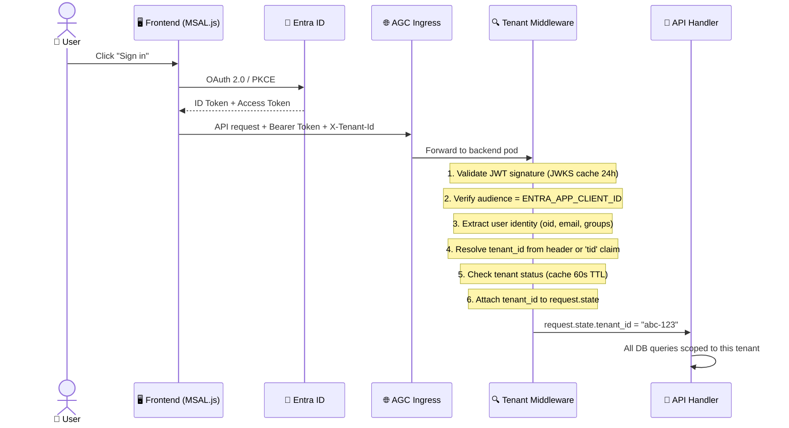
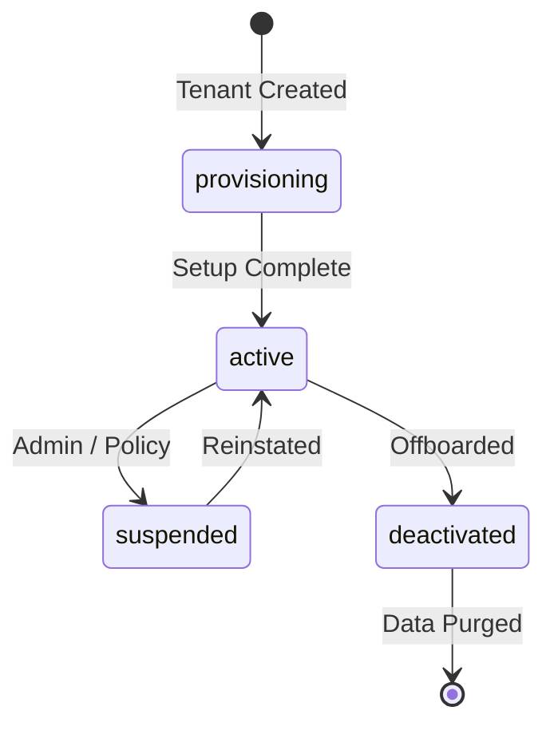
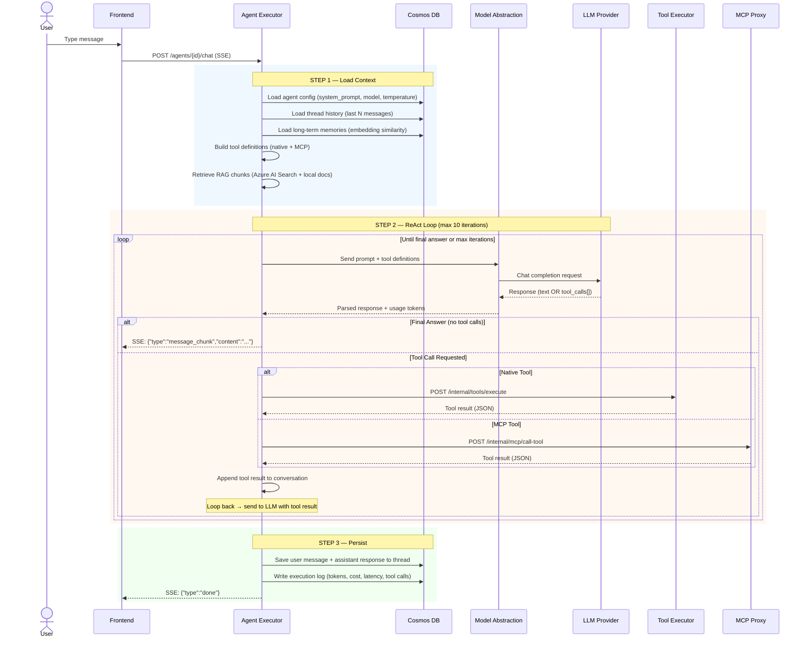
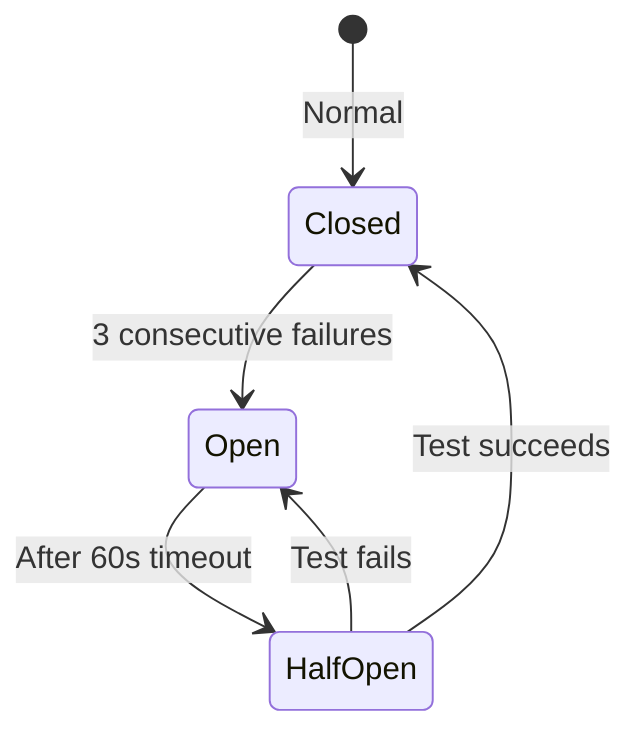
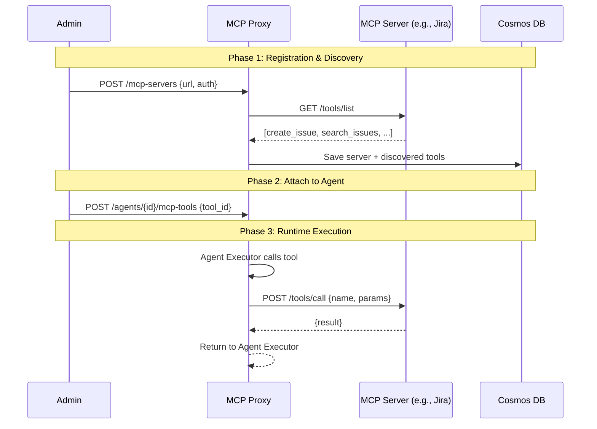
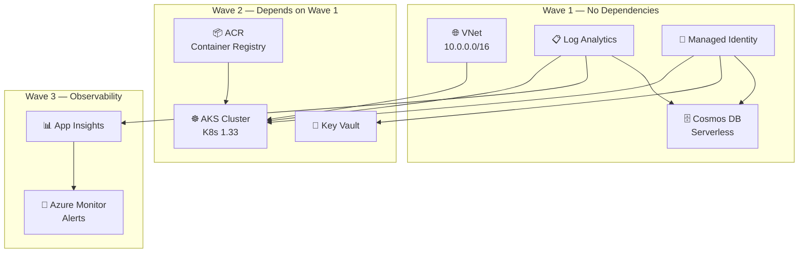

# AI Agent Platform as a Service

A production-grade, multi-tenant AI Agent Platform deployed on Azure Kubernetes Service. Product teams create, configure, and orchestrate AI agents through a self-service UI — with tenant-isolated runtime environments, model-agnostic LLM integration, and full control-plane / runtime-plane separation.

**Core Value:** Go from zero to a working AI agent with tools, data sources, RAG, and multi-agent workflows — without writing infrastructure code or managing model deployments.

## Quick Overview

This platform empowers organizations to bring AI capabilities to their teams with enterprise-grade security, governance, and rapid deployment. Instead of building AI infrastructure from scratch, developers and product managers can use a centralized control plane to build, test, and deployed sophisticated AI agents.

**Key capabilities include:**
- **Create Custom AI Agents:** Configure agents with specific personas, instructions, and capabilities using any preferred underlying LLM.
- **Equip Agents with Tools:** Connect agents directly to internal APIs, databases, or third-party services using integrated tools and the Model Context Protocol (MCP).
- **Manage Multi-Tenant Workloads:** Safely host multiple teams or customers on the same platform with strict data, namespace, and runtime isolation.
- **Orchestrate Complex Workflows:** Chain multiple specialized agents together to solve complex, multi-step business problems.
- **Monitor and Evaluate:** Track token costs, monitor execution latency, and evaluate agent quality from a single pane of glass.


---

## Getting Started

### Prerequisites

| Tool | Version |
|------|---------|
| Docker Desktop | Latest (must be running) |
| Python | 3.11 – 3.13 |
| Node.js | 18+ |
| npm | 9+ |

### Quick Start (one command)

```bash
git clone https://github.com/roie9876/AI-Platform-System.git
cd AI-Platform-System
./start.sh
```

The `start.sh` script handles everything automatically:
1. Starts **PostgreSQL** (with pgvector) and **Redis** via Docker Compose
2. Creates a Python virtual environment and installs backend dependencies
3. Runs database migrations (Alembic)
4. Starts the **FastAPI** backend on `http://localhost:8000`
5. Starts demo **MCP servers** (Web Tools on `:8081`, Atlassian on `:8082`)
6. Installs frontend npm packages and starts the **Next.js** app on `http://localhost:3000`

### Access Points

| Service | URL |
|---------|-----|
| Frontend (UI) | http://localhost:3000 |
| Backend API | http://localhost:8000 |
| API Docs (Swagger) | http://localhost:8000/docs |
| MCP Web Tools | http://localhost:8081/mcp |
| MCP Jira/Confluence | http://localhost:8082/mcp |

### Docker-Only Setup (alternative)

If you prefer running everything inside containers:

```bash
docker compose up --build
```

This starts the backend, frontend, PostgreSQL, and Redis — no local Python or Node.js required.

Press `Ctrl+C` to stop all services.

---

## Table of Contents

- [1. High-Level Architecture](#1-high-level-architecture)
  - [1.1 System-Level View](#11-system-level-view)
  - [1.2 Control Plane vs Runtime Plane](#12-control-plane-vs-runtime-plane)
  - [1.3 Data Layer](#13-data-layer)
- [2. Control Plane — Deep Dive](#2-control-plane--deep-dive)
  - [2.1 API Gateway Pod](#21-api-gateway-pod)
  - [2.2 Authentication & Identity](#22-authentication--identity)
  - [2.3 Tenant Management & Isolation](#23-tenant-management--isolation)
  - [2.4 Agent Registry & Configuration](#24-agent-registry--configuration)
  - [2.5 Policy Engine & Governance](#25-policy-engine--governance)
  - [2.6 Evaluation Engine](#26-evaluation-engine)
  - [2.7 Tool & Agent Marketplace](#27-tool--agent-marketplace)
  - [2.8 Cost Observability Dashboard](#28-cost-observability-dashboard)
- [3. Runtime Plane — Deep Dive](#3-runtime-plane--deep-dive)
  - [3.1 Agent Executor Pod](#31-agent-executor-pod)
  - [3.2 Agent Execution Lifecycle (ReAct Loop)](#32-agent-execution-lifecycle-react-loop)
  - [3.3 Model Abstraction Layer & Multi-Model Routing](#33-model-abstraction-layer--multi-model-routing)
  - [3.4 Memory Management (Short-Term & Long-Term)](#34-memory-management-short-term--long-term)
  - [3.5 Thread & State Management](#35-thread--state-management)
  - [3.6 Tool Executor Pod](#36-tool-executor-pod)
  - [3.7 RAG System (Retrieval-Augmented Generation)](#37-rag-system-retrieval-augmented-generation)
  - [3.8 MCP Proxy Pod](#38-mcp-proxy-pod)
    - [3.8.1 MCP Servers](#381-mcp-servers)
  - [3.9 Workflow Engine Pod](#39-workflow-engine-pod)
- [4. Security Architecture](#4-security-architecture)
  - [4.1 Authentication Flow](#41-authentication-flow)
  - [4.2 Tenant Isolation Model](#42-tenant-isolation-model)
  - [4.3 Secrets Management](#43-secrets-management)
  - [4.4 Network Security Boundaries](#44-network-security-boundaries)
- [5. Scalability & Fault Tolerance](#5-scalability--fault-tolerance)
  - [5.1 Horizontal Pod Autoscaling](#51-horizontal-pod-autoscaling)
  - [5.2 KEDA Scale-to-Zero](#52-keda-scale-to-zero)
  - [5.3 Circuit Breaker & Resilience](#53-circuit-breaker--resilience)
  - [5.4 Cosmos DB Partition Strategy](#54-cosmos-db-partition-strategy)
- [6. Observability](#6-observability)
- [7. Microsoft Product Architecture Mapping](#7-microsoft-product-architecture-mapping)
  - [7.1 Logical-to-Physical Mapping](#71-logical-to-physical-mapping)
  - [7.2 Azure Resource Topology](#72-azure-resource-topology)
  - [7.3 End-to-End Request Lifecycle (Microsoft Stack)](#73-end-to-end-request-lifecycle-microsoft-stack)
- [8. Kubernetes Deployment Architecture](#8-kubernetes-deployment-architecture)
  - [8.1 Cluster Topology](#81-cluster-topology)
  - [8.2 Ingress & Traffic Routing](#82-ingress--traffic-routing)
  - [8.3 Pod Configuration](#83-pod-configuration)
- [9. Data Model — Cosmos DB Schema](#9-data-model--cosmos-db-schema)
- [10. Frontend Architecture](#10-frontend-architecture)
- [11. Deployment Pipeline](#11-deployment-pipeline)
- [12. Local Development](#12-local-development)
- [13. API Reference](#13-api-reference)
- [14. Project Structure](#14-project-structure)

---

## 📚 Companion Education Repository

> **New to AI Agent Platforms?** The **[AI-Agent-Platform Education Hub](https://github.com/roie9876/AI-Agent-Platform)** is a companion repository with 17 in-depth chapters and 10 hands-on labs that teach all the concepts behind this codebase.

| This Repo (Implementation) | Education Chapter | Lab |
|---|---|---|
| [§1 High-Level Architecture](#1-high-level-architecture) | [Ch 14 — HLD Full Architecture](https://github.com/roie9876/AI-Agent-Platform/blob/main/education/en/14-hld-architecture.md) | — |
| [§2 Control Plane](#2-control-plane--deep-dive) | [Ch 08 — Control Plane](https://github.com/roie9876/AI-Agent-Platform/blob/main/education/en/08-control-plane.md) | — |
| [§3 Runtime Plane](#3-runtime-plane--deep-dive) | [Ch 09 — Runtime Plane](https://github.com/roie9876/AI-Agent-Platform/blob/main/education/en/09-runtime-plane.md) | — |
| [§3.2 ReAct Loop](#32-agent-execution-lifecycle-react-loop) | [Ch 01 — Fundamentals](https://github.com/roie9876/AI-Agent-Platform/blob/main/education/en/01-fundamentals.md) | [Lab 01](https://github.com/roie9876/AI-Agent-Platform/blob/main/labs/lab-01-react-agent/README.md) |
| [§3.3 Model Abstraction](#33-model-abstraction-layer--multi-model-routing) | [Ch 02 — Model Abstraction & Routing](https://github.com/roie9876/AI-Agent-Platform/blob/main/education/en/02-model-abstraction-routing.md) | [Lab 02](https://github.com/roie9876/AI-Agent-Platform/blob/main/labs/lab-02-model-routing/README.md) |
| [§3.4 Memory + §3.7 RAG](#34-memory-management-short-term--long-term) | [Ch 03 — Memory Management & RAG](https://github.com/roie9876/AI-Agent-Platform/blob/main/education/en/03-memory-management.md) | [Lab 03](https://github.com/roie9876/AI-Agent-Platform/blob/main/labs/lab-03-memory-rag/README.md) |
| [§3.5 Thread & State](#35-thread--state-management) | [Ch 04 — Thread & State Management](https://github.com/roie9876/AI-Agent-Platform/blob/main/education/en/04-thread-state-management.md) | — |
| [§3.9 Workflow Engine](#39-workflow-engine-pod) | [Ch 05 — Orchestration Patterns](https://github.com/roie9876/AI-Agent-Platform/blob/main/education/en/05-orchestration.md) | [Lab 04](https://github.com/roie9876/AI-Agent-Platform/blob/main/labs/lab-04-orchestration/README.md) |
| [§2.7 Marketplace + §3.6 Tools + §3.8 MCP](#27-tool--agent-marketplace) | [Ch 06 — Tools & Marketplace](https://github.com/roie9876/AI-Agent-Platform/blob/main/education/en/06-tools-marketplace.md) | [Lab 05](https://github.com/roie9876/AI-Agent-Platform/blob/main/labs/lab-05-tools-safety/README.md) |
| [§2.5 Policy Engine](#25-policy-engine--governance) | [Ch 07 — Policy & Governance](https://github.com/roie9876/AI-Agent-Platform/blob/main/education/en/07-policy-governance.md) | [Lab 05](https://github.com/roie9876/AI-Agent-Platform/blob/main/labs/lab-05-tools-safety/README.md) |
| [§2.6 Evaluation Engine](#26-evaluation-engine) | [Ch 10 — Evaluation Engine](https://github.com/roie9876/AI-Agent-Platform/blob/main/education/en/10-evaluation-engine.md) | [Lab 06](https://github.com/roie9876/AI-Agent-Platform/blob/main/labs/lab-06-evaluation/README.md) |
| [§2.8 Cost Dashboard + §6 Observability](#28-cost-observability-dashboard) | [Ch 11 — Observability & Cost](https://github.com/roie9876/AI-Agent-Platform/blob/main/education/en/11-observability-cost.md) | [Lab 08](https://github.com/roie9876/AI-Agent-Platform/blob/main/labs/lab-08-observability/README.md) |
| [§4 Security Architecture](#4-security-architecture) | [Ch 12 — Security & Isolation](https://github.com/roie9876/AI-Agent-Platform/blob/main/education/en/12-security-isolation.md) | — |
| [§5 Scalability](#5-scalability--fault-tolerance) | [Ch 13 — Scalability Patterns](https://github.com/roie9876/AI-Agent-Platform/blob/main/education/en/13-scalability.md) | — |
| [§7 Microsoft Stack](#7-microsoft-product-architecture-mapping) | [Ch 15 — Microsoft Stack Mapping](https://github.com/roie9876/AI-Agent-Platform/blob/main/education/en/15-microsoft-stack.md) | — |
| [§3.8 MCP Proxy](#38-mcp-proxy-pod) | [Ch 16 — Agent Frameworks & Ecosystem](https://github.com/roie9876/AI-Agent-Platform/blob/main/education/en/16-agent-frameworks.md) | [Lab 07](https://github.com/roie9876/AI-Agent-Platform/blob/main/labs/lab-07-frameworks/README.md) |

---

## 1. High-Level Architecture

> 📚 **Learn the concepts:** [HLD — Full Architecture (Education)](https://github.com/roie9876/AI-Agent-Platform/blob/main/education/en/14-hld-architecture.md)

### 1.1 System-Level View

The platform is organized into three layers: a **Control Plane** for management, a **Runtime Plane** for execution, and a shared **Data Layer** for persistence. Eight Kubernetes pods (7 backend microservices + 1 frontend) run inside an AKS cluster behind an Application Gateway for Containers (AGC) ingress controller.


### 1.2 Control Plane vs Runtime Plane

The architecture enforces a strict separation between **management** and **execution**. The Control Plane can go down without affecting running agents. The Runtime Plane can scale independently to handle execution load.

| Property | Control Plane | Runtime Plane |
|----------|--------------|---------------|
| **Pods** | `api-gateway` | `agent-executor`, `tool-executor`, `mcp-proxy`, `mcp-atlassian`, `mcp-sharepoint`, `mcp-github`, `workflow-engine` |
| **Purpose** | Configuration, governance, admin ops | Agent execution, tool calls, LLM routing |
| **Traffic Pattern** | Low frequency (admin CRUD) | High frequency (user conversations) |
| **Latency Tolerance** | Seconds acceptable | Milliseconds critical (streaming) |
| **Scaling Strategy** | Minimal (1–2 replicas) | Aggressive (KEDA scale-to-zero → N) |
| **State** | Stateless (reads config from DB) | Stateful (threads, memory, execution state) |
| **If it goes down** | "Can't manage agents" | "Agents don't respond" |


### 1.3 Data Layer

| Service | Technology | Purpose |
|---------|-----------|---------|
| **Primary Database** | Azure Cosmos DB (NoSQL, Serverless) | All platform data — 33 containers, partitioned by `/tenant_id` |
| **Secrets** | Azure Key Vault | API keys, connection strings, Entra config |
| **Search** | Azure AI Search | Hybrid vector + keyword search for RAG retrieval |
| **Observability** | Application Insights + Log Analytics | APM, distributed tracing, KQL queries |
| **Async Queue** | Azure Service Bus | Async agent execution with KEDA scale-to-zero |

---

## 2. Control Plane — Deep Dive

> 📚 **Learn the concepts:** [Control Plane (Education)](https://github.com/roie9876/AI-Agent-Platform/blob/main/education/en/08-control-plane.md)

The Control Plane is the **management surface** of the platform. It is a single pod (`api-gateway`) running FastAPI that handles all administrative and configuration operations. No LLM calls or agent execution happen here.

### 2.1 API Gateway Pod

Despite the name, this is **not** a routing gateway. It is a **control-plane application service** that owns all management APIs. The actual request routing is done by the AGC ingress controller at the edge layer.

**What it owns:**

| Domain | Routes | Description |
|--------|--------|-------------|
| Authentication | `/api/v1/auth/*` | Entra ID SSO, device-code flow |
| Agent CRUD | `/api/v1/agents` | Create, list, update, delete agents |
| Model Endpoints | `/api/v1/model-endpoints` | Register LLM providers (Azure OpenAI, OpenAI, Anthropic, custom) |
| Catalog | `/api/v1/catalog` | Browse data source connector templates |
| Marketplace | `/api/v1/marketplace` | Share and discover agent/tool templates |
| Evaluations | `/api/v1/evaluations` | Test suite management and execution |
| Observability | `/api/v1/observability` | Cost dashboards, token usage, execution logs |
| Tenant Admin | `/api/v1/tenants` | Tenant lifecycle (create, suspend, deactivate) |
| Azure Integration | `/api/v1/azure/*` | Subscription connection, resource discovery |
| AI Services | `/api/v1/ai-services` | Platform-managed AI tools (Bing, Grounding) |

**What it does NOT do:**
- Does not route requests to other services (the ingress does that)
- Does not call LLMs or execute agents
- Does not process chat messages or manage threads

### 2.2 Authentication & Identity

The platform uses **Microsoft Entra ID** for all authentication. No username/password flows exist.



**Key design decisions:**
- **Bearer tokens** (not httpOnly cookies) — tokens managed by MSAL.js in the browser, sent as `Authorization: Bearer <token>` headers
- **Tenant context** — determined by `X-Tenant-Id` header; users can access multiple tenants
- **Platform admin** — identified by Entra group membership or email allowlist
- **Pod-to-Azure auth** — workload identity (OIDC token exchange), no secrets in env vars

### 2.3 Tenant Management & Isolation

The platform implements **logical tenant isolation** using Cosmos DB partition keys. Every container uses `/tenant_id` as its partition key, meaning tenant data is physically separated at the storage layer.



**Provisioning creates:**
1. Kubernetes namespace `tenant-{slug}` with ResourceQuota and NetworkPolicy
2. Entra ID security group for tenant members
3. Default seed data (sample agent, tools)
4. Admin user record linked to Entra identity

**Runtime isolation:**
- Every API request → middleware extracts `tenant_id` → all Cosmos DB queries use it as partition key
- A query without `tenant_id` returns empty results — cross-tenant leakage is structurally impossible
- Tenant status is cached in-memory (60s TTL) — suspended tenants get `403` immediately

### 2.4 Agent Registry & Configuration

Agents are the core entity of the platform. Each agent has:

| Field | Description |
|-------|-------------|
| `name` | Display name |
| `system_prompt` | Instructions defining agent behavior |
| `model_endpoint_id` | Which LLM to use |
| `temperature` | Creativity control (0.0–2.0) |
| `max_tokens` | Maximum response length |
| `timeout` | Execution timeout in seconds |
| `tools[]` | Attached tools (native + MCP) |
| `data_sources[]` | Attached data sources for RAG |
| `knowledge_indexes[]` | Azure AI Search indexes |

**Configuration versioning:** Every update creates a new version snapshot, enabling rollback to any previous configuration.

### 2.5 Policy Engine & Governance

> 📚 **Learn the concepts:** [Policy & Governance (Education)](https://github.com/roie9876/AI-Agent-Platform/blob/main/education/en/07-policy-governance.md)

The policy layer enforces rules at multiple levels:


### 2.6 Evaluation Engine

> 📚 **Learn the concepts:** [Evaluation Engine (Education)](https://github.com/roie9876/AI-Agent-Platform/blob/main/education/en/10-evaluation-engine.md)

The evaluation engine measures agent quality through structured test suites:

```
Test Suite                    Evaluation Run
├── Test Case 1               ├── Result 1 (score: 0.92)
│   ├── input: "..."         │   ├── actual_output: "..."
│   ├── expected_output       │   ├── similarity: 0.92
│   └── keywords: [...]       │   ├── latency_ms: 1240
│                              │   └── tokens: {in: 340, out: 180}
├── Test Case 2               ├── Result 2 (score: 0.85)
└── Test Case N               └── Result N
```

**Workflow:** Create test suite → add test cases → run against agent → compare versions → iterate.

**Metrics computed:**
- Semantic similarity (embedding distance between actual and expected output)
- Keyword matching (presence of required terms)
- Latency (end-to-end response time)
- Token efficiency (tokens per useful output unit)
- Cost per test case

### 2.7 Tool & Agent Marketplace

> 📚 **Learn the concepts:** [Tools & Marketplace (Education)](https://github.com/roie9876/AI-Agent-Platform/blob/main/education/en/06-tools-marketplace.md)

The marketplace enables sharing across tenants:

- **Agent templates**: Pre-built agent configurations with system prompts and tool attachments
- **Tool templates**: Reusable tool definitions with JSON Schema
- **Categories**: Browsable by domain (Sales, Support, Engineering, etc.)
- **Featured**: Curated templates highlighted on dashboard
- **Import**: One-click import creates a copy in the user's tenant (deduplicated)

### 2.8 Cost Observability Dashboard

> 📚 **Learn the concepts:** [Observability & Cost (Education)](https://github.com/roie9876/AI-Agent-Platform/blob/main/education/en/11-observability-cost.md)

Every agent execution logs token usage and cost. The observability API surfaces this data:

| Endpoint | Data |
|----------|------|
| `GET /observability/dashboard` | KPI summary: total requests, tokens, cost ($), avg latency |
| `GET /observability/tokens` | Token usage time series (configurable granularity: 1h, 1d) |
| `GET /observability/costs` | Cost breakdown by agent, model, or time range |
| `GET /observability/logs` | Structured execution logs with state snapshots |
| `POST /observability/alerts` | Budget threshold alerts and spike detection |

**Cost calculation:**
```
cost_per_request = (input_tokens × model.input_price_per_1k / 1000)
                 + (output_tokens × model.output_price_per_1k / 1000)
```

Token counts are captured from the LLM response `usage` object and stored in the `execution_logs` container with each agent invocation.

---

## 3. Runtime Plane — Deep Dive

> 📚 **Learn the concepts:** [Runtime Plane (Education)](https://github.com/roie9876/AI-Agent-Platform/blob/main/education/en/09-runtime-plane.md)

The Runtime Plane handles the actual execution of AI agents. It consists of seven pods that work together: the **Agent Executor** orchestrates the core loop, the **Tool Executor** runs tools and retrieves RAG content, the **MCP Proxy** bridges external tool protocols, three **MCP servers** (`mcp-atlassian`, `mcp-sharepoint`, `mcp-github`) connect to external SaaS APIs, and the **Workflow Engine** coordinates multi-agent flows.

### 3.1 Agent Executor Pod

The **primary execution engine** of the platform. This pod receives user messages, runs the ReAct loop (LLM → Tool → Observe → Repeat), manages conversation threads, and handles memory storage.

| Responsibility | Routes | Description |
|---------------|--------|-------------|
| Chat | `POST /api/v1/agents/{id}/chat` | Send message, receive SSE stream |
| Async Chat | `POST /api/v1/agents/{id}/chat/async` | Queue via Service Bus (KEDA) |
| Threads | `/api/v1/threads/*` | CRUD for conversation sessions |
| Memory | `/api/v1/agents/{id}/memories` | Long-term agent memory |
| Internal Execute | `POST /api/v1/internal/agents/{id}/execute` | Called by Workflow Engine |

### 3.2 Agent Execution Lifecycle (ReAct Loop)

> 📚 **Learn the concepts:** [Fundamentals — What is an AI Agent? (Education)](https://github.com/roie9876/AI-Agent-Platform/blob/main/education/en/01-fundamentals.md)

When a user sends a message, the agent executor runs the **ReAct loop** — Reason (LLM thinks), Act (call tool), Observe (read result), Repeat.



**ReAct loop parameters:**

| Parameter | Default | Description |
|-----------|---------|-------------|
| `MAX_TOOL_ITERATIONS` | 10 | Max LLM↔Tool round-trips before forced stop |
| Agent `timeout` | 120s | Per-agent execution timeout |
| Tool `timeout` | 30s | Per-tool invocation timeout |

### 3.3 Model Abstraction Layer & Multi-Model Routing

> 📚 **Learn the concepts:** [Model Abstraction & Routing (Education)](https://github.com/roie9876/AI-Agent-Platform/blob/main/education/en/02-model-abstraction-routing.md)

The model abstraction layer provides a **unified OpenAI-compatible interface** to 100+ LLM providers. Every model interaction, regardless of provider, goes through the same interface.


**Multi-model routing:** Each agent has a `model_endpoint_id` pointing to a registered endpoint. The platform supports:
- **Azure OpenAI** (Entra ID or API key auth)
- **OpenAI** (API key auth)
- **Anthropic** (API key auth)
- **Custom endpoints** (any OpenAI-compatible API)

**Circuit breaker pattern:**



- **Closed**: All requests pass through to the endpoint
- **Open**: All requests fail-fast immediately (use fallback endpoint if configured)
- **Half-Open**: Allow one test request to probe recovery

**Cost tracking:** Every LLM call captures `usage.prompt_tokens` and `usage.completion_tokens` from the response. The cost calculator multiplies by the per-model pricing stored in `model_pricing` and writes to `execution_logs`.

### 3.4 Memory Management (Short-Term & Long-Term)

> 📚 **Learn the concepts:** [Memory Management & RAG (Education)](https://github.com/roie9876/AI-Agent-Platform/blob/main/education/en/03-memory-management.md)

The platform implements two memory scopes:


**Short-term memory:**
- Conversation history within a single thread
- All messages (user, assistant, system, tool) stored in `thread_messages` container
- Loaded automatically when building the prompt for the next LLM call
- Thread can be resumed — history persists until the thread is deleted

**Long-term memory:**
- Persistent knowledge that survives across threads
- Extracted from conversations via `extract_memories_from_thread` (automated insight extraction)
- Stored as text + vector embedding (OpenAI `text-embedding-3-small`, 1536 dimensions)
- Retrieved via embedding similarity search when constructing agent context
- Scoped per-agent, per-tenant — agent A's memories are never injected into agent B's context

**Memory flow at execution time:**
1. User sends message
2. Load short-term: last N messages from current thread
3. Load long-term: top-K memories by embedding similarity to the user's message
4. Inject both into the system prompt as context
5. Send to LLM

### 3.5 Thread & State Management

> 📚 **Learn the concepts:** [Thread & State Management (Education)](https://github.com/roie9876/AI-Agent-Platform/blob/main/education/en/04-thread-state-management.md)

Threads are conversation containers. Each thread belongs to one agent and one tenant.

```
Thread (id, agent_id, tenant_id, title)
  ├── Message 1 (role: user, content: "Hello")
  ├── Message 2 (role: assistant, content: "Hi! How can I help?")
  ├── Message 3 (role: user, content: "Search for...")
  ├── Message 4 (role: tool, tool_call_id: "xyz", content: "{result}")
  └── Message 5 (role: assistant, content: "I found...")
```

**Thread API:**
- `POST /threads` — Create new conversation
- `GET /threads` — List all threads (tenant-scoped)
- `GET /threads/{id}` — Get thread with messages
- `GET /threads/{id}/messages` — Paginated message history
- `PUT /threads/{id}` — Update title
- `DELETE /threads/{id}` — Delete thread and all messages

**State tracking:** Each agent execution writes an **execution log** capturing:
- Input/output token counts
- Tool calls made (name, input, output)
- Model endpoint used
- Latency (total and per-step)
- Cost (calculated from token counts × pricing)
- State snapshots at each iteration step

These logs power the observability dashboard and enable debugging of agent behavior.

### 3.6 Tool Executor Pod

> 📚 **Learn the concepts:** [Tools & Marketplace (Education)](https://github.com/roie9876/AI-Agent-Platform/blob/main/education/en/06-tools-marketplace.md)

The tool executor manages the **tool registry**, **data source connections**, and **RAG retrieval**. It runs tools in sandboxed subprocesses with input validation and timeout protection.

| Responsibility | Routes | Description |
|---------------|--------|-------------|
| Tool Registry | `/api/v1/tools` | Register tools with JSON Schema for input/output |
| Data Sources | `/api/v1/data-sources` | Connect data sources (file upload, URL, databases) |
| Knowledge/RAG | `/api/v1/knowledge` | Azure AI Search index management |
| Internal Execute | `POST /internal/tools/execute` | Called by Agent Executor during ReAct loop |

**Tool execution flow:**
1. Agent Executor sends tool call request (tool name + parameters)
2. Tool Executor validates parameters against JSON Schema
3. Runs tool in subprocess with timeout (default 30s)
4. Captures stdout/stderr, truncates if output exceeds limit
5. Returns structured JSON result

**Supported data source types:**
- File upload (PDF, DOCX, TXT, MD — parsed and chunked automatically)
- URL ingestion (web scraping)
- SharePoint, OneDrive (via catalog connectors)
- Azure Blob Storage, AWS S3
- SQL Server, PostgreSQL, Cosmos DB

### 3.7 RAG System (Retrieval-Augmented Generation)

> 📚 **Learn the concepts:** [Memory Management & RAG (Education)](https://github.com/roie9876/AI-Agent-Platform/blob/main/education/en/03-memory-management.md)

The RAG pipeline runs at execution time, injecting relevant external knowledge into the agent's prompt before sending to the LLM.


**Two retrieval paths (executed in parallel):**

1. **Local documents** — User-uploaded files are parsed, chunked (1000 chars, 200 overlap), and stored in `document_chunks`. Retrieved by text matching against the user's query.

2. **Azure AI Search indexes** — Externally managed search indexes connected via Azure connections. Retrieved via hybrid search (vector + keyword) for higher relevance. Indexes are attached per-agent via the knowledge management API (`ARRAY_CONTAINS` query ensures per-agent scoping).

**At execution time:**
```python
# Simplified execution flow
local_chunks = rag_service.retrieve(agent_id, query)          # Local docs
search_chunks = rag_service.retrieve_from_azure_search(agent_id, query)  # AI Search
context = format_rag_context(local_chunks + search_chunks)
prompt = f"{system_prompt}\n\n{context}\n\n{user_message}"
response = model_abstraction.chat_completion(prompt)
```

### 3.8 MCP Proxy Pod

> 📚 **Learn the concepts:** [Tools & Marketplace (Education)](https://github.com/roie9876/AI-Agent-Platform/blob/main/education/en/06-tools-marketplace.md) · [Agent Frameworks & Ecosystem (Education)](https://github.com/roie9876/AI-Agent-Platform/blob/main/education/en/16-agent-frameworks.md)

The MCP Proxy bridges the **Model Context Protocol** ecosystem to the platform. MCP is a standardized protocol for tool discovery and invocation across external services. The proxy routes tool calls to the appropriate MCP server based on the server registry.

| Responsibility | Routes | Description |
|---------------|--------|-------------|
| Server Registry | `/api/v1/mcp-servers` | Register/manage MCP server endpoints |
| Tool Discovery | `/api/v1/mcp/tools` | Introspect available tools from servers |
| Tool Execution | `POST /internal/mcp/call-tool` | Proxy tool calls during agent execution |
| Agent Attachment | `/api/v1/agents/{id}/mcp-tools` | Attach/detach discovered tools to agents |

### 3.8.1 MCP Servers

Each external SaaS integration runs as a dedicated MCP server pod. Separate servers are required because each SaaS has a different API and authentication model.

| MCP Server | External Service | API | Auth | Tools | Status |
|---|---|---|---|---|---|
| `mcp-atlassian` | Jira Cloud + Confluence | Atlassian REST API | API Token (Key Vault) | 12 (7 Jira + 5 Confluence) | **Active** |
| `mcp-sharepoint` | SharePoint / OneDrive | Microsoft Graph API | Managed Identity (Entra ID) | — | Planned |
| `mcp-github` | Repos, Issues, PRs | GitHub REST / GraphQL | GitHub App or PAT | — | Planned |

**MCP lifecycle:**



### 3.9 Workflow Engine Pod

> 📚 **Learn the concepts:** [Orchestration Patterns (Education)](https://github.com/roie9876/AI-Agent-Platform/blob/main/education/en/05-orchestration.md)

The workflow engine orchestrates **multi-agent workflows** as directed acyclic graphs (DAGs). Each node is an agent execution, and edges define data flow between agents.

| Responsibility | Routes | Description |
|---------------|--------|-------------|
| Workflow CRUD | `/api/v1/workflows` | Create/edit workflow definitions |
| Nodes & Edges | `/api/v1/workflows/{id}/nodes`, `/edges` | Build the DAG structure |
| Execution | `POST /api/v1/workflows/{id}/execute` | Run workflow end-to-end |
| History | `GET /api/v1/workflows/{id}/executions` | Execution history with per-node results |

**Supported orchestration patterns:**

```
Sequential                    Parallel (Fan-out/Fan-in)
A ──► B ──► C                 ┌──► B ──┐
                         A ──►├──► C ──►├──► E
                              └──► D ──┘

Conditional                   Sub-Agent Delegation
        ┌──► Sales Agent      Supervisor ──► Research ──┐
Classifier──► Support Agent                             │
        └──► Billing Agent    Supervisor ◄──────────────┘
                              Supervisor ──► Writer ──► Done
```

**Execution flow:** The workflow engine traverses the DAG, calling the Agent Executor internally via `POST /api/v1/internal/agents/{agent_id}/execute` for each node, passing tenant context and thread state. Node outputs feed into downstream nodes via `output_mapping` defined on edges.

---

## 4. Security Architecture

> 📚 **Learn the concepts:** [Security & Isolation (Education)](https://github.com/roie9876/AI-Agent-Platform/blob/main/education/en/12-security-isolation.md)

### 4.1 Authentication Flow


### 4.2 Tenant Isolation Model

| Layer | Mechanism |
|-------|-----------|
| **Identity** | JWT `tid` claim + `X-Tenant-Id` header; multi-tenant Entra ID app |
| **Middleware** | `TenantMiddleware` on every request — extracts, validates, attaches `tenant_id` |
| **Database** | Cosmos DB partition key = `/tenant_id`; all queries include partition key |
| **Kubernetes** | Per-tenant namespaces with `ResourceQuota`, `LimitRange`, `NetworkPolicy` |
| **Network** | NetworkPolicy restricts ingress to ALB controller + same namespace only |

**Cross-tenant leakage is structurally impossible:** Cosmos DB queries without the partition key return empty results. The middleware rejects requests with invalid or missing tenant context.

### 4.3 Secrets Management

| Secret Type | Storage | Access Method |
|------------|---------|---------------|
| LLM API keys | Key Vault (Cosmos endpoint backup, encrypted with Fernet in DB) | Read at execution time, decrypt in memory |
| Azure connection strings | Key Vault | `DefaultAzureCredential` via Workload Identity |
| Entra config (client ID, tenant ID) | Key Vault → ConfigMap | Environment variable injection |
| Service Bus namespace | Key Vault | Workload Identity |

### 4.4 Network Security Boundaries


---

## 5. Scalability & Fault Tolerance

> 📚 **Learn the concepts:** [Scalability Patterns (Education)](https://github.com/roie9876/AI-Agent-Platform/blob/main/education/en/13-scalability.md)

### 5.1 Horizontal Pod Autoscaling

All pods can be scaled horizontally. The current configuration runs 1 replica per service with the option for HPA based on CPU/memory metrics.

### 5.2 KEDA Scale-to-Zero

The **Agent Executor** supports a scale-to-zero pattern via Azure Service Bus + KEDA:


**Service Bus configuration:** 5-minute lock duration, 1-hour TTL, 3 max delivery retries, dead-letter enabled.

### 5.3 Circuit Breaker & Resilience

- **Model endpoints**: Circuit breaker (3 consecutive failures → open for 60s → half-open probe)
- **Fallback chains**: If primary model endpoint fails, route to configured secondary
- **Tool timeouts**: Each tool invocation has a configurable timeout (default 30s)
- **Max iterations**: ReAct loop capped at 10 iterations to prevent infinite loops
- **Graceful degradation**: If RAG retrieval fails, agent still responds (without external context)

### 5.4 Cosmos DB Partition Strategy

All 33 containers use `/tenant_id` as partition key:

- **Single-partition queries**: All tenant-scoped operations are O(1) partition reads (lowest RU cost)
- **Independent scaling**: Each partition scales independently based on storage and throughput
- **Serverless model**: Pay-per-request — no provisioned throughput; auto-scales with load
- **Session consistency**: Strong enough for user-facing operations; avoids global strong consistency cost

---

## 6. Observability

> 📚 **Learn the concepts:** [Observability & Cost (Education)](https://github.com/roie9876/AI-Agent-Platform/blob/main/education/en/11-observability-cost.md)

The platform uses **OpenTelemetry** for distributed tracing across all five microservices, with data exported to Azure Application Insights.


**What gets tracked per execution:**

| Metric | Source | Storage |
|--------|--------|---------|
| Input tokens | LLM `usage` response | `execution_logs` |
| Output tokens | LLM `usage` response | `execution_logs` |
| Total cost ($) | Token count × model pricing | `execution_logs` |
| Latency (ms) | Middleware timing + span duration | App Insights |
| Tool calls count | ReAct loop counter | `execution_logs` |
| Error rate | Exception spans | App Insights |
| Trace ID | OpenTelemetry propagation | All logs |

---

## 7. Microsoft Product Architecture Mapping

> 📚 **Learn the concepts:** [Microsoft Stack Mapping (Education)](https://github.com/roie9876/AI-Agent-Platform/blob/main/education/en/15-microsoft-stack.md)

### 7.1 Logical-to-Physical Mapping

Every logical component maps to a specific Microsoft Azure service:

| Logical Component | Microsoft Product | How It's Used |
|-------------------|-------------------|---------------|
| **Compute** | Azure Kubernetes Service (AKS) | Hosts all 6 pods (5 backend + 1 frontend) |
| **Ingress / Edge** | Application Gateway for Containers (AGC) | TLS termination, path-based routing, health checks |
| **Container Registry** | Azure Container Registry (ACR) | Docker image storage and vulnerability scanning |
| **Primary Database** | Azure Cosmos DB (NoSQL, Serverless) | 33 containers, all platform data, partition key = `/tenant_id` |
| **Search / RAG** | Azure AI Search | Hybrid vector + keyword search for knowledge retrieval |
| **Secrets** | Azure Key Vault | API keys, connection strings, Entra config |
| **Identity (Users)** | Microsoft Entra ID | User SSO, JWT authentication, group-based RBAC |
| **Identity (Pods)** | Azure Workload Identity | Pod-to-Azure auth without secrets |
| **Async Queue** | Azure Service Bus | Agent request queue for KEDA scale-to-zero |
| **Autoscaler** | KEDA | Scale agent-executor 0→5 based on Service Bus queue depth |
| **APM / Traces** | Application Insights | Distributed tracing, dependency map, exception tracking |
| **Log Analytics** | Azure Monitor Log Analytics | KQL queries, 30-day retention, diagnostic logs |
| **Alerts** | Azure Monitor Alerts | Pod restart alerts, metric thresholds |
| **Networking** | Azure VNet + CNI Overlay | Network isolation, pod-level networking |
| **Default LLM** | Azure OpenAI Service | Default LLM provider (Entra ID auth or API key) |
| **Content Safety** | Azure AI Content Safety | Pre/post-execution content filtering (planned) |
| **IaC** | Azure Bicep | 10 modules for all infrastructure provisioning |

### 7.2 Azure Resource Topology

All infrastructure is defined in Bicep and deployed in three waves:



| Resource | Bicep Module | Key Config |
|----------|-------------|------------|
| VNet | `vnet.bicep` | CNI Overlay, pod CIDR `192.168.0.0/16`, service CIDR `172.16.0.0/16` |
| AKS | `aks.bicep` | K8s 1.33, system pool (2×D4s_v5), user pool (1×D4s_v5), Workload Identity |
| Cosmos DB | `cosmos.bicep` | Serverless, session consistency, 33 containers |
| ACR | `acr.bicep` | Standard SKU, AKS `AcrPull` RBAC |
| Key Vault | `keyvault.bicep` | RBAC-enabled, soft delete (7 days) |
| Log Analytics | `loganalytics.bicep` | 30-day retention |
| App Insights | `appinsights.bicep` | Linked to Log Analytics |
| Managed Identity | `identity.bicep` | Workload Identity + AKS identity |
| AGC | `agc.bicep` | Azure ALB ingress controller |
| Alerts | `alerts.bicep` | Pod restart count > 5 in 5min → email |

### 7.3 End-to-End Request Lifecycle (Microsoft Stack)

This traces a complete chat request through the entire Microsoft stack:


---

## 8. Kubernetes Deployment Architecture

### 8.1 Cluster Topology


### 8.2 Ingress & Traffic Routing

The AGC ingress routes requests to the correct pod based on URL path prefix. Rules are evaluated top-to-bottom:

| Priority | Path Pattern | Target Service | Port | Responsibility |
|----------|-------------|----------------|------|----------------|
| 1 | `/api/v1/threads` | agent-executor | 8000 | Chat threads, messages |
| 2 | `/api/v1/workflows` | workflow-engine | 8000 | Workflow CRUD & execution |
| 3 | `/api/v1/tools` | tool-executor | 8000 | Tool registry |
| 4 | `/api/v1/data-sources` | tool-executor | 8000 | Data source management |
| 5 | `/api/v1/knowledge` | tool-executor | 8000 | RAG / AI Search indexes |
| 6 | `/api/v1/mcp-servers` | mcp-proxy | 8000 | MCP server registry |
| 7 | `/api/v1/mcp` | mcp-proxy | 8000 | MCP tool operations |
| 8 | `/api/v1/*` | api-gateway | 8000 | All other APIs (catch-all) |
| 9 | `/` | frontend | 3000 | Web UI, static assets |

**Important:** The chat endpoint `POST /api/v1/agents/{id}/chat` routes to `agent-executor` via the `/api/v1/threads` path. Agent CRUD (`GET/POST /api/v1/agents`) routes to `api-gateway` via the catch-all.

### 8.3 Pod Configuration

**Shared by all pods:**

| Config | Value |
|--------|-------|
| CPU request / limit | 100m / 500m |
| Memory request / limit | 256Mi / 512Mi |
| Liveness probe | `/healthz` every 10s (5s initial delay) |
| Readiness probe | `/readyz` every 5s (10s initial delay) |
| Startup probe | `/startupz` every 2s (3s initial, 30 failure threshold) |

**ConfigMap (aiplatform-config):**

| Key | Value | Purpose |
|-----|-------|---------|
| `COSMOS_DATABASE` | `aiplatform` | Database name |
| `TOOL_EXECUTOR_URL` | `http://tool-executor:8000` | Inter-service call |
| `MCP_PROXY_URL` | `http://mcp-proxy:8000` | Inter-service call |
| `MCP_ATLASSIAN_URL` | `http://mcp-atlassian:8082` | Atlassian MCP server |
| `AGENT_EXECUTOR_URL` | `http://agent-executor:8000` | Inter-service call |
| `WORKFLOW_ENGINE_URL` | `http://workflow-engine:8000` | Inter-service call |
| `CORS_ORIGINS` | `["https://aiplatform.stumsft.com", "http://localhost:3000"]` | CORS |

**Shared codebase pattern:** All 7 backend microservices share the same Python `app/` package. Each microservice's `main.py` creates a FastAPI app and mounts only the relevant routers for that service. A single Dockerfile per service copies the entire `backend/` directory and sets the entry point. The MCP servers (`mcp-atlassian`, `mcp-sharepoint`, `mcp-github`) each run as standalone FastAPI apps with dedicated Dockerfiles.

---

## 9. Data Model — Cosmos DB Schema

Azure Cosmos DB (serverless, NoSQL) hosts all platform data in 33 containers. Every container uses `/tenant_id` as partition key.

```
Database: aiplatform
│
├── CORE ENTITIES
│   ├── agents                    — Agent definitions (system_prompt, model, config)
│   ├── tools                     — Tool definitions (name, schema, command)
│   ├── threads                   — Conversation containers
│   ├── thread_messages           — Individual messages (user/assistant/tool)
│   ├── workflows                 — Workflow definitions (type, status)
│   ├── workflow_nodes            — Agent nodes in workflow DAG
│   └── workflow_edges            — Edges between nodes (conditions, mappings)
│
├── AGENT CONFIGURATION
│   ├── agent_config_versions     — Version history snapshots
│   ├── agent_tools               — Agent ↔ Tool join table
│   ├── agent_mcp_tools           — Agent ↔ MCP Tool join table
│   ├── agent_data_sources        — Agent ↔ Data Source join table
│   ├── agent_memories            — Long-term memories (text + embedding)
│   └── agent_templates           — Marketplace agent templates
│
├── TOOL ECOSYSTEM
│   ├── tool_templates            — Marketplace tool templates
│   ├── data_sources              — Data source configurations
│   ├── documents                 — Uploaded file metadata
│   ├── document_chunks           — Parsed text chunks
│   ├── mcp_servers               — MCP server registrations
│   └── mcp_discovered_tools      — Tools discovered from MCP servers
│
├── INFRASTRUCTURE
│   ├── tenants                   — Tenant records (status, settings, quotas)
│   ├── users                     — User accounts
│   ├── model_endpoints           — LLM endpoint configurations
│   ├── model_pricing             — Per-model pricing (input/output per 1k tokens)
│   ├── azure_connections         — Azure resource connections
│   └── azure_subscriptions       — Azure subscription tokens
│
├── EXECUTION & OBSERVABILITY
│   ├── execution_logs            — Per-execution metrics (tokens, cost, latency)
│   ├── test_suites               — Evaluation test suite definitions
│   ├── test_cases                — Individual test cases
│   ├── evaluation_runs           — Batch evaluation executions
│   ├── evaluation_results        — Per-case evaluation results
│   └── cost_alerts               — Budget alerts and thresholds
│
├── WORKFLOW EXECUTION
│   ├── workflow_executions       — Workflow run records
│   └── workflow_node_executions  — Per-node execution results
│
└── OTHER
    ├── catalog_entries           — Data source connector templates
    └── refresh_tokens            — Token revocation tracking
```

---

## 10. Frontend Architecture

The frontend is a **Next.js 15** application (React 19, App Router) with **Shadcn/ui** components and **Tailwind CSS**.

**Authentication:** MSAL.js (Microsoft Entra ID) — browser handles OAuth2/PKCE flow, sends Bearer token on every API call.

**Key pages:**

| Page | Path | Features |
|------|------|----------|
| Agents | `/dashboard/agents` | List, create, delete agents |
| Agent Config | `/dashboard/agents/{id}` | Tabs: Playground, Traces, Monitor, Evaluation, Tools, Data Sources, Knowledge, AI Services, Versions |
| Chat | Agent detail → Playground tab | SSE streaming chat, thread management |
| Workflows | `/dashboard/workflows` | React Flow canvas, node/edge editing, execution monitor |
| Tools | `/dashboard/tools` | Custom tool creation, JSON Schema editor |
| MCP | `/dashboard/mcp-tools` | MCP server registration, tool discovery |
| Data Sources | `/dashboard/data-sources` | File upload, URL ingestion, connector catalog |
| Knowledge | `/dashboard/knowledge` | Azure AI Search connection, index selection |
| Models | `/dashboard/models` | LLM endpoint management (Azure OpenAI, OpenAI, Anthropic) |
| Evaluations | `/dashboard/evaluations` | Test suites, execution runs, score trends |
| Observability | `/dashboard/observability` | KPI tiles, token charts, cost breakdown, logs |
| Marketplace | `/dashboard/marketplace` | Browse and import agent/tool templates |
| Tenants | `/dashboard/tenants` | Admin: create, configure, suspend tenants |
| Azure | `/dashboard/azure` | Subscription connection, resource discovery |

**Proxy configuration:** API calls from the browser use relative paths (`/api/v1/...`). In production, the AGC ingress routes them directly to backend pods. In development, `next.config.ts` rewrites them to `http://api-gateway:8000`.

---

## 11. Deployment Pipeline

End-to-end deployment is orchestrated by `scripts/deploy.sh` in three phases:


```bash
./scripts/deploy.sh \
  --resource-group <rg-name> \
  --environment prod \
  [--skip-infra]     # Skip Bicep deployment
  [--skip-build]     # Skip Docker build
  [--dry-run]        # Preview only
```

**Manual deployment (single service):**
```bash
# Build for AKS (linux/amd64 required)
docker build --platform linux/amd64 \
  -t stumsftaiplatformprodacr.azurecr.io/aiplatform-<service>:latest \
  -f backend/microservices/<service>/Dockerfile backend/

# Push to ACR
az acr login --name stumsftaiplatformprodacr
docker push stumsftaiplatformprodacr.azurecr.io/aiplatform-<service>:latest

# Restart deployment
kubectl rollout restart deployment/<service> -n aiplatform
```

---

## 12. Local Development

### Option 1: Native (Recommended)

```bash
./start.sh
```

| Service | Port | Description |
|---------|------|-------------|
| Backend | 8000 | FastAPI (uvicorn --reload) |
| Frontend | 3000 | Next.js (npm run dev) |
| MCP Web Tools | 8081 | Demo MCP server |
| MCP Atlassian | 8082 | Demo Jira/Confluence MCP |

### Option 2: Docker Compose

```bash
./start-docker.sh                                     # Monolith mode
docker compose -f docker-compose.microservices.yml up  # Microservices mode
```

---

## 13. API Reference

### Authentication
| Method | Path | Service |
|--------|------|---------|
| `GET` | `/api/v1/auth/me` | api-gateway |
| `POST` | `/api/v1/azure/auth/device-code` | api-gateway |
| `POST` | `/api/v1/azure/auth/device-code/token` | api-gateway |

### Agents
| Method | Path | Service |
|--------|------|---------|
| `POST` | `/api/v1/agents` | api-gateway |
| `GET` | `/api/v1/agents` | api-gateway |
| `GET` | `/api/v1/agents/{id}` | api-gateway |
| `PUT` | `/api/v1/agents/{id}` | api-gateway |
| `DELETE` | `/api/v1/agents/{id}` | api-gateway |

### Chat & Threads
| Method | Path | Service |
|--------|------|---------|
| `POST` | `/api/v1/agents/{id}/chat` | agent-executor |
| `POST` | `/api/v1/agents/{id}/chat/async` | agent-executor |
| `GET` | `/api/v1/threads` | agent-executor |
| `POST` | `/api/v1/threads` | agent-executor |
| `GET` | `/api/v1/threads/{id}` | agent-executor |
| `GET` | `/api/v1/threads/{id}/messages` | agent-executor |
| `DELETE` | `/api/v1/threads/{id}` | agent-executor |

### Tools
| Method | Path | Service |
|--------|------|---------|
| `POST` | `/api/v1/tools` | tool-executor |
| `GET` | `/api/v1/tools` | tool-executor |
| `PUT` | `/api/v1/tools/{id}` | tool-executor |
| `DELETE` | `/api/v1/tools/{id}` | tool-executor |

### Data Sources & RAG
| Method | Path | Service |
|--------|------|---------|
| `POST` | `/api/v1/data-sources` | tool-executor |
| `GET` | `/api/v1/data-sources` | tool-executor |
| `POST` | `/api/v1/data-sources/{id}/documents` | tool-executor |
| `POST` | `/api/v1/data-sources/{id}/ingest-url` | tool-executor |

### Knowledge (Azure AI Search)
| Method | Path | Service |
|--------|------|---------|
| `GET` | `/api/v1/knowledge/connections/{id}/indexes` | tool-executor |
| `POST` | `/api/v1/agents/{id}/knowledge/attach/{conn_id}` | tool-executor |
| `DELETE` | `/api/v1/agents/{id}/knowledge/detach/{conn_id}` | tool-executor |

### MCP
| Method | Path | Service |
|--------|------|---------|
| `POST` | `/api/v1/mcp-servers` | mcp-proxy |
| `GET` | `/api/v1/mcp-servers` | mcp-proxy |
| `GET` | `/api/v1/mcp/tools` | mcp-proxy |
| `POST` | `/api/v1/mcp/discover` | mcp-proxy |

### Workflows
| Method | Path | Service |
|--------|------|---------|
| `POST` | `/api/v1/workflows` | workflow-engine |
| `GET` | `/api/v1/workflows` | workflow-engine |
| `POST` | `/api/v1/workflows/{id}/execute` | workflow-engine |
| `GET` | `/api/v1/workflows/{id}/executions` | workflow-engine |

### Model Endpoints
| Method | Path | Service |
|--------|------|---------|
| `POST` | `/api/v1/model-endpoints` | api-gateway |
| `GET` | `/api/v1/model-endpoints` | api-gateway |

### Evaluations
| Method | Path | Service |
|--------|------|---------|
| `POST` | `/api/v1/evaluations/test-suites` | api-gateway |
| `POST` | `/api/v1/evaluations/test-suites/{id}/run` | api-gateway |
| `GET` | `/api/v1/evaluations/runs/{id}` | api-gateway |

### Observability
| Method | Path | Service |
|--------|------|---------|
| `GET` | `/api/v1/observability/dashboard` | api-gateway |
| `GET` | `/api/v1/observability/tokens` | api-gateway |
| `GET` | `/api/v1/observability/costs` | api-gateway |
| `GET` | `/api/v1/observability/logs` | api-gateway |
| `POST` | `/api/v1/observability/alerts` | api-gateway |

### Marketplace
| Method | Path | Service |
|--------|------|---------|
| `GET` | `/api/v1/marketplace/agents` | api-gateway |
| `POST` | `/api/v1/marketplace/agents/{id}/import` | api-gateway |
| `GET` | `/api/v1/marketplace/tools` | api-gateway |

### Tenant Management
| Method | Path | Service |
|--------|------|---------|
| `POST` | `/api/v1/tenants` | api-gateway |
| `GET` | `/api/v1/tenants` | api-gateway |
| `PUT` | `/api/v1/tenants/{id}` | api-gateway |
| `POST` | `/api/v1/tenants/{id}/suspend` | api-gateway |
| `DELETE` | `/api/v1/tenants/{id}` | api-gateway |

### Internal (Service-to-Service)
| Method | Path | Service |
|--------|------|---------|
| `POST` | `/api/v1/internal/agents/{id}/execute` | agent-executor |
| `POST` | `/api/v1/internal/tools/execute` | tool-executor |
| `POST` | `/api/v1/internal/mcp/call-tool` | mcp-proxy |

Full OpenAPI spec available at `/docs` (Swagger UI) and `/redoc` on each service.

---

## 14. Project Structure

```
├── backend/
│   ├── app/                          # Shared application code (all microservices import this)
│   │   ├── api/v1/                   # API routers (18+ route files)
│   │   ├── core/                     # Config (Pydantic Settings), security (JWT, JWKS), telemetry
│   │   ├── middleware/               # Tenant isolation, OpenTelemetry context
│   │   ├── models/                   # Pydantic/data models (30+ entities)
│   │   ├── repositories/            # Cosmos DB data access layer (12+ repos)
│   │   └── services/                # Business logic (15+ services)
│   ├── microservices/               # Per-service entry points
│   │   ├── api_gateway/             # Control Plane: auth, agents, catalog, evaluations, observability
│   │   ├── agent_executor/          # Runtime: chat, threads, memory, ReAct loop
│   │   ├── tool_executor/           # Runtime: tools, data sources, RAG, knowledge
│   │   ├── mcp_proxy/               # Runtime: MCP server registry, tool discovery, protocol bridge
│   │   └── workflow_engine/         # Runtime: multi-agent DAG orchestration
│   ├── cli/                         # CLI client (Typer)
│   ├── tests/                       # Test suite (pytest)
│   ├── alembic/                     # Database migrations (legacy, pre-Cosmos)
│   ├── requirements.txt             # Python dependencies
│   └── pyproject.toml               # Project metadata
│
├── frontend/
│   └── src/
│       ├── app/                     # Next.js App Router pages
│       ├── components/              # React components (Shadcn/ui + custom)
│       ├── contexts/                # Auth & Tenant context providers
│       └── lib/                     # API client, utilities
│
├── infra/
│   ├── main.bicep                   # Root Bicep template
│   ├── modules/                     # 10 Bicep modules (AKS, Cosmos, ACR, KV, etc.)
│   └── parameters/                  # Environment-specific parameters
│
├── k8s/
│   └── base/                        # Kustomize manifests
│       ├── ingress.yaml             # AGC routing rules
│       ├── configmap.yaml           # Shared environment config
│       ├── health-check-policies.yaml
│       └── {service}/               # Per-service deployment + service YAML
│
├── scripts/
│   ├── deploy.sh                    # End-to-end deployment script
│   ├── validate-deployment.sh       # Post-deploy health checks
│   └── post-deploy-config.sh        # Post-deploy configuration
│
├── docs/
│   └── architecture/
│       └── HLD-ARCHITECTURE.md      # Detailed HLD (aspirational design document)
│
├── docker-compose.yml               # Local dev (monolith mode)
├── docker-compose.microservices.yml  # Local dev (microservices mode)
├── start.sh                         # Native local startup
└── start-docker.sh                  # Docker local startup
```

---

## Technology Stack

| Layer | Technology | Version | Purpose |
|-------|-----------|---------|---------|
| Backend Framework | FastAPI | 0.115+ | Async API, auto OpenAPI spec, Pydantic validation |
| Language | Python | 3.12+ | AI/ML ecosystem native |
| LLM Abstraction | OpenAI Python SDK | 1.40+ | Unified client for Azure OpenAI, OpenAI, and OpenAI-compatible providers |
| Frontend Framework | Next.js | 15 | App Router, SSR, standalone Docker output |
| UI Library | React | 19 | Component architecture |
| Component Library | Shadcn/ui + Tailwind | latest | Modern, accessible components |
| Workflow Editor | React Flow (@xyflow) | 12+ | Visual DAG builder |
| Charts | Recharts | latest | Cost/token visualization |
| Auth (Browser) | MSAL.js | latest | Entra ID OAuth2/PKCE |
| Auth (Backend) | python-jose + azure-identity | latest | JWT validation + Workload Identity |
| Database SDK | azure-cosmos | 4.7+ | Async Cosmos DB client |
| HTTP Client | httpx | 0.28+ | Async inter-service calls |
| Telemetry | OpenTelemetry + Azure Monitor | latest | Distributed tracing |
| Container Runtime | Docker | latest | `--platform linux/amd64` for AKS |
| Orchestration | Kubernetes (AKS) | 1.33 | Pod management, scaling |
| IaC | Azure Bicep | latest | Infrastructure provisioning |

---

*Built by STU-MSFT as an internal AI Agent Platform.*
