# AI Agent Platform as a Service (PaaS)

A production-grade, multi-tenant AI Agent Platform deployed on Azure Kubernetes Service (AKS). The platform enables product teams to create, configure, and orchestrate AI agents through a self-service UI — with secure, tenant-isolated runtime environments, model-agnostic LLM integration, and a full control/runtime plane separation.

---

## Table of Contents

- [Architecture Overview](#architecture-overview)
- [Infrastructure — Azure Resource Topology](#infrastructure--azure-resource-topology)
- [Kubernetes Cluster Architecture](#kubernetes-cluster-architecture)
- [Ingress & Traffic Routing](#ingress--traffic-routing)
- [Pod Roles & Responsibilities](#pod-roles--responsibilities)
- [Control Plane vs Runtime Plane](#control-plane-vs-runtime-plane)
- [Tenant Isolation Model](#tenant-isolation-model)
- [Authentication & Identity Flow](#authentication--identity-flow)
- [Application Layer — Backend Architecture](#application-layer--backend-architecture)
- [Agent Execution Lifecycle](#agent-execution-lifecycle)
- [Model Abstraction Layer](#model-abstraction-layer)
- [MCP Protocol Integration](#mcp-protocol-integration)
- [Workflow Engine](#workflow-engine)
- [Observability & Cost Tracking](#observability--cost-tracking)
- [Frontend Architecture](#frontend-architecture)
- [Data Layer — Cosmos DB Schema](#data-layer--cosmos-db-schema)
- [Deployment Pipeline](#deployment-pipeline)
- [Local Development](#local-development)
- [API Reference](#api-reference)
- [Education & Labs](#education--labs)

---

## Architecture Overview

The platform is organized into two primary planes with a shared data layer, deployed as five microservices on AKS behind an Application Gateway for Containers (AGC) ingress controller.

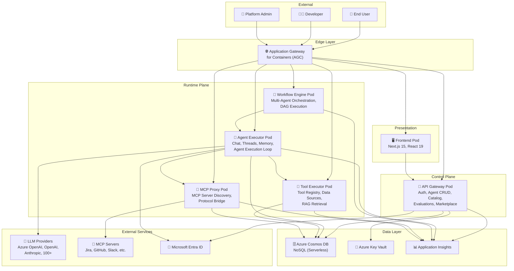
```mermaid
graph TB
    subgraph "External"
        User["👤 End User"]
        Dev["👨‍💻 Developer"]
        Admin["👑 Platform Admin"]
    end

    subgraph "Edge Layer"
        AGC["🌐 Application Gateway<br/>for Containers (AGC)"]
    end

    subgraph "Control Plane"
        APIGateway["🚪 API Gateway Pod<br/>Auth, Agent CRUD, Catalog,<br/>Evaluations, Marketplace"]
    end

    subgraph "Runtime Plane"
        AgentExec["🤖 Agent Executor Pod<br/>Chat, Threads, Memory,<br/>Agent Execution Loop"]
        Workflow["🔄 Workflow Engine Pod<br/>Multi-Agent Orchestration,<br/>DAG Execution"]
        ToolExec["🔧 Tool Executor Pod<br/>Tool Registry, Data Sources,<br/>RAG Retrieval"]
        MCPProxy["🔌 MCP Proxy Pod<br/>MCP Server Discovery,<br/>Protocol Bridge"]
    end

    subgraph "Presentation"
        Frontend["🖥️ Frontend Pod<br/>Next.js 15, React 19"]
    end

    subgraph "Data Layer"
        Cosmos["🗄️ Azure Cosmos DB<br/>NoSQL (Serverless)"]
        KeyVault["🔐 Azure Key Vault"]
        AppInsights["📊 Application Insights"]
    end

    subgraph "External Services"
        LLMs["🧠 LLM Providers<br/>Azure OpenAI, OpenAI,<br/>Anthropic, 100+"]
        MCPServers["🔌 MCP Servers<br/>Jira, GitHub, Slack, etc."]
        EntraID["🔐 Microsoft Entra ID"]
    end

    User & Dev & Admin --> AGC
    AGC --> APIGateway & AgentExec & Workflow & ToolExec & MCPProxy & Frontend

    APIGateway --> Cosmos & KeyVault
    AgentExec --> Cosmos & ToolExec & MCPProxy & LLMs
    Workflow --> AgentExec
    ToolExec --> Cosmos
    MCPProxy --> Cosmos & MCPServers
    Frontend --> APIGateway

    APIGateway & AgentExec --> EntraID
    APIGateway & AgentExec & Workflow & ToolExec & MCPProxy --> AppInsights
```

---

## Infrastructure — Azure Resource Topology

All infrastructure is defined in Bicep (Infrastructure as Code) and deployed to a single Azure Resource Group. Resources are deployed in three waves to respect dependency ordering.

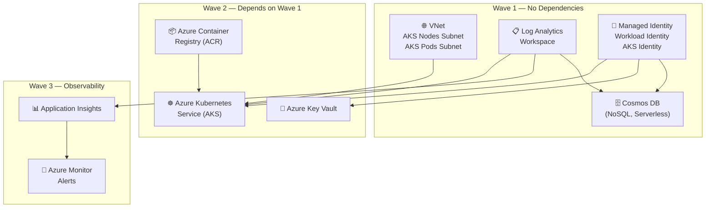
```mermaid
graph TB
    subgraph "Wave 1 — No Dependencies"
        VNet["🌐 VNet<br/>AKS Nodes Subnet<br/>AKS Pods Subnet"]
        LogAnalytics["📋 Log Analytics<br/>Workspace"]
        Identity["🪪 Managed Identity<br/>Workload Identity<br/>AKS Identity"]
        CosmosDB["🗄️ Cosmos DB<br/>(NoSQL, Serverless)"]
    end

    subgraph "Wave 2 — Depends on Wave 1"
        ACR["📦 Azure Container<br/>Registry (ACR)"]
        AKS["☸️ Azure Kubernetes<br/>Service (AKS)"]
        KeyVault["🔐 Azure Key Vault"]
    end

    subgraph "Wave 3 — Observability"
        AppInsights["📊 Application Insights"]
        Alerts["🚨 Azure Monitor<br/>Alerts"]
    end

    VNet --> AKS
    Identity --> AKS
    Identity --> KeyVault
    Identity --> CosmosDB
    LogAnalytics --> AKS
    LogAnalytics --> AppInsights
    LogAnalytics --> CosmosDB
    ACR --> AKS
    AppInsights --> Alerts
```

### Resource Configuration Summary

| Resource | Naming Pattern | Key Configuration |
|----------|---------------|-------------------|
| **VNet** | `stumsft-aiplatform-{env}-vnet` | CNI Overlay, Pod CIDR `192.168.0.0/16`, Service CIDR `172.16.0.0/16` |
| **AKS** | `stumsft-aiplatform-{env}-aks` | K8s 1.33, System Pool (2×D4s_v5), User Pool (1×D4s_v5), OIDC + Workload Identity |
| **Cosmos DB** | `stumsft-aiplatform-{env}-cosmos` | NoSQL API, Serverless, Session consistency, 33 containers |
| **ACR** | `stumsftaiplatform{env}acr` | Standard SKU, AKS `AcrPull` RBAC |
| **Key Vault** | `stumsft-aiplat-{env}-kv` | RBAC-enabled, soft delete (7 days), auto-seeded secrets |
| **Log Analytics** | `stumsft-aiplatform-{env}-log` | 30-day retention, linked to App Insights |
| **App Insights** | `stumsft-aiplatform-{env}-appinsights` | Linked to Log Analytics workspace |
| **Managed Identity** | Workload Identity | Cosmos DB Data Contributor, Key Vault Secrets User |

### Network Topology

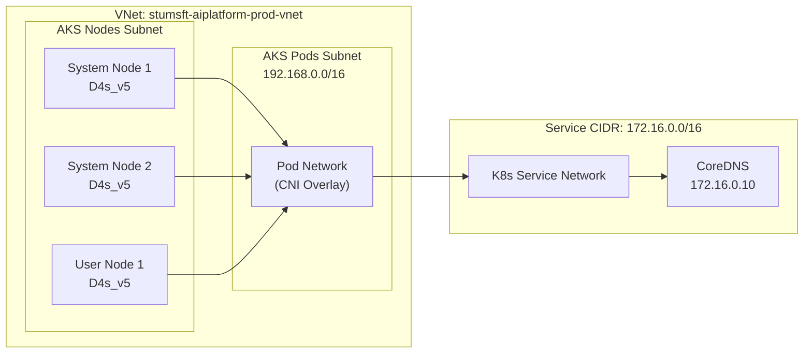
```mermaid
graph LR
    subgraph "VNet: stumsft-aiplatform-prod-vnet"
        subgraph "AKS Nodes Subnet"
            Node1["System Node 1<br/>D4s_v5"]
            Node2["System Node 2<br/>D4s_v5"]
            Node3["User Node 1<br/>D4s_v5"]
        end
        subgraph "AKS Pods Subnet<br/>192.168.0.0/16"
            Pods["Pod Network<br/>(CNI Overlay)"]
        end
    end

    subgraph "Service CIDR: 172.16.0.0/16"
        DNS["CoreDNS<br/>172.16.0.10"]
        SvcNet["K8s Service Network"]
    end

    Node1 & Node2 & Node3 --> Pods
    Pods --> SvcNet
    SvcNet --> DNS
```

---

## Kubernetes Cluster Architecture

The AKS cluster runs six deployments (5 backend microservices + 1 frontend) with shared configuration, health checks, and a unified ingress layer.

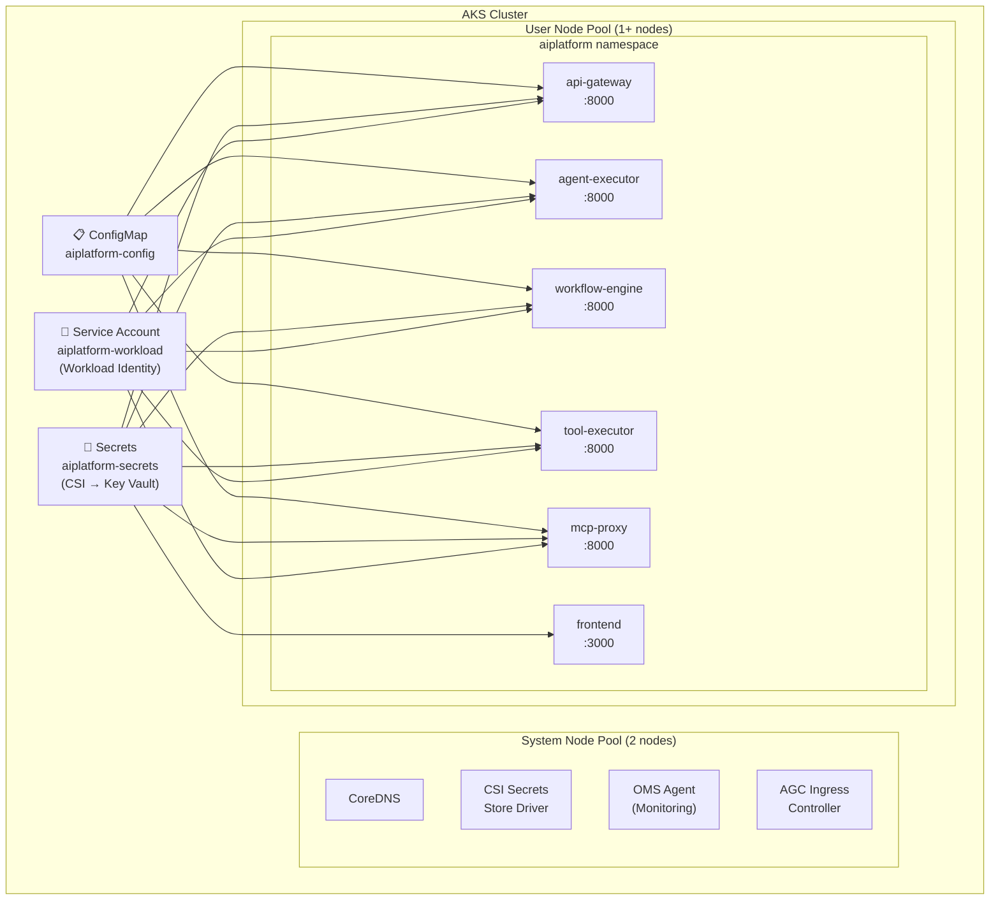
```mermaid
graph TB
    subgraph "AKS Cluster"
        subgraph "System Node Pool (2 nodes)"
            CoreDNS["CoreDNS"]
            CSI["CSI Secrets<br/>Store Driver"]
            OMS["OMS Agent<br/>(Monitoring)"]
            AGCController["AGC Ingress<br/>Controller"]
        end

        subgraph "User Node Pool (1+ nodes)"
            subgraph "aiplatform namespace"
                APIGw["api-gateway<br/>:8000"]
                AgExec["agent-executor<br/>:8000"]
                WfEng["workflow-engine<br/>:8000"]
                ToolExec["tool-executor<br/>:8000"]
                McpProxy["mcp-proxy<br/>:8000"]
                FE["frontend<br/>:3000"]
            end
        end

        ConfigMap["📋 ConfigMap<br/>aiplatform-config"]
        Secrets["🔐 Secrets<br/>aiplatform-secrets<br/>(CSI → Key Vault)"]
        SA["🪪 Service Account<br/>aiplatform-workload<br/>(Workload Identity)"]
    end

    ConfigMap --> APIGw & AgExec & WfEng & ToolExec & McpProxy
    Secrets --> APIGw & AgExec & WfEng & ToolExec & McpProxy & FE
    SA --> APIGw & AgExec & WfEng & ToolExec & McpProxy
```

### Pod Resource Allocation

All microservice pods share the same resource profile:

| Resource | Request | Limit |
|----------|---------|-------|
| CPU | 100m | 500m |
| Memory | 256Mi | 512Mi |

### Health Check Configuration

Every pod exposes three probe endpoints:

| Probe | Endpoint | Initial Delay | Interval | Failure Threshold |
|-------|----------|---------------|----------|-------------------|
| **Liveness** | `/healthz` | 5s | 10s | 3 |
| **Readiness** | `/readyz` | 10s | 5s | 3 |
| **Startup** | `/startupz` | 3s | 2s | 30 |

AGC-level health checks additionally probe `/healthz` every 15 seconds (timeout 10s, healthy after 1 success, unhealthy after 3 failures, accept HTTP 200-299).

---

## Ingress & Traffic Routing

The Application Gateway for Containers (AGC) acts as the edge ingress controller, terminating TLS and routing requests to the correct backend service based on URL path prefixes.

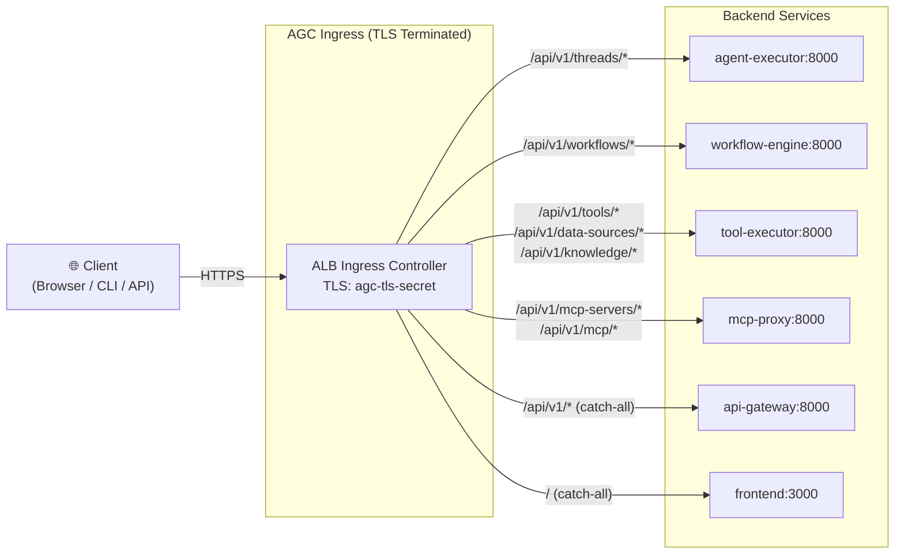
```mermaid
graph LR
    Client["🌐 Client<br/>(Browser / CLI / API)"]
    
    subgraph "AGC Ingress (TLS Terminated)"
        Ingress["ALB Ingress Controller<br/>TLS: agc-tls-secret"]
    end

    subgraph "Backend Services"
        AgentExec["agent-executor:8000"]
        WorkflowEng["workflow-engine:8000"]
        ToolExec["tool-executor:8000"]
        MCPProxy["mcp-proxy:8000"]
        APIGateway["api-gateway:8000"]
        Frontend["frontend:3000"]
    end

    Client -->|"HTTPS"| Ingress

    Ingress -->|"/api/v1/threads/*"| AgentExec
    Ingress -->|"/api/v1/workflows/*"| WorkflowEng
    Ingress -->|"/api/v1/tools/*<br/>/api/v1/data-sources/*<br/>/api/v1/knowledge/*"| ToolExec
    Ingress -->|"/api/v1/mcp-servers/*<br/>/api/v1/mcp/*"| MCPProxy
    Ingress -->|"/api/v1/* (catch-all)"| APIGateway
    Ingress -->|"/ (catch-all)"| Frontend
```

### Routing Rules (Evaluated Top-to-Bottom)

| Priority | Path Pattern | Target Service | Port | Description |
|----------|-------------|----------------|------|-------------|
| 1 | `/api/v1/threads` | agent-executor | 8000 | Chat threads & agent execution |
| 2 | `/api/v1/workflows` | workflow-engine | 8000 | Workflow CRUD & execution |
| 3 | `/api/v1/tools` | tool-executor | 8000 | Tool management |
| 4 | `/api/v1/data-sources` | tool-executor | 8000 | Data source connections |
| 5 | `/api/v1/knowledge` | tool-executor | 8000 | RAG retrieval |
| 6 | `/api/v1/mcp-servers` | mcp-proxy | 8000 | MCP server registry |
| 7 | `/api/v1/mcp` | mcp-proxy | 8000 | MCP protocol operations |
| 8 | `/api/v1/*` | api-gateway | 8000 | All other API routes (auth, agents, catalog, etc.) |
| 9 | `/` | frontend | 3000 | UI, static assets |

> **Why path-based routing?** Each microservice owns a specific domain. The ingress controller routes requests directly to the owning service — no inter-service hops for API calls. The API Gateway pod handles "management" routes; specialized services handle "execution" routes. This keeps the control plane (API Gateway) separate from the runtime plane (Agent Executor, Tool Executor, etc.).

---

## Pod Roles & Responsibilities

The platform decomposes into five backend microservices, each with a distinct responsibility. All share a common codebase (`backend/app/`) but mount only the relevant routers.

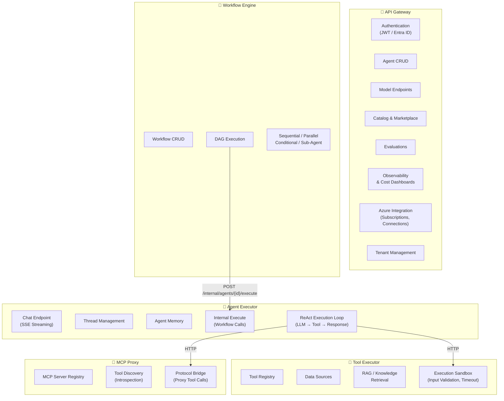
```mermaid
graph TB
    subgraph "🚪 API Gateway"
        AG_Auth["Authentication<br/>(JWT / Entra ID)"]
        AG_Agents["Agent CRUD"]
        AG_Models["Model Endpoints"]
        AG_Catalog["Catalog & Marketplace"]
        AG_Eval["Evaluations"]
        AG_Obs["Observability<br/>& Cost Dashboards"]
        AG_Azure["Azure Integration<br/>(Subscriptions, Connections)"]
        AG_Tenants["Tenant Management"]
    end

    subgraph "🤖 Agent Executor"
        AE_Chat["Chat Endpoint<br/>(SSE Streaming)"]
        AE_Threads["Thread Management"]
        AE_Memory["Agent Memory"]
        AE_Internal["Internal Execute<br/>(Workflow Calls)"]
        AE_Loop["ReAct Execution Loop<br/>(LLM → Tool → Response)"]
    end

    subgraph "🔄 Workflow Engine"
        WF_CRUD["Workflow CRUD"]
        WF_Exec["DAG Execution"]
        WF_Patterns["Sequential / Parallel<br/>Conditional / Sub-Agent"]
    end

    subgraph "🔧 Tool Executor"
        TE_Registry["Tool Registry"]
        TE_DataSrc["Data Sources"]
        TE_RAG["RAG / Knowledge<br/>Retrieval"]
        TE_Sandbox["Execution Sandbox<br/>(Input Validation, Timeout)"]
    end

    subgraph "🔌 MCP Proxy"
        MCP_Reg["MCP Server Registry"]
        MCP_Disc["Tool Discovery<br/>(Introspection)"]
        MCP_Bridge["Protocol Bridge<br/>(Proxy Tool Calls)"]
    end

    WF_Exec -->|"POST /internal/agents/{id}/execute"| AE_Internal
    AE_Loop -->|"HTTP"| TE_Sandbox
    AE_Loop -->|"HTTP"| MCP_Bridge
```

### Pod Detail Breakdown

#### 1. API Gateway (`api-gateway`)

The **management surface** of the platform. Handles all administrative and configuration operations. This is the **Control Plane** pod.

| Responsibility | Routes | Description |
|---------------|--------|-------------|
| Authentication | `/api/v1/auth/*` | JWT login, refresh, logout via Entra ID |
| Agent CRUD | `/api/v1/agents` | Create, list, update, delete agents |
| Model Endpoints | `/api/v1/model-endpoints` | Register LLM provider endpoints |
| Catalog | `/api/v1/catalog` | Browse public agent/tool catalog |
| Marketplace | `/api/v1/marketplace` | Share and discover agents/tools |
| Evaluations | `/api/v1/evaluations` | Test suite management and execution |
| Observability | `/api/v1/observability` | Cost dashboards, token usage |
| Tenant Admin | `/api/v1/tenants` | Tenant management (admin-only) |
| Azure Integration | `/api/v1/azure/*` | Subscription & connection management |
| AI Services | `/api/v1/ai-services` | Platform-managed AI tools |

#### 2. Agent Executor (`agent-executor`)

The **execution engine** of the platform. Runs the core ReAct loop (LLM → Tool → Observe → Repeat). This is the primary **Runtime Plane** pod.

| Responsibility | Routes | Description |
|---------------|--------|-------------|
| Chat | `/api/v1/agents/{id}/chat` | Send message, receive SSE stream |
| Threads | `/api/v1/threads/*` | Create, list, delete conversation sessions |
| Memory | `/api/v1/agents/{id}/memories` | Long-term agent memory management |
| Internal Execute | `/api/v1/internal/agents/{id}/execute` | Inter-service execution (from Workflow Engine) |

#### 3. Workflow Engine (`workflow-engine`)

Orchestrates **multi-agent workflows** as directed acyclic graphs (DAGs). Calls the Agent Executor pod internally to execute individual agents within a workflow.

| Responsibility | Routes | Description |
|---------------|--------|-------------|
| Workflow CRUD | `/api/v1/workflows` | Create, list, update, delete workflows |
| Execution | `/api/v1/workflows/{id}/execute` | Run a workflow (DAG traversal) |

Supported patterns: sequential chains, parallel fan-out/fan-in, conditional branching, sub-agent delegation.

#### 4. Tool Executor (`tool-executor`)

Manages the **tool registry**, data source connections, and **RAG (Retrieval-Augmented Generation)** retrieval.

| Responsibility | Routes | Description |
|---------------|--------|-------------|
| Tool Registry | `/api/v1/tools` | Register tools with JSON Schema |
| Data Sources | `/api/v1/data-sources` | Connect external data (URLs, files, DBs) |
| Knowledge/RAG | `/api/v1/knowledge` | Chunk retrieval for agent context |

#### 5. MCP Proxy (`mcp-proxy`)

Bridges the **Model Context Protocol (MCP)** ecosystem to the platform. Discovers tools from MCP servers and proxies tool calls during agent execution.

| Responsibility | Routes | Description |
|---------------|--------|-------------|
| MCP Servers | `/api/v1/mcp-servers` | Register/discover MCP server endpoints |
| MCP Protocol | `/api/v1/mcp/*` | Introspect tools, proxy tool calls |

---

## Control Plane vs Runtime Plane

The architecture follows a strict separation of concerns between **management** and **execution**. The Control Plane can go down without affecting running agents. The Runtime Plane can scale independently to handle execution load.

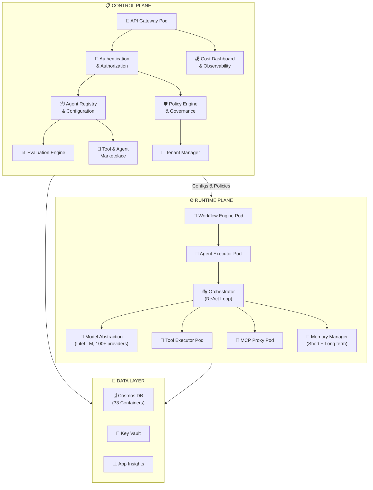
```mermaid
graph TB
    subgraph CP["📋 CONTROL PLANE"]
        direction TB
        CP_GW["🚪 API Gateway Pod"]
        CP_Auth["🔐 Authentication<br/>& Authorization"]
        CP_Registry["📦 Agent Registry<br/>& Configuration"]
        CP_Policy["🛡️ Policy Engine<br/>& Governance"]
        CP_Eval["📊 Evaluation Engine"]
        CP_Cost["💰 Cost Dashboard<br/>& Observability"]
        CP_Market["🏪 Tool & Agent<br/>Marketplace"]
        CP_Tenant["👥 Tenant Manager"]

        CP_GW --> CP_Auth
        CP_Auth --> CP_Registry & CP_Policy
        CP_Registry --> CP_Eval & CP_Market
        CP_Policy --> CP_Tenant
        CP_GW --> CP_Cost
    end

    subgraph RP["⚙️ RUNTIME PLANE"]
        direction TB
        RP_Agent["🤖 Agent Executor Pod"]
        RP_Orch["🎭 Orchestrator<br/>(ReAct Loop)"]
        RP_Model["🧠 Model Abstraction<br/>(LiteLLM, 100+ providers)"]
        RP_Tool["🔧 Tool Executor Pod"]
        RP_MCP["🔌 MCP Proxy Pod"]
        RP_WF["🔄 Workflow Engine Pod"]
        RP_Mem["💾 Memory Manager<br/>(Short + Long term)"]

        RP_Agent --> RP_Orch
        RP_Orch --> RP_Model & RP_Tool & RP_MCP & RP_Mem
        RP_WF --> RP_Agent
    end

    subgraph DL["💾 DATA LAYER"]
        DL_Cosmos["🗄️ Cosmos DB<br/>(33 Containers)"]
        DL_KV["🔐 Key Vault"]
        DL_AI["📊 App Insights"]
    end

    CP --> DL
    RP --> DL
    CP -->|"Configs & Policies"| RP
```

### Key Differences

| Property | Control Plane | Runtime Plane |
|----------|--------------|---------------|
| **Pod** | `api-gateway` | `agent-executor`, `tool-executor`, `mcp-proxy`, `workflow-engine` |
| **Purpose** | Management & configuration | Execution & processing |
| **Traffic** | Low (admin operations) | High (user conversations) |
| **Latency** | Seconds OK | Milliseconds critical |
| **Scaling** | Minimal (1-2 replicas) | Aggressive (scale to demand) |
| **State** | Stateless (reads config) | Stateful (threads, memory) |
| **If down** | "Can't manage" | "Agents don't work" |

---

## Tenant Isolation Model

The platform implements **logical tenant isolation** with row-level partitioning in Cosmos DB and JWT-enforced tenant scoping in every API request.

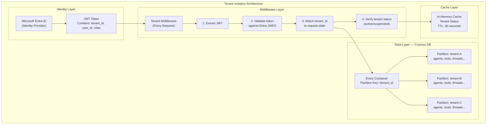
```mermaid
graph TB
    subgraph "Tenant Isolation Architecture"
        subgraph "Identity Layer"
            EntraID["Microsoft Entra ID<br/>(Identity Provider)"]
            JWT["JWT Token<br/>Contains: tenant_id, user_id, roles"]
        end

        subgraph "Middleware Layer"
            TenantMW["Tenant Middleware<br/>(Every Request)"]
            Extract["1. Extract JWT"]
            Validate["2. Validate token<br/>against Entra JWKS"]
            Scope["3. Attach tenant_id<br/>to request.state"]
            Check["4. Verify tenant status<br/>(active/suspended)"]

            TenantMW --> Extract --> Validate --> Scope --> Check
        end

        subgraph "Data Layer — Cosmos DB"
            Container["Every Container<br/>Partition Key: /tenant_id"]
            TenantA["Partition: tenant-A<br/>agents, tools, threads..."]
            TenantB["Partition: tenant-B<br/>agents, tools, threads..."]
            TenantC["Partition: tenant-C<br/>agents, tools, threads..."]

            Container --> TenantA & TenantB & TenantC
        end

        subgraph "Cache Layer"
            StatusCache["In-Memory Cache<br/>Tenant Status<br/>TTL: 60 seconds"]
        end
    end

    EntraID --> JWT --> TenantMW
    Check --> StatusCache
    Scope --> Container
```

### How Tenant Isolation Works

1. **Authentication**: User authenticates via Microsoft Entra ID → receives JWT with `tenant_id` claim
2. **Middleware Extraction**: On every API request, the `TenantMiddleware` extracts `tenant_id` from the JWT
3. **Request Scoping**: The `tenant_id` is attached to `request.state` and available to all downstream handlers
4. **Query Filtering**: Every Cosmos DB query automatically includes `tenant_id` as the partition key — a tenant can never read another tenant's data
5. **Status Validation**: Tenant status (active, suspended, deactivated, provisioning) is checked with an in-memory cache (60s TTL)

### Cosmos DB Partition Strategy

All 33 Cosmos DB containers use `/tenant_id` as the partition key. This guarantees:

- **Physical isolation**: Data for different tenants lives in different logical partitions
- **Query efficiency**: All queries within a tenant are single-partition queries (fast, low RU)
- **No cross-tenant leakage**: Queries without `tenant_id` return empty results

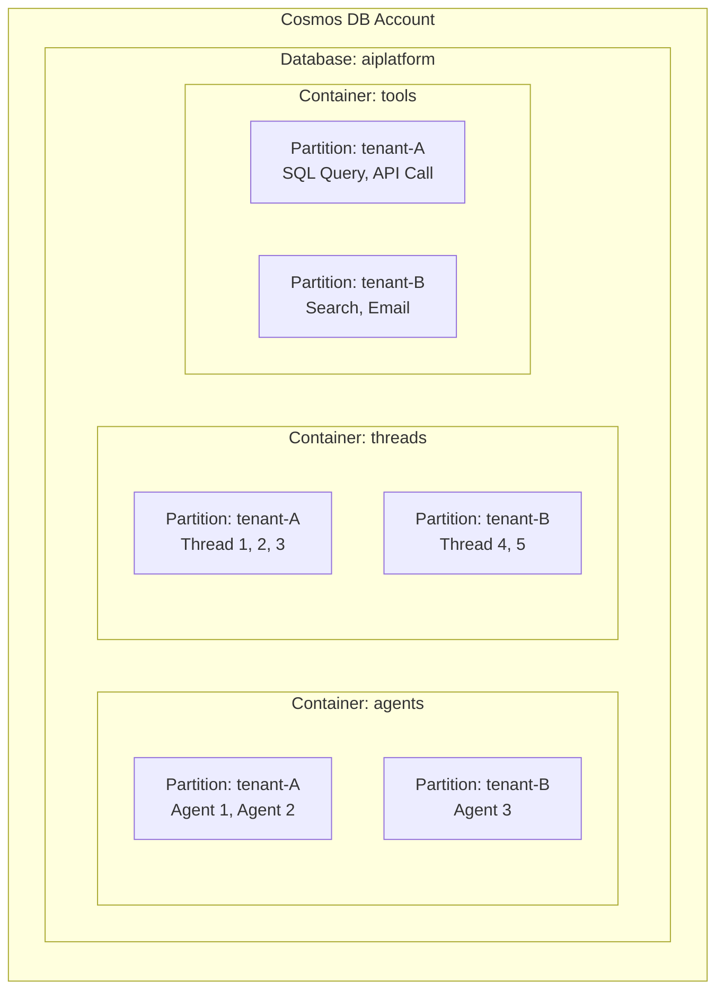
```mermaid
graph LR
    subgraph "Cosmos DB Account"
        subgraph "Database: aiplatform"
            subgraph "Container: agents"
                PA["Partition: tenant-A<br/>Agent 1, Agent 2"]
                PB["Partition: tenant-B<br/>Agent 3"]
            end
            subgraph "Container: threads"
                TA["Partition: tenant-A<br/>Thread 1, 2, 3"]
                TB["Partition: tenant-B<br/>Thread 4, 5"]
            end
            subgraph "Container: tools"
                ToolA["Partition: tenant-A<br/>SQL Query, API Call"]
                ToolB["Partition: tenant-B<br/>Search, Email"]
            end
        end
    end
```

### Tenant Status Lifecycle

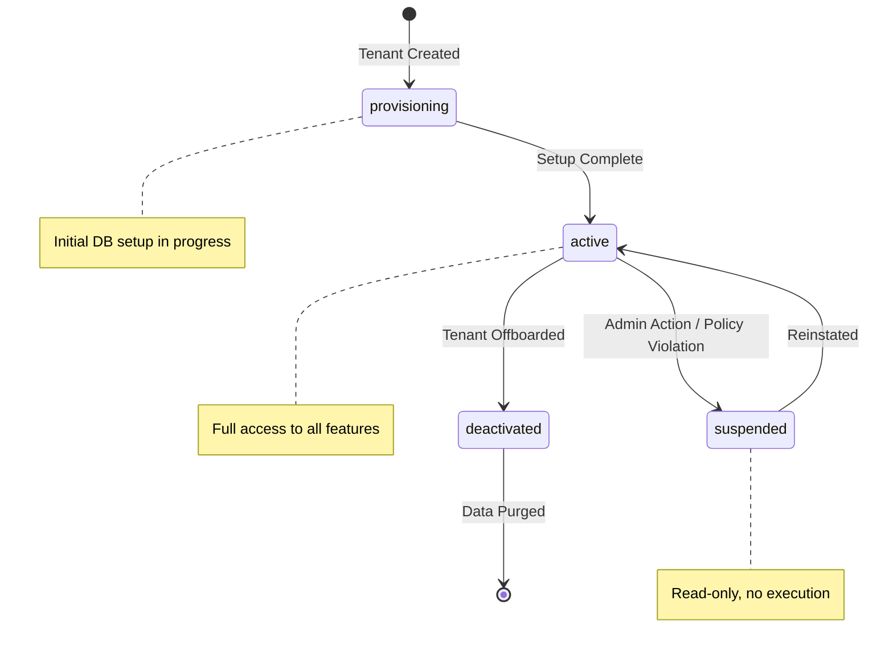
```mermaid
stateDiagram-v2
    [*] --> provisioning: Tenant Created
    provisioning --> active: Setup Complete
    active --> suspended: Admin Action / Policy Violation
    suspended --> active: Reinstated
    active --> deactivated: Tenant Offboarded
    deactivated --> [*]: Data Purged

    note right of active: Full access to all features
    note right of suspended: Read-only, no execution
    note right of provisioning: Initial DB setup in progress
```

---

## Authentication & Identity Flow

The platform uses Microsoft Entra ID for enterprise SSO with Azure Workload Identity for pod-level authentication to Azure services.

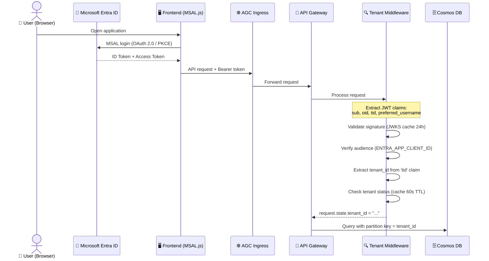
```mermaid
sequenceDiagram
    actor User as 👤 User (Browser)
    participant Entra as 🔐 Microsoft Entra ID
    participant FE as 🖥️ Frontend (MSAL.js)
    participant AGC as 🌐 AGC Ingress
    participant GW as 🚪 API Gateway
    participant MW as 🔍 Tenant Middleware
    participant Cosmos as 🗄️ Cosmos DB

    User->>FE: Open application
    FE->>Entra: MSAL login (OAuth 2.0 / PKCE)
    Entra-->>FE: ID Token + Access Token
    FE->>AGC: API request + Bearer token
    AGC->>GW: Forward request
    GW->>MW: Process request

    Note over MW: Extract JWT claims:<br/>sub, oid, tid, preferred_username

    MW->>MW: Validate signature (JWKS cache 24h)
    MW->>MW: Verify audience (ENTRA_APP_CLIENT_ID)
    MW->>MW: Extract tenant_id from 'tid' claim
    MW->>MW: Check tenant status (cache 60s TTL)
    MW-->>GW: request.state.tenant_id = "..."
    GW->>Cosmos: Query with partition key = tenant_id
```

### Pod-to-Azure Authentication (Workload Identity)

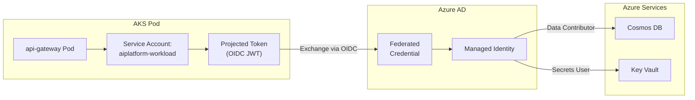
```mermaid
graph LR
    subgraph "AKS Pod"
        Pod["api-gateway Pod"]
        SA["Service Account:<br/>aiplatform-workload"]
        Token["Projected Token<br/>(OIDC JWT)"]
    end

    subgraph "Azure AD"
        FedCred["Federated<br/>Credential"]
        MI["Managed Identity"]
    end

    subgraph "Azure Services"
        CosmosDB["Cosmos DB"]
        KV["Key Vault"]
    end

    Pod --> SA --> Token
    Token -->|"Exchange via OIDC"| FedCred
    FedCred --> MI
    MI -->|"Data Contributor"| CosmosDB
    MI -->|"Secrets User"| KV
```

No secrets or connection strings are stored in pod environment variables. Pods authenticate to Azure services through Workload Identity (OIDC token exchange), with RBAC roles assigned via Bicep:

| Azure Service | RBAC Role | Purpose |
|--------------|-----------|---------|
| Cosmos DB | Built-in Data Contributor | Read/write all containers |
| Key Vault | Key Vault Secrets User | Read secrets (Cosmos endpoint, Entra config) |
| ACR | AcrPull | Pull container images |

---

## Application Layer — Backend Architecture

The backend is a Python 3.12+ FastAPI application organized into layers. All five microservices share the same codebase (`backend/app/`) but mount different routers.

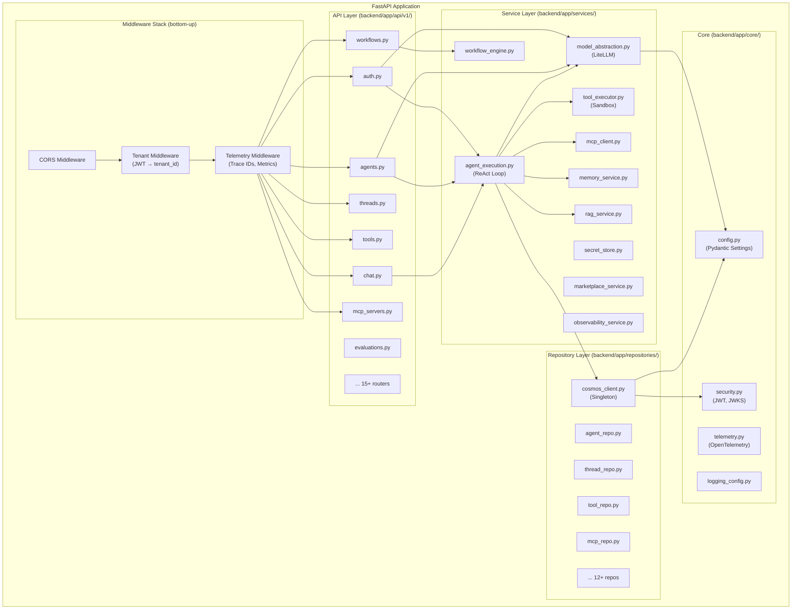
```mermaid
graph TB
    subgraph "FastAPI Application"
        subgraph "Middleware Stack (bottom-up)"
            CORS["CORS Middleware"]
            Tenant["Tenant Middleware<br/>(JWT → tenant_id)"]
            Telemetry["Telemetry Middleware<br/>(Trace IDs, Metrics)"]
        end

        subgraph "API Layer (backend/app/api/v1/)"
            Auth["auth.py"]
            Agents["agents.py"]
            Chat["chat.py"]
            Threads["threads.py"]
            Tools["tools.py"]
            Workflows["workflows.py"]
            MCP["mcp_servers.py"]
            Evals["evaluations.py"]
            Rest["... 15+ routers"]
        end

        subgraph "Service Layer (backend/app/services/)"
            AgentExec["agent_execution.py<br/>(ReAct Loop)"]
            ModelAbs["model_abstraction.py<br/>(LiteLLM)"]
            ToolExecSvc["tool_executor.py<br/>(Sandbox)"]
            MCPClient["mcp_client.py"]
            RAG["rag_service.py"]
            Memory["memory_service.py"]
            WFEngine["workflow_engine.py"]
            SecretStore["secret_store.py"]
            Marketplace["marketplace_service.py"]
            Observability["observability_service.py"]
        end

        subgraph "Repository Layer (backend/app/repositories/)"
            CosmosClient["cosmos_client.py<br/>(Singleton)"]
            AgentRepo["agent_repo.py"]
            ThreadRepo["thread_repo.py"]
            ToolRepo["tool_repo.py"]
            MCPRepo["mcp_repo.py"]
            RepoRest["... 12+ repos"]
        end

        subgraph "Core (backend/app/core/)"
            Config["config.py<br/>(Pydantic Settings)"]
            Security["security.py<br/>(JWT, JWKS)"]
            TelemetryCore["telemetry.py<br/>(OpenTelemetry)"]
            Logging["logging_config.py"]
        end
    end

    CORS --> Tenant --> Telemetry
    Telemetry --> Auth & Agents & Chat & Threads & Tools & Workflows & MCP
    Auth & Agents --> AgentExec & ModelAbs
    Chat --> AgentExec
    AgentExec --> ModelAbs & ToolExecSvc & MCPClient & Memory & RAG
    Workflows --> WFEngine
    AgentExec --> CosmosClient
    ModelAbs --> Config
    CosmosClient --> Config & Security
```

### Key Python Dependencies

| Category | Package | Purpose |
|----------|---------|---------|
| Web Framework | `fastapi 0.115` | Async API framework |
| LLM Integration | `litellm 1.63` | 100+ LLM provider abstraction |
| Azure Auth | `azure-identity` | Workload Identity, DefaultAzureCredential |
| Azure Data | `azure-cosmos 4.7+` | Cosmos DB async client |
| Validation | `pydantic 2.10` | Request/response models |
| HTTP Client | `httpx 0.28` | Async inter-service calls |
| Telemetry | `opentelemetry-*` | Distributed tracing (FastAPI + HTTPX) |
| JWT | `python-jose` | Token validation |

---

## Agent Execution Lifecycle

When a user sends a message, the Agent Executor runs the core **ReAct loop** (Reason → Act → Observe → Repeat) until the model produces a final answer or hits the iteration limit.

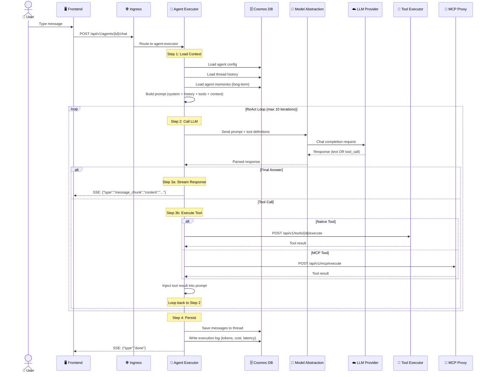
```mermaid
sequenceDiagram
    actor User as 👤 User
    participant FE as 🖥️ Frontend
    participant AGC as 🌐 Ingress
    participant AE as 🤖 Agent Executor
    participant DB as 🗄️ Cosmos DB
    participant MAL as 🧠 Model Abstraction
    participant LLM as ☁️ LLM Provider
    participant TE as 🔧 Tool Executor
    participant MCP as 🔌 MCP Proxy

    User->>FE: Type message
    FE->>AGC: POST /api/v1/agents/{id}/chat
    AGC->>AE: Route to agent-executor

    Note over AE: Step 1: Load Context
    AE->>DB: Load agent config
    AE->>DB: Load thread history
    AE->>DB: Load agent memories (long-term)
    AE->>AE: Build prompt (system + history + tools + context)

    loop ReAct Loop (max 10 iterations)
        Note over AE: Step 2: Call LLM
        AE->>MAL: Send prompt + tool definitions
        MAL->>LLM: Chat completion request
        LLM-->>MAL: Response (text OR tool_call)
        MAL-->>AE: Parsed response

        alt Final Answer
            Note over AE: Step 3a: Stream Response
            AE-->>FE: SSE: {"type":"message_chunk","content":"..."}
        else Tool Call
            Note over AE: Step 3b: Execute Tool
            alt Native Tool
                AE->>TE: POST /api/v1/tools/{id}/execute
                TE-->>AE: Tool result
            else MCP Tool
                AE->>MCP: POST /api/v1/mcp/execute
                MCP-->>AE: Tool result
            end
            AE->>AE: Inject tool result into prompt
            Note over AE: Loop back to Step 2
        end
    end

    Note over AE: Step 4: Persist
    AE->>DB: Save messages to thread
    AE->>DB: Write execution log (tokens, cost, latency)
    AE-->>FE: SSE: {"type":"done"}
```

### Execution Configuration

| Parameter | Default | Description |
|-----------|---------|-------------|
| `MAX_TOOL_ITERATIONS` | 10 | Maximum ReAct loop iterations |
| `ACCESS_TOKEN_EXPIRE_MINUTES` | 30 | JWT access token lifetime |
| `REFRESH_TOKEN_EXPIRE_DAYS` | 7 | Refresh token lifetime |

---

## Model Abstraction Layer

The Model Abstraction Layer provides a unified OpenAI-compatible interface to 100+ LLM providers via LiteLLM, with circuit breaker protection and automatic fallback chains.

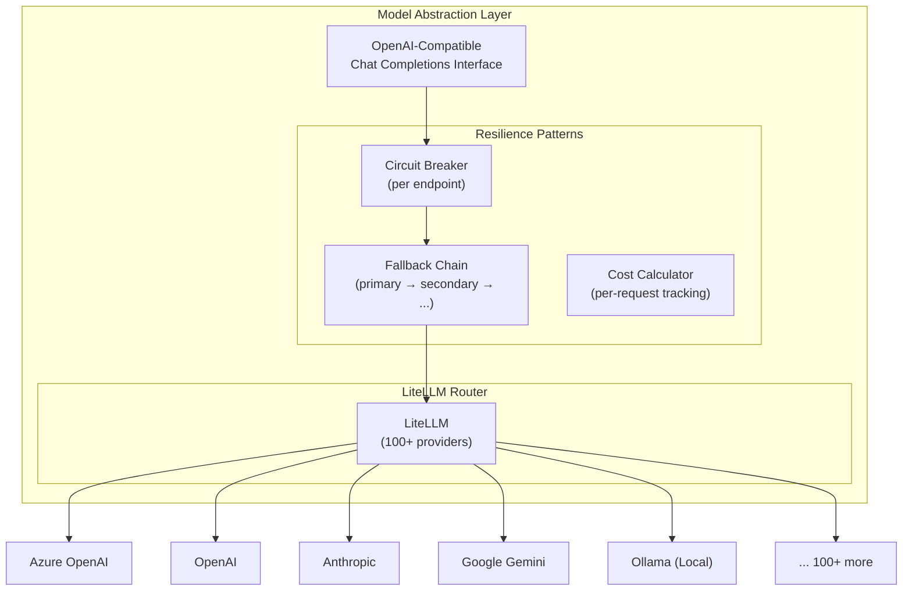
```mermaid
graph TB
    subgraph "Model Abstraction Layer"
        Interface["OpenAI-Compatible<br/>Chat Completions Interface"]

        subgraph "Resilience Patterns"
            CB["Circuit Breaker<br/>(per endpoint)"]
            Fallback["Fallback Chain<br/>(primary → secondary → ...)"]
            CostCalc["Cost Calculator<br/>(per-request tracking)"]
        end

        subgraph "LiteLLM Router"
            LiteLLM["LiteLLM<br/>(100+ providers)"]
        end
    end

    Interface --> CB --> Fallback --> LiteLLM

    LiteLLM --> AzureOpenAI["Azure OpenAI"]
    LiteLLM --> OpenAI["OpenAI"]
    LiteLLM --> Anthropic["Anthropic"]
    LiteLLM --> Google["Google Gemini"]
    LiteLLM --> Ollama["Ollama (Local)"]
    LiteLLM --> Others["... 100+ more"]
```

### Circuit Breaker State Machine

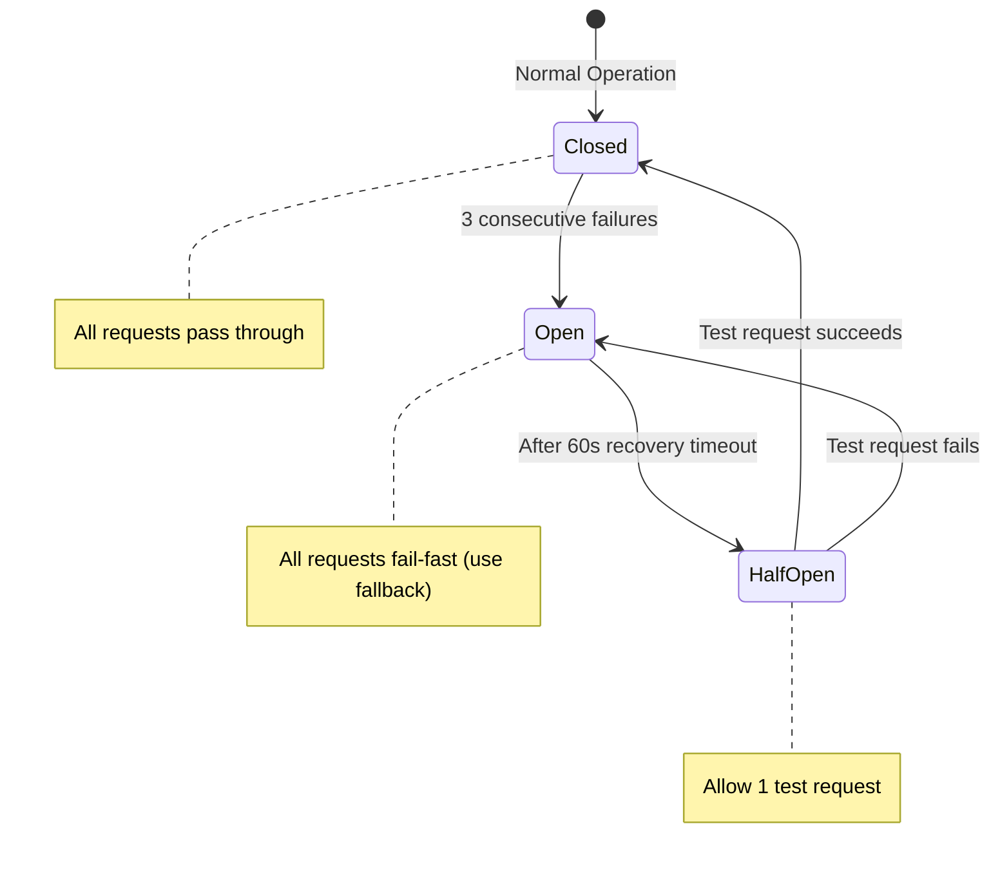
```mermaid
stateDiagram-v2
    [*] --> Closed: Normal Operation

    Closed --> Open: 3 consecutive failures
    Open --> HalfOpen: After 60s recovery timeout
    HalfOpen --> Closed: Test request succeeds
    HalfOpen --> Open: Test request fails

    note right of Closed: All requests pass through
    note right of Open: All requests fail-fast (use fallback)
    note right of HalfOpen: Allow 1 test request
```

---

## MCP Protocol Integration

The platform supports the Model Context Protocol (MCP) for discovering and invoking tools from external MCP servers (e.g., Jira, GitHub, Slack, Confluence).

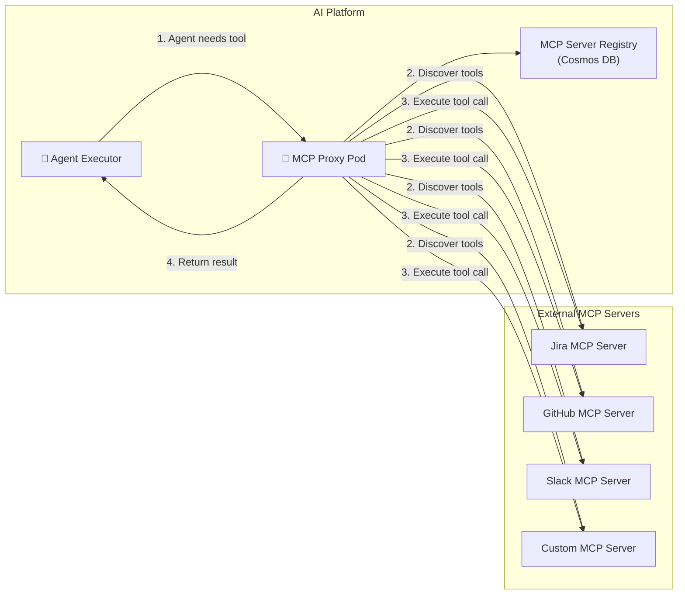
```mermaid
graph LR
    subgraph "AI Platform"
        AgentExec["🤖 Agent Executor"]
        MCPProxy["🔌 MCP Proxy Pod"]
        MCPRepo["MCP Server Registry<br/>(Cosmos DB)"]
    end

    subgraph "External MCP Servers"
        Jira["Jira MCP Server"]
        GitHub["GitHub MCP Server"]
        Slack["Slack MCP Server"]
        Custom["Custom MCP Server"]
    end

    AgentExec -->|"1. Agent needs tool"| MCPProxy
    MCPProxy -->|"2. Discover tools"| Jira & GitHub & Slack & Custom
    MCPProxy -->|"3. Execute tool call"| Jira & GitHub & Slack & Custom
    MCPProxy -->|"4. Return result"| AgentExec
    MCPProxy --> MCPRepo
```

### MCP Lifecycle

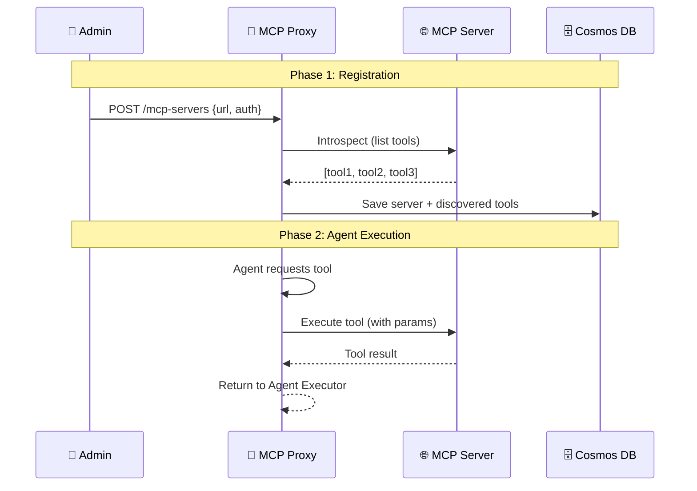
```mermaid
sequenceDiagram
    participant Admin as 👑 Admin
    participant Proxy as 🔌 MCP Proxy
    participant Server as 🌐 MCP Server
    participant DB as 🗄️ Cosmos DB

    Note over Admin,DB: Phase 1: Registration
    Admin->>Proxy: POST /mcp-servers {url, auth}
    Proxy->>Server: Introspect (list tools)
    Server-->>Proxy: [tool1, tool2, tool3]
    Proxy->>DB: Save server + discovered tools

    Note over Admin,DB: Phase 2: Agent Execution
    Proxy->>Proxy: Agent requests tool
    Proxy->>Server: Execute tool (with params)
    Server-->>Proxy: Tool result
    Proxy-->>Proxy: Return to Agent Executor
```

---

## Workflow Engine

The Workflow Engine orchestrates multi-agent workflows as directed acyclic graphs (DAGs). Each node in the workflow is an agent execution, and edges define data flow between agents.

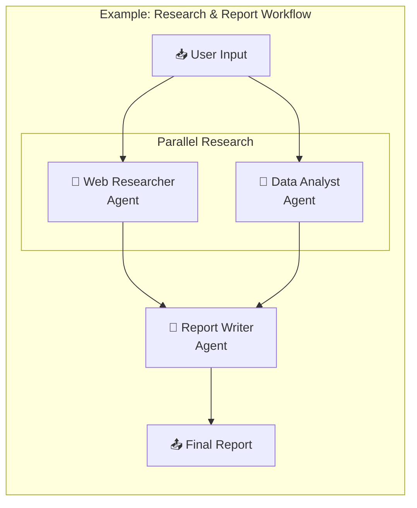
```mermaid
graph LR
    subgraph "Example: Research & Report Workflow"
        Start["📥 User Input"]
        
        subgraph "Parallel Research"
            Agent1["🤖 Web Researcher<br/>Agent"]
            Agent2["🤖 Data Analyst<br/>Agent"]
        end

        Agent3["🤖 Report Writer<br/>Agent"]
        End["📤 Final Report"]
    end

    Start --> Agent1 & Agent2
    Agent1 & Agent2 --> Agent3
    Agent3 --> End
```

### Supported Orchestration Patterns

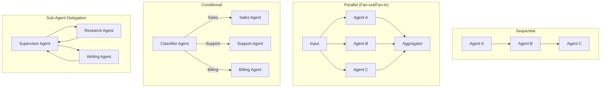
```mermaid
graph TB
    subgraph "Sequential"
        S1["Agent A"] --> S2["Agent B"] --> S3["Agent C"]
    end

    subgraph "Parallel (Fan-out/Fan-in)"
        P0["Input"] --> P1["Agent A"] & P2["Agent B"] & P3["Agent C"]
        P1 & P2 & P3 --> P4["Aggregator"]
    end

    subgraph "Conditional"
        C0["Classifier Agent"] -->|"Sales"| C1["Sales Agent"]
        C0 -->|"Support"| C2["Support Agent"]
        C0 -->|"Billing"| C3["Billing Agent"]
    end

    subgraph "Sub-Agent Delegation"
        D0["Supervisor Agent"] --> D1["Research Agent"]
        D1 --> D0
        D0 --> D2["Writing Agent"]
        D2 --> D0
    end
```

The Workflow Engine calls the Agent Executor internally via `POST /api/v1/internal/agents/{agent_id}/execute`, passing the tenant context and thread state.

---

## Observability & Cost Tracking

The platform uses OpenTelemetry for distributed tracing across all microservices, with data exported to Azure Application Insights and Log Analytics.

```mermaid
graph TB
    subgraph "Instrumentation (per pod)"
        FastAPIInst["FastAPI Instrumentation"]
        HTTPXInst["HTTPX Instrumentation"]
        CustomSpans["Custom Spans<br/>(LLM calls, tool exec)"]
        JSONLogger["Structured JSON Logger"]
    end

    subgraph "Collection"
        OTEL["OpenTelemetry SDK"]
        Exporter["Azure Monitor<br/>Exporter"]
    end

    subgraph "Analysis"
        AppInsights["📊 Application Insights<br/>(APM, Traces, Metrics)"]
        LogAnalytics["📋 Log Analytics<br/>(KQL Queries)"]
        Alerts["🚨 Alert Rules<br/>(CPU, Memory, HTTP Errors)"]
    end

    subgraph "Dashboard"
        CostDash["💰 Cost Dashboard<br/>/api/v1/observability"]
    end

    FastAPIInst & HTTPXInst & CustomSpans --> OTEL
    JSONLogger --> OTEL
    OTEL --> Exporter
    Exporter --> AppInsights --> LogAnalytics --> Alerts
    AppInsights --> CostDash
```

### Cost Tracking Flow

Every agent execution logs:

| Metric | Source | Stored In |
|--------|--------|-----------|
| Input tokens | LLM response | `execution_logs` container |
| Output tokens | LLM response | `execution_logs` container |
| Total cost ($) | Model pricing table × tokens | `execution_logs` container |
| Latency (ms) | Middleware timing | App Insights |
| Tool calls count | Execution loop | `execution_logs` container |

---

## Frontend Architecture

The frontend is a Next.js 15 application (React 19, App Router) with Shadcn/ui components and Tailwind CSS. It authenticates via MSAL.js (Microsoft Entra ID) and communicates with the backend through the AGC ingress proxy.

```mermaid
graph TB
    subgraph "Next.js 15 Frontend"
        subgraph "App Router Pages"
            Home["/ Dashboard"]
            AgentList["/agents — Agent List"]
            AgentChat["/chat/{agent_id} — Chat UI"]
            Workflows["/workflows — Visual Editor"]
            Tools["/tools — Tool Registry"]
            Evals["/evaluations — Test Suites"]
            Market["/marketplace — Discover"]
            Observe["/observability — Cost Charts"]
        end

        subgraph "Core Libraries"
            MSAL["@azure/msal-react<br/>(Entra ID Auth)"]
            ReactFlow["@xyflow/react<br/>(Workflow Editor)"]
            Recharts["recharts<br/>(Cost Charts)"]
            Shadcn["shadcn/ui<br/>(Component Library)"]
        end

        subgraph "Data Flow"
            AuthCtx["AuthContext<br/>(User, Tenant)"]
            API["fetch('/api/v1/...')<br/>+ Bearer Token"]
            SSE["EventSource<br/>(Chat Streaming)"]
        end
    end

    subgraph "Proxy"
        NextRewrite["next.config.ts<br/>rewrites: /api/v1/* → backend"]
    end

    Home & AgentList & AgentChat & Workflows --> API
    AgentChat --> SSE
    API --> NextRewrite
    MSAL --> AuthCtx --> API
```

### Next.js Configuration

The frontend runs in `standalone` output mode (optimized for Docker) and proxies API calls to the backend:

```typescript
// next.config.ts
{
  output: "standalone",
  rewrites: [
    { source: "/api/v1/:path*", destination: "${API_URL}/api/v1/:path*" }
  ]
}
```

In Kubernetes, `API_URL` points to `http://api-gateway:8000` (server-side), while the browser uses relative paths (`/api/v1/...`) that are routed by the AGC ingress.

---

## Data Layer — Cosmos DB Schema

Azure Cosmos DB NoSQL (serverless) hosts all platform data. All 33 containers use `/tenant_id` as the partition key for tenant isolation.

```mermaid
graph TB
    subgraph "Cosmos DB: aiplatform"
        subgraph "Core Entities"
            agents["agents"]
            tools["tools"]
            threads["threads"]
            thread_messages["thread_messages"]
            workflows["workflows"]
            workflow_nodes["workflow_nodes"]
            workflow_edges["workflow_edges"]
        end

        subgraph "Agent Configuration"
            agent_config_versions["agent_config_versions"]
            agent_tools["agent_tools (join)"]
            agent_mcp_tools["agent_mcp_tools"]
            agent_data_sources["agent_data_sources"]
            agent_memories["agent_memories"]
            agent_templates["agent_templates"]
        end

        subgraph "Tool Ecosystem"
            tool_templates["tool_templates"]
            data_sources["data_sources"]
            documents["documents"]
            document_chunks["document_chunks"]
            mcp_servers["mcp_servers"]
            mcp_discovered_tools["mcp_discovered_tools"]
        end

        subgraph "Infrastructure"
            tenants["tenants"]
            users["users"]
            model_endpoints["model_endpoints"]
            model_pricing["model_pricing"]
            azure_connections["azure_connections"]
            azure_subscriptions["azure_subscriptions"]
        end

        subgraph "Execution & Observability"
            execution_logs["execution_logs"]
            evaluation_runs["evaluation_runs"]
            evaluation_results["evaluation_results"]
            test_cases["test_cases"]
            test_suites["test_suites"]
            cost_alerts["cost_alerts"]
        end

        subgraph "Marketplace"
            catalog_entries["catalog_entries"]
            refresh_tokens["refresh_tokens"]
        end

        subgraph "Workflow Execution"
            workflow_executions["workflow_executions"]
            workflow_node_executions["workflow_node_executions"]
        end
    end
```

### Container Partition Strategy

Every container is partitioned by `/tenant_id`, ensuring:

- **Single-partition queries** for all tenant-scoped operations (optimal RU cost)
- **Physical data isolation** between tenants at the storage layer
- **Automatic scaling** — Cosmos DB serverless scales partitions independently

---

## Deployment Pipeline

The end-to-end deployment is orchestrated by `scripts/deploy.sh` and involves three phases.

```mermaid
graph LR
    subgraph "Phase 1: Infrastructure"
        Bicep["Bicep Templates<br/>infra/main.bicep"]
        AzDeploy["az deployment<br/>group create"]
        Resources["Azure Resources<br/>(VNet, AKS, Cosmos,<br/>ACR, KV, AppInsights)"]
    end

    subgraph "Phase 2: Build & Push"
        DockerBuild["Docker Build<br/>(6 images)"]
        ACRPush["ACR Push<br/>(tag: git SHA + latest)"]
    end

    subgraph "Phase 3: K8s Deploy"
        Kustomize["Kustomize Apply<br/>k8s/base/"]
        Rollout["Rollout Status<br/>Wait for Ready"]
        Smoke["Smoke Tests<br/>/healthz checks"]
    end

    Bicep --> AzDeploy --> Resources
    Resources --> DockerBuild --> ACRPush
    ACRPush --> Kustomize --> Rollout --> Smoke
```

### Container Images Built

| Image | Dockerfile | Purpose |
|-------|-----------|---------|
| `aiplatform-api-gateway` | `backend/microservices/api_gateway/Dockerfile` | Control Plane |
| `aiplatform-agent-executor` | `backend/microservices/agent_executor/Dockerfile` | Agent execution |
| `aiplatform-workflow-engine` | `backend/microservices/workflow_engine/Dockerfile` | Workflow orchestration |
| `aiplatform-tool-executor` | `backend/microservices/tool_executor/Dockerfile` | Tool & RAG |
| `aiplatform-mcp-proxy` | `backend/microservices/mcp_proxy/Dockerfile` | MCP protocol bridge |
| `aiplatform-frontend` | `frontend/Dockerfile` | Next.js UI |

### Deployment Command

```bash
./scripts/deploy.sh \
  --resource-group <rg-name> \
  --environment prod \
  [--skip-infra]    # Skip Bicep deployment
  [--skip-build]    # Skip Docker build
  [--dry-run]       # Preview only
```

---

## Local Development

### Option 1: Native (Recommended for Development)

```bash
./start.sh
```

Starts all services locally:

| Service | Port | Description |
|---------|------|-------------|
| PostgreSQL | 5432 | Database (Docker) |
| Redis | 6379 | Cache (Docker) |
| Backend | 8000 | FastAPI (uvicorn --reload) |
| Frontend | 3000 | Next.js (npm run dev) |
| MCP Web Tools | 8081 | Demo MCP server |
| MCP Atlassian | 8082 | Demo Jira/Confluence MCP |

### Option 2: Docker Compose (Full Stack)

```bash
./start-docker.sh
```

Runs all services in Docker containers using `docker-compose.yml`.

### Option 3: Microservices Mode

```bash
docker compose -f docker-compose.microservices.yml up --build
```

Runs all 5 backend microservices + frontend as separate containers with inter-service networking.

---

## API Reference

### Core Endpoints

| Method | Path | Service | Description |
|--------|------|---------|-------------|
| `POST` | `/api/v1/auth/login` | api-gateway | Authenticate via Entra ID |
| `POST` | `/api/v1/auth/refresh` | api-gateway | Refresh access token |
| `GET` | `/api/v1/agents` | api-gateway | List agents |
| `POST` | `/api/v1/agents` | api-gateway | Create agent |
| `PUT` | `/api/v1/agents/{id}` | api-gateway | Update agent |
| `DELETE` | `/api/v1/agents/{id}` | api-gateway | Delete agent |
| `POST` | `/api/v1/agents/{id}/chat` | agent-executor | Send message (SSE stream) |
| `GET` | `/api/v1/threads` | agent-executor | List threads |
| `GET` | `/api/v1/threads/{id}` | agent-executor | Get thread + messages |
| `POST` | `/api/v1/tools` | tool-executor | Register tool |
| `POST` | `/api/v1/workflows` | workflow-engine | Create workflow |
| `POST` | `/api/v1/workflows/{id}/execute` | workflow-engine | Execute workflow |
| `POST` | `/api/v1/mcp-servers` | mcp-proxy | Register MCP server |
| `GET` | `/api/v1/model-endpoints` | api-gateway | List model endpoints |
| `GET` | `/api/v1/observability/costs` | api-gateway | Cost dashboard data |
| `GET` | `/api/v1/marketplace` | api-gateway | Browse marketplace |

Full OpenAPI spec available at `/docs` (Swagger UI) and `/redoc`.

---

## Education & Labs

This platform is built alongside a comprehensive educational resource: the **[AI Agent Platform — Education Hub](https://github.com/roie9876/AI-Agent-Platform)**.

| Chapter | Topic | Mapping to This Codebase |
|---------|-------|--------------------------|
| Ch 1 | Fundamentals — What is an AI Agent? | `agent_execution.py` — ReAct loop |
| Ch 2 | Model Abstraction & Routing | `model_abstraction.py` — LiteLLM integration |
| Ch 3 | Memory Management & RAG | `memory_service.py`, `rag_service.py` |
| Ch 4 | Thread & State Management | `threads.py`, Thread model |
| Ch 5 | Orchestration Patterns | `workflow_engine.py` |
| Ch 6 | Tools & Marketplace | `tool_executor.py`, `marketplace_service.py` |
| Ch 8 | Control Plane | `api-gateway` pod |
| Ch 9 | Runtime Plane | `agent-executor`, `tool-executor`, `mcp-proxy` pods |
| Ch 11 | Observability & Cost | `observability_service.py`, App Insights |
| Ch 12 | Security & Isolation | Tenant middleware, Workload Identity |
| Ch 13 | Scalability | AKS horizontal scaling, Cosmos DB partitioning |
| Ch 14 | HLD Architecture | This README |
| Ch 15 | Microsoft Stack Mapping | `infra/` — Bicep modules |

---

## Project Structure

```
├── backend/
│   ├── app/
│   │   ├── api/v1/             # API routers (15+ route files)
│   │   ├── core/               # Config, security, telemetry
│   │   ├── middleware/          # Tenant isolation, tracing
│   │   ├── models/             # Pydantic + data models
│   │   ├── repositories/       # Cosmos DB data access
│   │   └── services/           # Business logic (15+ services)
│   ├── microservices/          # Microservice entry points
│   │   ├── api_gateway/        # Control Plane service
│   │   ├── agent_executor/     # Agent execution service
│   │   ├── workflow_engine/    # Workflow orchestration
│   │   ├── tool_executor/      # Tool & RAG service
│   │   └── mcp_proxy/          # MCP protocol bridge
│   └── tests/                  # Test suite
├── frontend/
│   └── src/
│       ├── app/                # Next.js App Router pages
│       ├── components/         # React components (Shadcn/ui)
│       ├── contexts/           # Auth context
│       └── lib/                # Utilities
├── infra/
│   ├── main.bicep              # Root Bicep template
│   ├── modules/                # 9 Bicep modules
│   └── parameters/             # Environment configs
├── k8s/
│   └── base/                   # Kustomize manifests
│       ├── ingress.yaml        # AGC routing rules
│       ├── configmap.yaml      # Shared configuration
│       ├── health-check-policies.yaml
│       └── {service}/          # Per-service deployment + service
├── scripts/
│   └── deploy.sh               # End-to-end deployment
├── docker-compose.yml          # Local dev (monolith)
├── docker-compose.microservices.yml  # Local dev (microservices)
├── start.sh                    # Native local startup
└── start-docker.sh             # Docker local startup
```

---

## License

This project is developed by STU-MSFT as an internal platform.
