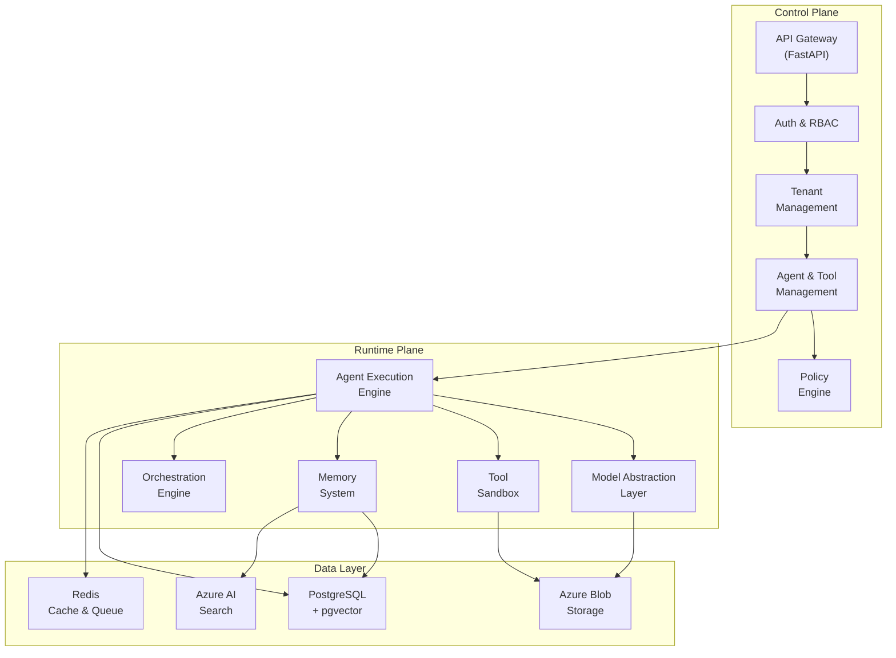
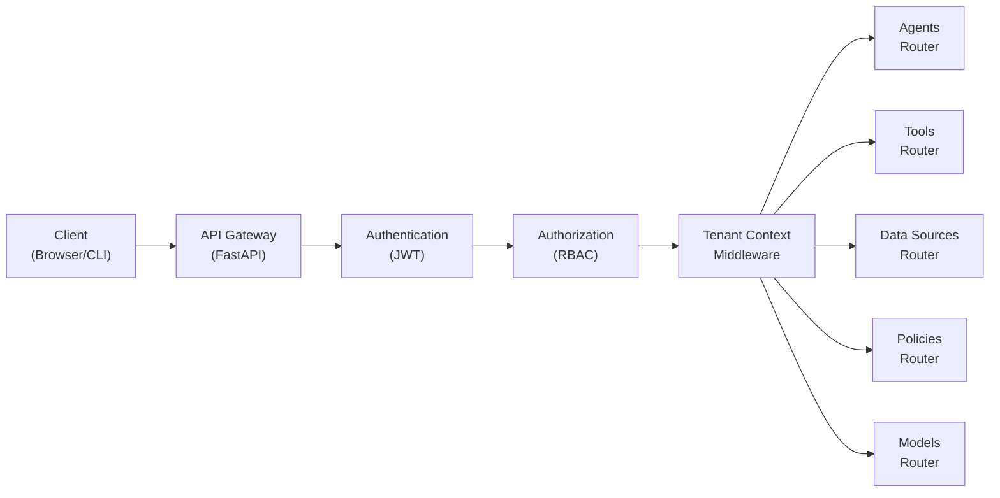
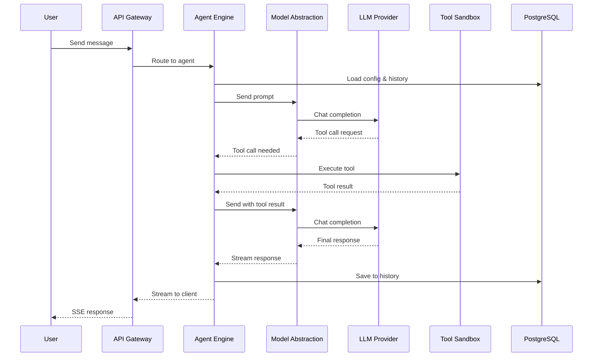
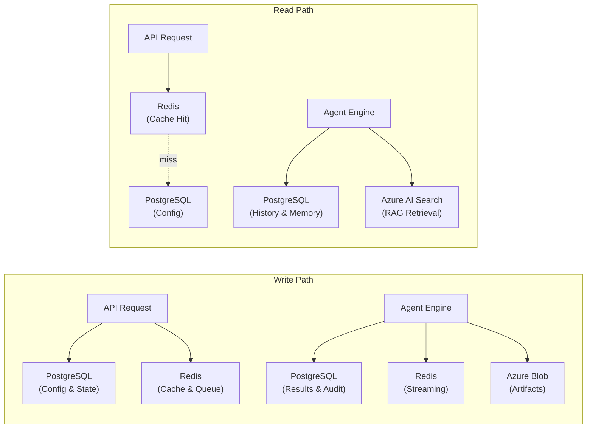
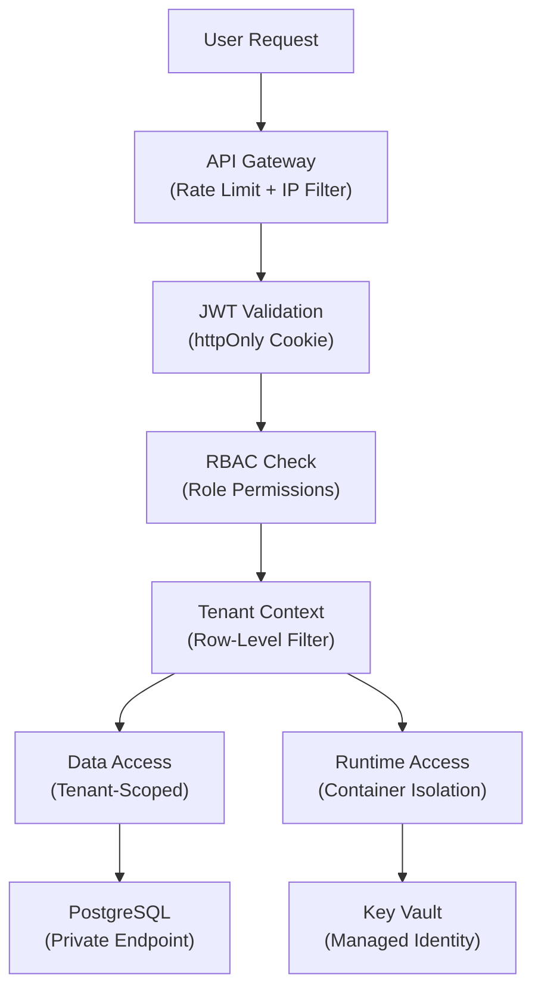
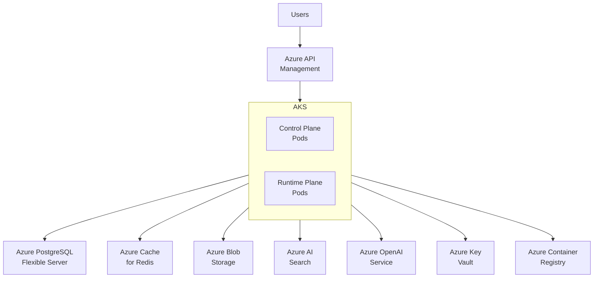

# AI Agent Platform as a Service — Architecture Design

## Executive Summary

The AI Agent Platform as a Service (PaaS) is a multi-tenant platform that enables product teams at STU-MSFT to create, configure, and orchestrate AI agents through a self-service UI. Teams can attach tools, connect data sources, build multi-agent workflows, and monitor agent performance — all within secure, isolated runtime environments. The platform is model-agnostic: customers bring their own model endpoints while Azure OpenAI serves as the default.

The architecture is organized into two primary planes:

- **Control Plane** — Management layer handling API requests, authentication, tenant management, agent CRUD, configuration, and policy enforcement.
- **Runtime Plane** — Execution layer responsible for agent execution, tool invocation, model abstraction, memory management, and orchestration workflows.

Both planes share a common **Data Layer** backed by PostgreSQL (relational + vector via pgvector), Redis (cache + pub-sub + task queue), and Azure Blob Storage (artifacts + file attachments).

---

## System Overview

The platform follows a layered architecture with clear separation between management (Control Plane) and execution (Runtime Plane) concerns. The Control Plane exposes a RESTful API for all management operations, while the Runtime Plane handles the actual agent execution lifecycle — from receiving a user message, routing it to the appropriate model, invoking tools, and returning a response.

### Control Plane

The Control Plane is the management surface of the platform. It handles:

- **API Gateway**: RESTful API (FastAPI) versioned under `/api/v1/`, with auto-generated OpenAPI documentation.
- **Authentication & Authorization**: JWT-based auth with httpOnly cookies, Microsoft Entra ID integration for enterprise SSO, and Role-Based Access Control (RBAC).
- **Tenant Management**: Multi-tenant architecture with `tenant_id` embedded in JWT claims. All queries are automatically scoped to the requesting tenant via middleware.
- **Agent Management**: Full CRUD lifecycle for agents, including configuration versioning and status tracking.
- **Tool & Data Source Management**: Registry for tools (with JSON Schema definitions) and data source connections.
- **Policy Engine**: Content filtering, rate limiting, and governance rules applied at global, tenant, and agent levels.

### Runtime Plane

The Runtime Plane is the execution engine of the platform. It handles:

- **Agent Execution Engine**: Processes agent invocations through the model → tool → response cycle.
- **Model Abstraction Layer**: OpenAI-compatible interface normalizing all model interactions, with multi-model routing, fallback chains, and circuit breaker patterns.
- **Tool Execution Sandbox**: Isolated execution environment for tool invocations with input validation and timeout handling.
- **Memory System**: Short-term (conversation history within a thread) and long-term (persistent knowledge via pgvector) memory.
- **Orchestration Engine**: Supports sequential chains, parallel execution, sub-agent delegation, and autonomous execution mode.

### Data Layer

The Data Layer provides persistent storage, caching, and search capabilities:

- **PostgreSQL 16+**: Relational data (tenants, users, agents, configs, policies, audit logs) plus pgvector extension for embedding storage and vector search.
- **Redis 7+**: Session cache, pub-sub for real-time updates, and Celery task queue backend for async agent execution.
- **Azure Blob Storage**: File attachments, agent artifacts, and large outputs.
- **Azure AI Search**: Hybrid vector + keyword search for RAG retrieval.

---

## Architecture Layers — Control Plane

The Control Plane provides the management API surface for the platform. All operations — agent creation, tool registration, data source configuration, policy management — flow through this layer.

### API Gateway

- **Framework**: FastAPI (Python 3.12+) with automatic OpenAPI spec generation.
- **Versioning**: All endpoints under `/api/v1/` with structured routers per domain (agents, tools, data sources, models, policies, threads).
- **Validation**: Pydantic v2 models for request/response schemas with automatic validation.
- **Streaming**: WebSocket and Server-Sent Events (SSE) support for real-time agent response streaming.

> **Why FastAPI?** We chose FastAPI over Django REST Framework because FastAPI provides native async support, automatic OpenAPI spec generation, and Pydantic-based validation — critical for an API-first platform with real-time agent streaming. Django was considered but its synchronous-first model adds complexity for WebSocket/SSE streaming and async agent execution.

### Authentication & Authorization

- **JWT Tokens**: Access tokens (30-minute expiry) and refresh tokens (7-day expiry) stored in httpOnly cookies.
- **Enterprise SSO**: Microsoft Entra ID integration for single sign-on.
- **RBAC**: Role-based permissions (Admin, Developer, Viewer) controlling access to agents, tools, and data sources.
- **Tenant Scoping**: `tenant_id` embedded in JWT claims; middleware automatically filters all database queries to the requesting tenant.

### Tenant Management

- **Isolation Model**: Row-level isolation with `tenant_id` foreign key on all tenant-scoped tables.
- **Middleware**: Automatic tenant context extraction from JWT on every request.
- **Onboarding**: Self-service tenant registration with automatic schema provisioning.

### Agent Management

- **CRUD**: Create, read, update, delete agents with full configuration (system prompt, model endpoint, temperature, max tokens, timeout).
- **Versioning**: Agent configurations are versioned with rollback capability.
- **Status Tracking**: Real-time agent status (running, stopped, error) with health metrics.

---

## Architecture Layers — Runtime Plane

The Runtime Plane handles the actual execution of AI agents. When a user sends a message to an agent, the Runtime Plane processes the request through model invocation, optional tool calls, and memory management.

### Agent Execution Engine

The execution engine is the core loop of agent processing:

1. Receive user message via API
2. Load agent configuration and conversation history
3. Construct prompt with system instructions, memory context, and available tools
4. Send to model via the Model Abstraction Layer
5. If model requests tool call → execute in Tool Sandbox → feed result back to model
6. Return final response to user (streaming via SSE)

### Model Abstraction Layer

The model abstraction layer provides a unified interface to any LLM provider:

- **OpenAI-Compatible Interface**: All model interactions use the OpenAI chat completions format, regardless of the underlying provider.
- **Multi-Model Routing**: Route requests to different models based on task type, cost constraints, or latency requirements.
- **Fallback Chains**: If the primary model endpoint fails, automatically fall back to secondary endpoints.
- **Circuit Breaker**: Prevent cascading failures by temporarily disabling unhealthy endpoints.
- **Provider Support**: Via LiteLLM — supports 100+ model providers with a unified interface.

> **Why Semantic Kernel over LangChain?** We chose Semantic Kernel as the agent orchestration framework because it's Microsoft-native with a stable API and plugin architecture that maps directly to our tool marketplace concept. LangChain has a larger community but its frequent breaking changes and heavy abstraction layers make it harder to debug at scale. AutoGen (Microsoft Research) was also considered but its API is less stable than Semantic Kernel.

### Tool Execution Sandbox

- **Isolation**: Each tool invocation runs in an isolated environment with resource limits.
- **Input Validation**: Tool inputs are validated against JSON Schema definitions before execution.
- **Timeout Handling**: Configurable per-tool timeout with graceful cancellation.
- **Output Capture**: Tool outputs are captured, sanitized, and fed back to the model.

### Memory System

- **Short-Term Memory**: Conversation history maintained within a thread/session. Stored in PostgreSQL.
- **Long-Term Memory**: Persistent knowledge across sessions stored as vector embeddings in pgvector. Retrieved via similarity search when constructing agent prompts.
- **Scope Isolation**: Memory is isolated per-agent, per-user, and per-tenant.

### Orchestration Engine

- **Sequential Chains**: Output of one agent feeds as input to the next agent.
- **Parallel Execution**: Multiple agents execute simultaneously with result aggregation.
- **Sub-Agent Delegation**: An agent can spawn sub-agents during execution for specialized tasks.
- **Autonomous Mode**: Agents determine their own execution flow based on the task at hand.
- **Visual Workflow Builder**: React Flow-based drag-and-drop editor for building agent workflows.

---

## Architecture Layers — Data Layer

The data layer provides persistent storage, caching, event streaming, and search capabilities for the platform.

### PostgreSQL 16+ (Primary Database)

PostgreSQL serves as the primary relational database for all platform data:

- **Core Tables**: Tenants, users, agents, agent configurations, tools, data sources, policies, audit logs.
- **pgvector Extension**: Vector embeddings for long-term agent memory and RAG similarity search.
- **JSONB Columns**: Flexible schema for agent configurations, tool definitions, and execution metadata.
- **Row-Level Isolation**: All tenant-scoped tables include `tenant_id` with indexed foreign keys.

### Redis 7+ (Cache & Queue)

Redis provides high-performance caching, real-time messaging, and task queue infrastructure:

- **Session Cache**: JWT session data and frequently accessed agent configurations.
- **Pub-Sub**: Real-time streaming of agent execution updates to connected clients.
- **Task Queue**: Celery task broker and result backend for async agent execution.

### Azure Blob Storage (Object Store)

- **File Attachments**: User-uploaded files for agent context (documents, images, data files).
- **Agent Artifacts**: Large outputs, generated reports, and execution logs.
- **Data Source Files**: Ingested documents for RAG pipeline processing.

### Azure AI Search (Retrieval)

- **Hybrid Search**: Vector + keyword search for RAG retrieval.
- **Document Ingestion**: Automated chunking and indexing of connected data sources.
- **Integration**: Direct integration with the Memory System for knowledge retrieval.

> **Why pgvector over Pinecone/Weaviate?** We chose pgvector (PostgreSQL extension) over dedicated vector databases because it eliminates a separate infrastructure component while providing sufficient vector search performance for PoC scale (~10k-100k embeddings). Pinecone offers better scaling at millions of vectors but adds operational complexity, cost, and another service to manage.

> **Why Azure AI Search over Elasticsearch?** We chose Azure AI Search for RAG retrieval because it provides native hybrid (vector + keyword) search, integrates with Azure Blob Storage for document ingestion, and is fully managed. Elasticsearch was considered but requires more operational overhead and doesn't integrate as tightly with the Azure ecosystem.

---

## Feature Area Subsystems

Each platform feature area maps to a set of requirements and is implemented across the Control Plane and Runtime Plane layers.

### a. Agent Management (AGNT-01 through AGNT-05)

**Purpose:** Enable users to create, configure, version, monitor, and share AI agents.

**Key Components:**
- **Agent CRUD API** (`/api/v1/agents`): Create, read, update, delete agents with full configuration.
- **Agent Config Store**: PostgreSQL-backed versioned configuration (system prompt, model endpoint, temperature, max tokens, tool attachments).
- **Agent Status Service**: Real-time status tracking (idle, running, error) with health metrics exposed via API.
- **Agent Marketplace**: Discover, share, and import agent templates across tenants.

**Interactions:** Agent Management depends on the Model Abstraction Layer (for model endpoint validation), Tool Management (for tool attachment), and the Policy Engine (for access control).

### b. Tool Management (TOOL-01 through TOOL-04)

**Purpose:** Enable users to register, manage, and share tools that agents can invoke during execution.

**Key Components:**
- **Tool Registry API** (`/api/v1/tools`): Register tools with name, description, and JSON Schema for input/output.
- **Tool Attachment Service**: Attach/detach tools to agents with validation.
- **Tool Sandbox Runtime**: Isolated execution environment with input validation, resource limits, and timeout handling.
- **Tool Marketplace**: Discover and import shared tool definitions.

**Interactions:** Tool Management integrates with the Agent Execution Engine (for tool invocation), the Policy Engine (for tool-level access control), and Agent Management (for tool-to-agent binding).

### c. Data Sources & RAG (DATA-01 through DATA-03)

**Purpose:** Enable users to connect external data sources and provide agents with contextual knowledge via Retrieval-Augmented Generation.

**Key Components:**
- **Data Source Registry** (`/api/v1/data-sources`): Connect and manage data sources (URLs, file uploads, databases).
- **Credential Store**: Secure storage of data source credentials via Azure Key Vault.
- **RAG Pipeline**: Document ingestion → chunking → embedding → indexing (Azure AI Search) → retrieval.
- **Context Injection**: Retrieved chunks are injected into agent prompts at execution time.

**Interactions:** Data Sources depend on Azure Blob Storage (for file storage), Azure AI Search (for indexing), the Memory System (for embedding storage), and the Agent Execution Engine (for context injection).

### d. Model Abstraction & Routing (MODL-01 through MODL-04)

**Purpose:** Provide a unified, model-agnostic interface for all LLM interactions with intelligent routing and resilience.

**Key Components:**
- **Model Endpoint Registry** (`/api/v1/models`): Register model endpoints with provider URL, API key, and capabilities.
- **OpenAI-Compatible Abstraction**: LiteLLM-based abstraction layer normalizing all model interactions to OpenAI chat completions format.
- **Multi-Model Router**: Route requests based on task type, cost constraints, and latency requirements.
- **Circuit Breaker**: Monitor endpoint health, disable unhealthy endpoints, and route to fallbacks automatically.

**Interactions:** The Model Abstraction Layer is consumed by the Agent Execution Engine for all model calls. It depends on the Model Endpoint Registry for configuration and Azure Key Vault for API key storage.

### e. Memory Management (MEMO-01 through MEMO-03)

**Purpose:** Maintain conversation context (short-term) and persistent knowledge (long-term) for agents.

**Key Components:**
- **Short-Term Memory Store**: Conversation history within a thread, stored in PostgreSQL with automatic pruning.
- **Long-Term Memory Store**: Cross-session knowledge stored as vector embeddings in pgvector with similarity search retrieval.
- **Memory Scope Isolation**: Memory is scoped per-agent, per-user, and per-tenant with no cross-tenant leakage.

**Interactions:** Memory integrates with the Agent Execution Engine (for context construction), PostgreSQL + pgvector (for storage), and the Thread Management system (for session context).

### f. Thread & State Management (THRD-01 through THRD-03)

**Purpose:** Manage conversation threads, execution state, and cross-agent context passing.

**Key Components:**
- **Thread Lifecycle API** (`/api/v1/threads`): Create, view, resume, and delete conversation threads.
- **State Snapshots**: Capture execution state at each step for debugging and replay.
- **Cross-Agent Threading**: Pass thread context between agents in multi-agent workflows.

**Interactions:** Thread Management depends on Memory Management (for conversation history), the Agent Execution Engine (for state capture), and the Orchestration Engine (for cross-agent context).

### g. Orchestration & Workflows (ORCH-01 through ORCH-05)

**Purpose:** Enable complex multi-agent workflows with sequential, parallel, and autonomous execution patterns.

**Key Components:**
- **Workflow Engine**: Executes workflow definitions with support for sequential chains, parallel fans, and conditional branches.
- **Visual Workflow Builder** (React Flow): Drag-and-drop UI for building agent workflows.
- **Sub-Agent Delegator**: Allows agents to spawn and manage sub-agents during execution.
- **Autonomous Mode Controller**: Lets agents determine their own execution flow based on task analysis.

**Interactions:** Orchestration depends on the Agent Execution Engine (for individual agent runs), Thread Management (for cross-agent context), and the Policy Engine (for workflow-level governance).

### h. Policy Engine & Governance (PLCY-01 through PLCY-04)

**Purpose:** Enforce security, content safety, rate limiting, and access control across the platform.

**Key Components:**
- **Content Filter**: Pre-execution and post-execution content filtering via Azure AI Content Safety.
- **Rate Limiter**: Per-agent, per-user, and per-tenant rate limiting with configurable thresholds.
- **RBAC Engine**: Role-based access control for agents, tools, data sources, and platform operations.
- **Audit Logger**: Comprehensive logging of all agent actions, user operations, and policy events.

**Interactions:** The Policy Engine intercepts all requests via middleware. It depends on the Auth system (for identity), Redis (for rate limit counters), and PostgreSQL (for audit log storage).

### i. Evaluation Engine (EVAL-01 through EVAL-03)

**Purpose:** Enable users to measure and compare agent quality through structured test suites and automated metrics.

**Key Components:**
- **Test Suite Manager** (`/api/v1/evaluations`): Create and manage test suites with input/expected-output pairs.
- **Evaluation Runner**: Execute test suites against agent versions and compute metrics.
- **Metrics Engine**: Semantic similarity, latency, token efficiency, and custom metric computation.
- **Evaluation Dashboard**: Compare agent versions and configurations visually.

**Interactions:** Evaluation depends on the Agent Execution Engine (for running test cases), the Model Abstraction Layer (for consistent model access), and the Cost Observability system (for token/cost metrics).

### j. Cost & Token Observability (COST-01 through COST-04)

**Purpose:** Track, visualize, and control AI model usage costs across the platform.

**Key Components:**
- **Token Counter Middleware**: Counts input/output tokens per model request at the abstraction layer.
- **Cost Calculator**: Calculates cost per request based on model pricing tables.
- **Usage Dashboard**: Per-agent, per-team, per-model cost breakdowns with time-series visualization.
- **Cost Alert System**: Configurable budget thresholds with alert notifications when exceeded.

**Interactions:** Cost Observability depends on the Model Abstraction Layer (for token counts), PostgreSQL (for usage storage), and the Policy Engine (for budget enforcement).

### k. AI Services Integration (AISV-01 through AISV-03)

**Purpose:** Expose Azure AI Services as toggleable platform-managed tools that agents can use without provisioning separate services.

**Key Components:**
- **Platform Tool Adapter**: Unified interface to Azure AI Services (search, speech, vision, document intelligence, content safety, language, translation).
- **Managed Authentication**: Authenticates to Azure AI Services via Managed Identity — users never handle API keys.
- **Usage Metering**: Tracks AI service consumption per tenant/agent integrated with Cost Observability.

**Interactions:** AI Services Integration depends on the Tool Management system (for tool registration), Azure Managed Identity (for authentication), and the Cost Observability system (for usage tracking).

### l. Terminal & CLI (TERM-01, TERM-02)

**Purpose:** Provide command-line access to agent execution and platform management.

**Key Components:**
- **CLI Application**: Execute agents and view results from the command line.
- **API-First Design**: All UI operations are available via REST API, enabling full CLI coverage.
- **Output Formatting**: Structured output (JSON, table, plain text) for integration with scripting and automation.

**Interactions:** The CLI is a thin client over the REST API, depending on the same Authentication and API Gateway layers as the web UI.

---

## Security Architecture

Security is built into every layer of the platform, from network boundaries to data isolation.

### Authentication

- **JWT Tokens**: Access tokens (30-minute expiry) stored in httpOnly cookies — never accessible to JavaScript, providing XSS protection.
- **Refresh Token Rotation**: 7-day refresh tokens with rotation on each use. Stored in PostgreSQL for revocation capability.
- **Enterprise SSO**: Microsoft Entra ID integration for single sign-on across the organization.

> **Why httpOnly cookies over Bearer tokens?** We chose httpOnly cookies for JWT transport because they provide automatic XSS protection — the token is never accessible to JavaScript. Bearer tokens were considered but require manual token management in frontend code and are vulnerable to XSS attacks that can steal tokens from localStorage/sessionStorage.

### Multi-Tenant Isolation

- **JWT Tenant Claims**: `tenant_id` embedded in JWT, extracted by middleware on every request.
- **Row-Level Filtering**: All database queries automatically scoped to the requesting tenant via SQLAlchemy middleware.
- **Namespace Isolation**: In production (AKS), tenants are isolated via Kubernetes namespaces with network policies.
- **No Cross-Tenant Access**: No API endpoint can access data outside the authenticated tenant's scope.

### Secrets Management

- **Azure Key Vault**: All sensitive credentials (model API keys, data source passwords, service connection strings) stored in Key Vault.
- **Managed Identity**: Platform services authenticate to Key Vault via Azure Managed Identity — no credentials in code or environment variables.
- **Key Rotation**: Support for automatic key rotation with zero-downtime credential refresh.

### Content Safety

- **Azure AI Content Safety**: Pre-execution and post-execution filtering of agent inputs and outputs.
- **Configurable Policies**: Content safety thresholds configurable at global, tenant, and agent levels.
- **Audit Trail**: All content safety decisions are logged for review.

### Network Security

- **API Gateway**: Azure API Management with rate limiting, IP allowlisting, and request throttling.
- **CORS**: Strict CORS configuration allowing only registered frontend origins.
- **HTTPS-Only**: All traffic encrypted in transit with TLS 1.2+.
- **Private Endpoints**: Database and cache accessible only via private network (Azure Private Link).

---

## Deployment Architecture

### Local Development

- **Docker Compose**: Single-command local environment with PostgreSQL, Redis, FastAPI backend, and Next.js frontend.
- **Hot Reload**: Both backend (uvicorn --reload) and frontend (next dev) support hot reload for rapid development.
- **Seed Data**: Database seeding scripts for development tenants, users, and sample agents.

### Production (Azure)

- **Azure Kubernetes Service (AKS)**: Container orchestration for both Control Plane and Runtime Plane services.
- **Namespace Isolation**: Each tenant gets a Kubernetes namespace with network policies for workload isolation.
- **Autoscaling**: Horizontal Pod Autoscaler (HPA) for API and runtime pods based on CPU/memory and custom metrics.
- **Node Pools**: Separate node pools for Control Plane (general-purpose) and Runtime Plane (compute-optimized) workloads.

> **Why AKS over Azure Container Apps?** We chose AKS for production because multi-tenant workload isolation requires fine-grained control over pod scheduling, network policies, and namespace isolation. Azure Container Apps was considered for its simplicity but lacks the namespace-level isolation and network policy controls needed for enterprise multi-tenancy.

### CI/CD

- **GitHub Actions**: Build, test, and deploy pipeline triggered on push to main.
- **Azure Container Registry (ACR)**: Container images stored in ACR with vulnerability scanning.
- **Blue-Green Deployment**: Zero-downtime deployments with rolling updates via AKS.

---

## Microsoft Azure Service Mapping

Each platform component maps to a specific Azure service with recommended SKUs for development and production environments.

| Platform Component | Azure Service | Dev SKU | Prod SKU | Monthly Cost (Dev) | Monthly Cost (Prod) |
|---|---|---|---|---|---|
| API Compute | Azure Kubernetes Service (AKS) | Free tier, B2s node | Standard, D4s_v5 nodes (3+) | ~$30-50 | ~$400-800 |
| Agent Runtime | Azure Container Apps | Consumption plan | Dedicated plan with autoscale | ~$10-30 | ~$200-500 |
| Primary Database | Azure Database for PostgreSQL Flexible Server | Burstable B1ms (1 vCore, 2GB) | General Purpose D4s_v3 (4 vCores, 16GB) | ~$15-25 | ~$300-500 |
| Vector Database | pgvector extension (same PostgreSQL) | (included) | (included) | $0 | $0 |
| Cache | Azure Cache for Redis | Basic C0 (250MB) | Standard C1 (1GB) | ~$15-20 | ~$80-150 |
| Object Storage | Azure Blob Storage | LRS Hot (10GB) | GRS Hot (100GB+) | ~$1-5 | ~$20-50 |
| Identity | Microsoft Entra ID | Free tier | P1 (per-user licensing) | $0 | ~$72/user/year |
| Secrets | Azure Key Vault | Standard | Standard | ~$1-3 | ~$5-10 |
| AI Models (default) | Azure OpenAI Service | S0 (pay-per-token) | S0 (PTU for production) | ~$20-100+ | ~$500-2000+ |
| Search / RAG | Azure AI Search | Free tier (50MB) | Basic (2GB) or S1 (25GB) | $0 | ~$75-300 |
| Monitoring | Azure Monitor + Application Insights | Free tier (5GB/month) | Log Analytics workspace | $0-5 | ~$50-200 |
| API Gateway | Azure API Management | Developer (no SLA) | Standard (99.95% SLA) | ~$50 | ~$700-1000 |
| Message Queue | Azure Service Bus | Basic | Standard | ~$1-5 | ~$10-50 |
| Container Registry | Azure Container Registry | Basic | Standard | ~$5 | ~$20 |
| Content Safety | Azure AI Content Safety | S0 (pay-per-call) | S0 (pay-per-call) | ~$5-20 | ~$50-200 |

### Cost Summary

| Environment | Estimated Monthly Cost | Notes |
|---|---|---|
| **Development** | **~$150-300/month** | Minimal SKUs, single instance, burstable compute |
| **Production** | **~$2,000-5,000/month** | HA configuration, autoscale, multiple instances |

> **Note:** Azure OpenAI costs are usage-dependent and highly variable. The estimates above include a modest usage baseline. Actual costs depend on token volume, model selection, and whether Provisioned Throughput Units (PTU) are used. Cost Observability (COST-01 through COST-04) provides real-time tracking.

---

## Scalability Model

### Horizontal Scaling

- **API Layer**: AKS Horizontal Pod Autoscaler (HPA) scales Control Plane pods based on CPU utilization and request rate.
- **Runtime Layer**: Agent execution pods scale independently based on queue depth and active agent count.
- **Node Autoscaling**: AKS cluster autoscaler adds/removes nodes based on pending pod resource requests.

### Database Scaling

- **Read Replicas**: PostgreSQL read replicas for read-heavy agent configuration queries.
- **Connection Pooling**: PgBouncer for efficient connection management across many concurrent agent executions.
- **Partitioning**: Audit log and execution history tables partitioned by tenant and time range.

### Cache Scaling

- **Redis Clustering**: Redis cluster mode for high-throughput pub-sub and task queue operations.
- **Cache Strategy**: Write-through cache for agent configurations, cache-aside for user sessions.

### Agent Runtime Scaling

- **Container-per-Execution**: Each agent execution runs in an isolated container for security and resource isolation.
- **Queue-Based Scheduling**: Celery task queue distributes agent executions across available runtime pods.
- **Priority Queues**: High-priority agent executions bypass the standard queue for latency-sensitive use cases.
- **Autoscale Trigger**: Custom metrics (queue depth, active executions) drive HPA scaling decisions.

---

## Appendix: Architecture Decision Records (ADRs)

This section documents the major architectural decisions made for the AI Agent Platform. Each decision follows the Architecture Decision Record (ADR) format with Status, Context, Decision, and Consequences.

### ADR-001: Python as Backend Language

**Status:** Accepted  
**Date:** 2026-03-23

**Context:**  
The platform needs a backend language for both the management API and the agent execution runtime. The AI/ML ecosystem — including all major agent frameworks (LangChain, AutoGen, Semantic Kernel, CrewAI) — is Python-first. Alternatives considered: TypeScript/Node.js (unified with frontend), Go (performance), Java (enterprise ecosystem).

**Decision:**  
Use Python 3.12+ as the backend language.

**Consequences:**  
- Positive: Native access to AI/ML ecosystem, all agent frameworks available, large talent pool for AI development
- Positive: Async performance via asyncio and FastAPI sufficient for API workloads
- Negative: Frontend/backend language mismatch (TypeScript frontend, Python backend)
- Neutral: Requires careful dependency management (pip/poetry) compared to compiled languages

---

### ADR-002: FastAPI as API Framework

**Status:** Accepted  
**Date:** 2026-03-23

**Context:**  
The platform needs an async web framework with automatic API documentation and strong validation. Alternatives considered: Django REST Framework (mature, batteries-included), Flask (lightweight), Litestar (modern alternative).

**Decision:**  
Use FastAPI with Pydantic v2 for request/response validation.

**Consequences:**  
- Positive: Automatic OpenAPI spec generation — critical for API-first design (TERM-02)
- Positive: Native async support for WebSocket/SSE streaming of agent responses
- Positive: Pydantic integration for type-safe request/response schemas
- Negative: Smaller community and ecosystem compared to Django
- Neutral: Need to manually add features Django provides out-of-box (admin, ORM migrations handled by SQLAlchemy/Alembic)

---

### ADR-003: PostgreSQL + pgvector Over Separate Vector Database

**Status:** Accepted  
**Date:** 2026-03-23

**Context:**  
The platform needs both relational storage (tenants, agents, configs) and vector storage (RAG embeddings, long-term memory). Options evaluated: PostgreSQL + pgvector (unified), PostgreSQL + Pinecone (managed vector), PostgreSQL + Weaviate (open-source vector), PostgreSQL + Milvus.

**Decision:**  
Use PostgreSQL 16+ with the pgvector extension for both relational and vector storage.

**Consequences:**  
- Positive: Single database to provision, manage, backup, and monitor
- Positive: Reduced infrastructure complexity — no additional service to maintain
- Positive: Sufficient performance for PoC scale (~10k-100k embeddings)
- Negative: May need dedicated vector database at extreme scale (millions of embeddings per tenant)
- Neutral: pgvector supports HNSW and IVFFlat indexes for approximate nearest neighbor search

---

### ADR-004: Semantic Kernel as Agent Framework

**Status:** Accepted  
**Date:** 2026-03-23

**Context:**  
The platform needs an agent orchestration framework for building and executing AI agents. Options evaluated: Semantic Kernel (Microsoft, Python SDK), AutoGen (Microsoft Research), LangChain (community standard), CrewAI (multi-agent focused).

**Decision:**  
Use Semantic Kernel (Python SDK) as the primary agent orchestration framework.

**Consequences:**  
- Positive: Microsoft-native alignment — organizational fit with STU-MSFT
- Positive: Stable, well-documented API with predictable release cycle
- Positive: Plugin architecture maps directly to the platform's tool marketplace concept
- Positive: Built-in function calling support for tool invocation
- Negative: Smaller community and fewer tutorials compared to LangChain
- Neutral: AutoGen remains available as alternative for complex multi-agent scenarios

---

### ADR-005: Multi-Tenancy via Row-Level Isolation

**Status:** Accepted  
**Date:** 2026-03-23

**Context:**  
The platform must be multi-tenant from day one. Isolation strategies considered: database-per-tenant (strongest isolation, highest cost), schema-per-tenant (moderate isolation, moderate cost), row-level with tenant_id (lowest isolation, lowest cost).

**Decision:**  
Use row-level isolation with `tenant_id` in JWT claims, enforced by middleware on every database query.

**Consequences:**  
- Positive: Simple infrastructure — single database instance serves all tenants
- Positive: Easy to add new tenants — no schema or database provisioning needed
- Positive: Cost efficient — no per-tenant database overhead
- Negative: Requires discipline in every query — a missing tenant filter leaks data
- Negative: Less isolation than database-per-tenant — a noisy neighbor can impact shared resources
- Neutral: Mitigated by middleware-enforced tenant context and code review practices

---

### ADR-006: Next.js with App Router for Frontend

**Status:** Accepted  
**Date:** 2026-03-23

**Context:**  
The platform needs a modern frontend framework for a complex admin and agent management UI. Options evaluated: Next.js (App Router), Remix (web standards), Vite + React SPA (lightweight).

**Decision:**  
Use Next.js 15+ with App Router, React 19, Shadcn/ui + Tailwind CSS.

**Consequences:**  
- Positive: Server-Side Rendering (SSR) for fast initial page loads
- Positive: API routes enable Backend-for-Frontend (BFF) pattern
- Positive: Large ecosystem of components, libraries, and deployment options
- Positive: Shadcn/ui provides accessible, customizable components without heavy dependency
- Negative: App Router adds complexity (server vs. client components, caching behavior)
- Neutral: Tailwind CSS requires learning utility-first approach but enables rapid UI development

---

### ADR-007: JWT in httpOnly Cookies Over Bearer Tokens

**Status:** Accepted  
**Date:** 2026-03-23

**Context:**  
The platform needs a secure token transport mechanism for authentication. Options evaluated: Bearer tokens in Authorization header, httpOnly cookies, server-side sessions.

**Decision:**  
Use JWT in httpOnly cookies with access tokens (30-minute expiry) and refresh tokens (7-day expiry) with rotation.

**Consequences:**  
- Positive: XSS protection — token never accessible to JavaScript
- Positive: Automatic inclusion on every request — no manual header management
- Positive: Refresh token rotation prevents token reuse after leak
- Negative: Requires careful CORS configuration for cross-origin requests
- Negative: Slightly more complex than simple Bearer token flow
- Neutral: Refresh tokens stored in PostgreSQL enable server-side revocation

---

### ADR-008: Azure-First Cloud Strategy

**Status:** Accepted  
**Date:** 2026-03-23

**Context:**  
The platform needs a cloud deployment target. The organization (STU-MSFT) is Microsoft-aligned, and the platform leverages Microsoft Entra ID for identity and Azure OpenAI as the default model provider.

**Decision:**  
Use Azure as the primary cloud platform with Microsoft services wherever possible.

**Consequences:**  
- Positive: Organizational alignment — existing Azure subscriptions, expertise, and support agreements
- Positive: Entra ID integration for enterprise SSO without third-party identity providers
- Positive: Azure OpenAI as default model provider with enterprise compliance and data residency
- Negative: Vendor lock-in to Microsoft ecosystem — migration to AWS/GCP would be costly
- Neutral: Platform's model-agnostic design (ADR-009) mitigates AI model vendor lock-in specifically

---

### ADR-009: Model-Agnostic via OpenAI-Compatible Interface

**Status:** Accepted  
**Date:** 2026-03-23

**Context:**  
The platform must support multiple model providers (Azure OpenAI, OpenAI, Anthropic, Google, open-source). Options: vendor-specific SDKs per provider, custom unified abstraction, OpenAI-compatible API format as universal interface.

**Decision:**  
Use the OpenAI-compatible API format as the universal model interface, with LiteLLM for provider abstraction.

**Consequences:**  
- Positive: Most model providers already support OpenAI-compatible endpoints
- Positive: Single abstraction layer for all providers — consistent code path
- Positive: LiteLLM provides 100+ provider support with minimal custom code
- Negative: Some provider-specific features (e.g., Anthropic's XML prompting) may not map cleanly
- Neutral: Custom extensions can be added for provider-specific features when needed

---

### ADR-010: Celery + Redis for Async Task Execution

**Status:** Accepted  
**Date:** 2026-03-23

**Context:**  
Agent execution can be long-running (seconds to minutes). The platform needs async task processing to avoid blocking API threads. Options evaluated: Celery + Redis (proven), Dramatiq (simpler), Taskiq (modern), in-process asyncio (no queue).

**Decision:**  
Use Celery with Redis as both message broker and result backend.

**Consequences:**  
- Positive: Battle-tested at scale — used by Instagram, Mozilla, and many large platforms
- Positive: Priority queues for latency-sensitive agent executions
- Positive: Task chains and groups for orchestration workflows
- Positive: Redis as result backend enables real-time status polling
- Negative: Operational complexity — requires monitoring Celery workers, beat scheduler, and Redis
- Negative: Redis as broker is less durable than RabbitMQ (mitigated by Azure Service Bus in production)
- Neutral: Can migrate broker to Azure Service Bus for production without changing task code
